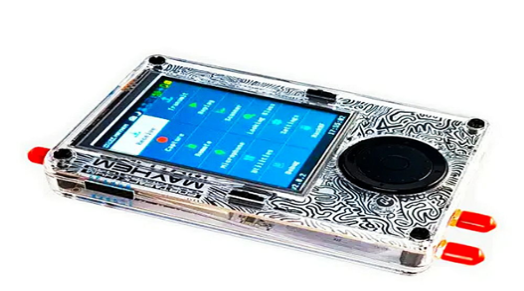
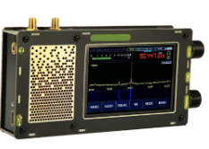
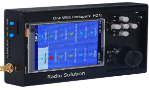

# **АНАЛІТИЧНИЙ ОГЛЯД ІСНУЮЧИХ ПОРТАТИВНИХ КОМПЛЕКСІВ ВИЯВЛЕННЯ ТА АНАЛІЗУ РАДІОСИГНАЛІВ**

У цьому розділі розглядаються сучасні портативні комплекси для виявлення, аналізу та обробки радіосигналів, що використовуються для моніторингу, тестування та дослідження у сфері радіозв'язку. Особлива увага приділяється програмно-визначуваним радіостанціям (SDR), які забезпечують гнучкість, багатофункціональність та робота у різному діапазоні частот.

## Опис технологій

Програмно-визначуване радіо (SDR, Software Defined Radio)
>>> ULVERSOY, Tore. Software defined radio: Challenges and opportunities. IEEE Communications Surveys & Tutorials, 2010, 12.4: 531-550.
— це підхід, при якому більшість функцій традиційного радіоапаратного забезпечення (наприклад, фільтрація, демодуляція, обробка сигналу) реалізується програмно, а не апаратно. Це дозволяє змінювати режими роботи пристрою, підтримувати різні протоколи та стандарти без необхідності заміни апаратної частини. 

Якщо взагалом уявити обладнання формування сигналу у приладах до SDR-технології, то це досить громіздкі пристрої (генератори, фільтри, кодери, декодери та інш), котрі мали порівняно великі розміри та коштували дуже дорого. І, якщо треба змінити певні параметри сигналу, то це у багатьох випадках потребувало безпосередньої фізичної зміни обладнання (заміни елементів радіосхем, блоків в пристрої і навіть цілих модулів радіостанцій) або фізичного настроювання оператором. Зі збільшеннями потреб суспільства ці необхідні зміни ставали більш неможливими і потребували виробництва іншого обладнання під необхідні вимоги формування/прийняття сигналу для відправлення і прийому відповідно. SDR-технологія використовує  персональний комп'ютер як центр радіостанції, завдяки чому практично всі процеси обробки сигналу виконує програмне забезпечення, яке обробляє (формує, кодує/декодує, фільтрує, модулює/демодулює…) сигнал. Мета такого підходу — створити систему, яка може приймати та передавати практично будь-які радіосигнали у широкому діапазоні частот за допомогою програмного забезпечення. Саме ця можливість – програмного керування і стала причиною розвитку приладів, що використовують SDR-технологію.

Основні переваги SDR.

- Універсальність — можливість роботи з різними типами сигналів та протоколів.
- Гнучкість — швидка зміна налаштувань, частот, режимів роботи через програмне забезпечення.
- Компактність і портативність — сучасні SDR-пристрої мають невеликі розміри та можуть працювати автономно.
- Масштабованість — можливість оновлення функціоналу шляхом зміни або доповнення програмного забезпечення.
- Широкий спектр застосування — від моніторингу стільникових мереж і аналізу бездротових протоколів до тестування безпеки, наукових досліджень та навчання.

SDR-комплекси дозволяють здійснювати прийом, аналіз, запис, відтворення та передачу радіосигналів у широкому частотному діапазоні, що робить їх незамінними інструментами для фахівців у сфері радіозв'язку, радіоаматорів, дослідників та інженерів.

Розробка приладу у моєму дипломному проєкті мусить грунтуватися на можливостях існуючих відомих пристроїв. Ці апарати порівняно недорогі, малі у розмірах, але водночас мають широкі характеристики.

### Радіостанція Hack RF One Portapack H4 Mayhem SDR 1 МГц – 6 ГГц.

Прилад HackRF One із PortaPack H4 із прошивкою Mayhem — це багатофункціональна портативна SDR-платформа, призначена для прийому, передачі й аналізу радіосигналів у широкому діапазоні частот. Пристрій базується на відкритих програмних рішеннях і може використовуватися для моніторингу мобільних мереж, дослідження бездротових стандартів, налаштування радіочастот, тестування захищеності бездротових систем та інших завдань
[HackRF One !](https://fd24.com.ua/ua/p1044872164-sdr-radiostantsiya-antennami.html?source=merchant_center&gad_source=1&gad_campaignid=16695681573&gbraid=0AAAAACqF10_-rY4lJZlaJmtpxI3HFCwSQ&gclid=CjwKCAjw56DBBhAkEiwAaFsG-tMrTVbThssU7Zpa5kQyvDk9m0I4ZMkaidrQvP96XgwxpQHuhkZQ7RoCglAQAvD_BwE).

Оновлений модуль PortaPack H2 розширює можливості HackRF One завдяки кольоровому сенсорному дисплею, навігаційним клавішам і енкодеру для зручного управління. Встановлена прошивка Mayhem значно розширює функції аналізу, тестування та роботи з бездротовими мережами.

У порівнянні з попередньою версією, H4 отримала покращений матовий екран, порт GPIO для підключення додаткових пристроїв, дисплеїв і сенсорів, а також оновлену систему живлення: один перемикач для вмикання/вимикання, вдосконалене управління акумулятором, швидке заряджання через Type-C, відсутність витоків струму та саморозряду.

Технічні характеристики

* Режим роботи: напівдуплексний
* Робочий частотний діапазон: 1 МГц – 6 ГГц
* Частота дискретизації: від 2 до 20 MSPS
* Програмно налаштований смуговий фільтр для прийому та передачі
* Програмно кероване живлення антенного виходу (до 50 мА при 3.3 В)
* Кольоровий сенсорний дисплей з діагоналлю 3.2 дюйма
* Вбудований гучномовець
* Зручні кнопки для налаштування
* Антенний роз’єм: SMA (гніздо)
* Аудіороз’єм для гарнітури/мікрофона: 3.5 мм
* GPIO-інтерфейс для підключення зовнішніх пристроїв
* Живлення: вбудований акумулятор на 2500 мА·год
* Матеріал корпусу: пластик ABS
* Габарити: 8 × 12,5 × 2,5 см

### Радіостанція Libre SDR PLUTO з Zynq 7020 70 МГц – 6 ГГц.

Прилад LibreSDR є альтернативою відомого SDR-пристрою ADALM-PLUTO (або PlutoSDR), виконаною у металевому корпусі для підвищення міцності та кращого відведення тепла [Детальніше про LibreSDR !](https://fd24.com.ua/ua/p2465955107-sdr-radiostantsiya-antennami.html).

Плата пристрою виконана на друкованій платі та оснащена 8-бітовим цифро-аналоговим перетворювачем. На ній розміщені такі інтерфейсні порти:

* два коаксіальні роз’єми MMCX для підключення сигналів синхронізації 1 PPS і 10 МГц;
* порт RJ-45 для Gigabit Ethernet, який забезпечує передачу IQ-даних і доступ до консолі вбудованої Linux-системи;
* два роз’єми Type-C (OTG і Debug):
    * OTG дозволяє підключатися до Linux-консолі через послідовний порт,
    * Debug використовується для відлагодження та завантаження прошивки через JTAG за допомогою інструментів Xilinx,
    * обидва роз’єми також застосовуються для живлення LibreSDR;
* слот для MicroSD-картки;
* чотири SMA-роз’єми для підключення двох приймальних і двох передавальних трактів.

Додатково на платі розташована прихована кнопка DFU для відновлення заводського програмного забезпечення. У LibreSDR інтегровано радіочастотний модуль AD9363.

Ключові технічні характеристики:

* Мікросхема: XC7Z020-2CLG400I xc7z020-2I
* RF-модуль AD9363, налаштований як AD9361 (діапазон 70 МГц ~ 6 ГГц)
* Кількість каналів: 2 на передачу, 2 на прийом
* Розрядність ЦАП/АЦП: 12 біт
* Робочий частотний діапазон: 70 МГц – 6 ГГц
* Генератор опорної частоти: VCTCXO 40 МГц, стабільність 0,5 ppm
* Система-на-кристалі: Zynq7010, FPGA: 28 Кб
* Оперативна пам’ять: 512 МБ
* FLASH-пам’ять: 32 МБ
* USB-інтерфейс: версія 2.0, підтримка OTG
* Мережевий інтерфейс: Gigabit Ethernet (1000 Мбіт/с)
* Підтримка завантаження з MicroSD-картки
* Живлення: 5 В, 2 А через MicroUSB
* Підтримка режимів дуплексу TDD і FDD
* Смуга пропускання: від 200 кГц до 20 МГц
* Корпус з алюмінієвого сплаву
* Розміри: 11,3 × 7,2 × 3 см
* Вага: 565 г

### Радіостанція 1.10D DSP SDR 10 МГц-2 ГГц

Прилад 1.10D DSP SDR підтримує AM, SSB, NFM, WFM, CW, побудований на SDR-архітектурі з використанням RF-фронтенду msi001 для 12-бітного оцифрування сигналу та процесора stm32h743 із тактовою частотою до 480 МГц
[Приймач 1.10D DSP SDR !](https://www.joom.com/uk/products/67b2acd0683d8101ba932088?variant_id=67b2acd0683d815eba93208a).

Діапазон частот пристрою становить 10 кГц–2,0 ГГц (версія 1.10d), чутливість — 0,3 мкВ при 10 дБ до 250 МГц. Приймач оснащений подвійним антенним входом, модулем атенюатора переднього каскаду з ослабленням до 30 дБ, високим вхідним опором, покращеною чутливістю на коротких хвилях і чотирма додатковими фронтальними фільтрами. Пристрій має розширені можливості - змінна ширина фільтра, адаптивне та порогове шумозаглушення, шумоподавлення, автоматичне регулювання підсилення (AGC), еквалайзер. Корпус із друкованої плати для покращеної радіочастотної ефективності, підключення до ПК через USB для передачі даних IQ, аудіо та керування пристроєм. 

Ключові технічні характеристики.

* Діапазони частот від 50 кГц до 49,999 МГц, від 50,001 МГц до 249,999 ГГц, від 400 МГц до 2 ГГц.
* Демодуляція: AM, SSB, NFM, WFM, CW.
* MCU: потужний stm32h743 із тактовою частотою 480 МГц.
* Змінна ширина фільтра, адаптивний шумоподавлювач, пороговий шумоподавлювач, шумоподавлювач, AGC, еквалайзер.
* Мікросхема демодуляції msi001.
* Акумулятор: вбудований літій-іонний акумулятор 503450, ємність: 3000 мА*год.
* Екран: 3,5-дюймовий IPS ємнісний сенсорний.
* Порт: USB, з’єднання з комп’ютером для коду, IQ та звукового зв’язку.

### Радіостанція Amator SDR  1 МГц - 6 ГГц.

Прилад Amator SDR [5] забезпечує прийом кількох голосових повідомлень, підтримує прийом голосу в діапазонах SSB, AM, вузькосмугового FM, широкосмугового FM, і спрощує прийом та відтворення бездротових сигналів з пультів дистанційного керування діапазону ISM
[Радіостанція Amator SDR  1 МГц - 6 ГГц. !](https://www.joom.com/uk/products/67ea3b1a35422d011b0f5a93?variant_id=67ea3b1a35422dbc1b0f5a95).

Одна з найкращих переваг радіотрансивера полягає в тому, що він дозволяє дуже легко вловлювати та відтворювати бездротові сигнали з пультів дистанційного керування діапазону ISM. Все, що вам потрібно зробити, це зайти в меню приймача, встановити частоту клавішею пульта дистанційного керування, натиснути червону кнопку запису «R» та натиснути клавішу на пульті дистанційного керування. Потім зупиніть запис, щоб зберегти його на карту пам’яті. Тепер ви можете перейти до меню «Відтворення», вибрати щойно записаний файл і натиснути кнопку «Відтворити». Точно такий же сигнал буде передаватися по повітрю, ефективно замінюючи ваш віддалений ключ.

Прилад дає можливість прослуховувати стандартні радіосигнали NFM та WFM, підключивши динамік до 3,5-мм радіороз’єму. Прийом ADS B легко вмикається на радіопередавачі, вибравши символ індуктора та блискавки у верхньому правому куті.
Прилад Amator SDR дає змогу передавати розмову через 3,5-мм аудіороз’єм. Тому, підключивши мікрофон, ви можете просто натиснути та утримувати праву бічну кнопку, щоб здійснити дзвінок. Цей радіотрансивер оснащений 3,2-дюймовим резистивним сенсорним екраном, навігаційними перемикачами, радіо-виходами, мікрофонними входами, інтерфейсом DC 2.1 та 4-шаровим позолоченим покриттям. 

Ключові технічні характеристики.

* тип пристрою: радіоприймач;
* тип батареї: вбудована літієва батарея 3,7 В 2000 мА*год;
* екран: 3,2-дюймовий, 240 x 320 RGB РК-дисплей з резистивний сенсорний;
* антена прийому частотного діапазону: 1 МГц – 6 ГГц;
* матеріал корпусу: алюмінієвий сплав.

Функціональність: відтворення файлів IQ, мікрофонна FM-передача з CTCSS, декодер CTCSS, частотний менеджер (збереження та завантаження з карти пам’яті з категоріями та коментарями), файловий менеджер, програвач звукових файлів Soundboard Wave (Зберігає 8-бітні монофайли) Карта пам’яті, каталог Wav, передавач SST, передавач POCSAG, приймач декодер POCSAG, передавач Морзе (FM-тон та CW), передавачі OOK для звичайних дистанційних кодерів (PT2262, дверні дзвінки, віддалені розетки, гаражі), RDS (система радіоданих) передавачі PSN, радіотексту та групового зв’язку за часом, приймач метеорологічних радіоехолотів для M10 та M2K2, універсальний пульт дистанційного керування TouchTunes Jukebox.
Особливості:

* 4-сторонні кнопки зі стрілками, колесо прокручування та кнопки вибору;
* батарейка-таблетка для збереження налаштувань, дати й часу;
* слот для мікрокартки пам’яті для зберігання даних та коду;
* SSB, AM, вузькосмуговий FM, широкосмуговий FM-радіоприйом;
* моніторинг суден (AIS), автомобілів (TPMS), Транспондери електронних лічильників комунальних послуг (ІТРОН ЕРТ).

Цей радіоприймач має широкий спектр застосування та може використовуватися на кораблях, автомобілях, електронних лічильниках комунальних послуг, для моніторингу транспондерів тощо.

### Радіостанція Malahit DSP2 2.40 Receiver 10 кГц - 2 ГГц.

Прилад Malahit-DSP2 SDR, оригінальний приймач другого покоління. Найновіша прошивка версії 2.40 створила абсолютно новий оригінальний приймач Malahit-DSP2, котрий має широкий спектр застосування та може використовуватися на кораблях, автомобілях, електронних лічильниках комунальних послуг, для моніторингу транспондерів тощо
[Malahit-DSP2 SDR !](https://www.joom.com/uk/products/67399c645aa1e901d90ed87c?variant_id=67399c645aa1e9c2d90ed87e).

Ключові технічні характеристики.

* Діапазон частот: 10 кГц-380 МГц, 404 МГц-2 ГГц.
* Ширина панорами: 192 кГц, 96 кГц, 48 кГц.
* Тип модуляції: AM, SSB, DSB, CW, NFM, WFM.
* Чутливість: 0,3 мкВ до 1 ГГц.
* Динамічна смуга пропускання: 82 дБ.
* Антена: роз'єм SMA з внутрішньою різьбою 50 Ом.
* Режим високого імпедансу (DSP2 або DSP1 з додатковою платою)
* Активна антена Bias Tee (DSP2 або DSP1 з додатковою платою)
* Джерело живлення: літій-іонний акумулятор 5000 мА*г.
* Екран: сенсорний РК-дисплей 3,5 дюйма.

Характеристики програмного забезпечення.

* Адаптивне шумозаглушення (NR)
* Порогове шумозаглушення
* Шумозаглушення (NB)
* Автоматичне регулювання підсилення (AGC)
* Автоматичний режекторний фільтр (ANF)
* Стерео FM підтримує аналогове стерео RDS
* Еквалайзер

Всі вищеописані пристрої дуже ефективні та широкофункціональні. Найбільш важливі характеристики для наочності порівняння зведені у наступній таблиці.

## Висновок по розділу 1

На основі проведеного аналітичного огляду приладів SDR-технології  можна зробити висновк, що сучасні портативні системи для виявлення, аналізу та передачі  радіосигналів є ефективними, універсальними та багатофункціональними засобами. Їхній функціонал значною мірою визначається як апаратною, так і програмною складовими, що дає змогу налаштовувати ці прилади під різні сфери застосування. Так у промисловості – для професійного контролю параметрів та якості радіочастот. У  науці - для точності дослідів та експериментів. У хобі-проєктах – для розваг та навчання. А особливу увагу розробки приладів SDR на сьогодні необхідно приділити у зв’язку із загарбницьким військовим вторгненням ворожої Російської Федерації – для створення радіо комплексів виявлення, ідентифікації, обробки  та допомоги у знищенні ворожих цілей.

Оглянуті прилади SDR — HackRF One, Libre PLUTO, 1.10D DSP SDR, Amator та Malahit DSP2 — демонструють різні підходи до реалізації SDR-рішень. Вони відрізняються функціональністю, широким діапазоном частот, інтеграцією різноманітних інтерфейсів, типами екранів, автономністю та можливостями програмного налаштування. Зокрема, HackRF Onе виділяється універсальністю і компактністю, LibreSDR - потужним обчислювальним модулем та високою пропускною здатністю, 1.10D DSP SDR - простотою використання та широким функціоналом, Amator SDR - зручністю роботи з голосовими повідомленнями та аналізом ISM-сигналів а Malahit DSP2  - автономністю роботи.

Таким чином, вибір конкретного комплексу залежить від специфічних завдань користувача, технічних вимог і умов експлуатації. Загалом, розвиток SDR-технологій відкриває нові горизонти у сфері бездротових комунікацій, підвищуючи ефективність, мобільність і функціональність систем радіозв’язку і радіокерування.

