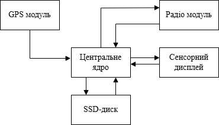

# Розробка АПКВАР (автоматизованого портативного комплексу)

Розробка — це комплексний процес створення нового пристрою або системи, що включає аналіз вимог, проєктування, виготовлення, тестування та впровадження. Метою розробки є отримання функціонального, надійного та ефективного продукту, який відповідає поставленим завданням і вимогам користувача.

Основні цілі розробки.

* Задоволення потреб користувача: створення пристрою, який вирішує конкретні задачі, наприклад, виявлення та аналіз радіосигналів.
* Оптимізація функціональності: забезпечення максимальної ефективності роботи системи при мінімальних витратах ресурсів.
* Інтеграція сучасних технологій: використання новітніх апаратних і програмних рішень для підвищення продуктивності та зручності експлуатації.

Етапи розробки автоматизованого портативного комплексу

1. Розробка структурної схеми

    * Визначення основних функціональних блоків системи.
    * Встановлення взаємозв’язків між компонентами.
    * Формування загальної архітектури пристрою.

2. Підбір елементної бази

    * Вибір необхідних апаратних компонентів (мікроконтролери, модулі зв’язку, накопичувачі тощо).
    * Оцінка технічних характеристик та сумісності елементів.
    * Формування специфікації компонентів для подальшого проєктування.

3. Розробка принципової електричної схеми

    * Створення детальної електричної схеми пристрою.
    * Визначення електричних з’єднань між усіма елементами.
    * Перевірка коректності схеми та підготовка до виготовлення прототипу.

    4. Розробка корпусу

        * Визначення вимог до габаритів, ергономіки та матеріалів корпусу.
        * Створення 3D-моделі корпусу з урахуванням розміщення всіх компонентів.
        * Аналіз тепловідведення, захисту від пилу, вологи та механічних впливів.
        * Підготовка креслень і специфікацій для виготовлення прототипу корпусу.

Ретельно організований процес розробки дозволяє мінімізувати ризики, скоротити час виходу продукту на ринок і забезпечити відповідність пристрою сучасним стандартам. Для автоматизованого портативного комплексу це особливо важливо, оскільки система повинна бути надійною, мобільною, енергоефективною та зручною у використанні.

## Розробка структурної схеми

Структурна схема — це візуальне представлення, яке демонструє ключові елементи системи та взаємозв’язки між ними. Вона дає змогу сформувати цілісне бачення побудови пристрою, його функціональних можливостей і способів взаємодії компонентів. Такий підхід спрощує аналіз системи, допомагає виявити надлишкові або відсутні частини, а також сприяє оптимізації її функціонування.

Структурна схема відіграє ключову роль у документації, оскільки забезпечує зрозумілий спосіб загального обміну інформацією між розробниками, інженерами, виконавцями та іншими учасниками проєкту.

На рисунку представлена структурна схема автоматизованого портативного комплексу для виявлення та аналізу радіосигналів (АПКВАР).

Опис роботи системи.

1. Центральний модуль.
    * Виконує обчислювальні операції, обробку даних та управління всіма компонентами системи.
    * Підключений до периферійних пристроїв через IO Board.
    * Інтегрує функції комунікаційного модуля (Wi-Fi/Bluetooth).

2. Сенсорний дисплей.
    * Забезпечує інтерфейс користувача для управління системою.
    * Відображає дані, отримані від інших компонентів, та дозволяє вводити команди.

3. Модуль радіо прийому передачі.
    * Виконує прийом та передачу радіосигналів у діапазоні від 1 МГц до 6 ГГц.
    * Передає отримані дані на центральний модуль для подальшого аналізу.

4. GPS-модуль.
    * Визначає координати пристрою та передає їх до центрального модуля.
    * Використовується для геопросторового аналізу та синхронізації.

5. SSD-диск.
    * Використовується для зберігання операційної системи, програмного забезпечення та даних, отриманих під час роботи.

<!-- 6. USB карта відеозахоплення:
    * Використовується для захоплення відеосигналу з аналогових джерел, таких як камери або інші пристрої.
    * Дозволяє передавати відео та аудіо через USB для подальшого аналізу або збереження.
    * Забезпечує можливість інтеграції аналогових відеоджерел у систему для моніторингу або запису. -->

Висновок по розділу  2.1

Структурна схема дозволяє зрозуміти загальну організацію системи, її функціональні можливості та взаємодію компонентів. Вона є основою для подальшого проектування, тестування та впровадження автоматизованого портативного комплексу.
