## Підбір елементної бази

> TODO

### Антени

> **TODO: оформити антени**

Пристрій захоплення радіосигналу складається із антени та блоку прийому/передачі радіосигналу.

1. Телескопічна антена (Whip Antenna)
Частотний діапазон: ~30 МГц – 1 ГГц (залежно від довжини)
Переваги: регульована довжина, компактність
Недоліки: погано працює на частотах нижче 20 МГц або вище 1 ГГц
Ідеальна для загального моніторингу, прослуховування FM-радіо, авіадіапазону тощо.

2. Дипольна антена
Частотний діапазон: залежить від довжини плечей (резонансна)
Переваги: хороша ефективність на налаштовану частоту
Недоліки: потребує місця для встановлення, вузькосмугова
Підходить для прийому короткохвильових (HF) та деяких VHF сигналів.

3. Антена Discone
Частотний діапазон: ~25 МГц – 1.3 ГГц
Переваги: надширокий діапазон, всенаправлена
Недоліки: габаритна, складна у транспортуванні
Популярна для загального спектрального аналізу або моніторингу кількох діапазонів.

4. Спрямовані антени (Yagi, Log-periodic)
Частотний діапазон: залежить від конструкції
Переваги: велике підсилення, вузька діаграма направленості
Недоліки: потрібно точно наводити, габарити
Використовується для направленого прийому, наприклад, супутникових або цифрових наземних сигналів.

5. Петльова антена (Loop Antenna)
Частотний діапазон: від LW до HF
Переваги: низький рівень шуму, малий розмір
Недоліки: вузькосмугова, потребує підстроювання
Чудово підходить для прийому слабких сигналів у діапазоні коротких хвиль.

6. Антена типу "вухо кролика" (Rabbit Ears)
Частотний діапазон: 50 – 800 МГц
Переваги: дешева, проста
Недоліки: неефективна поза телевізійними діапазонами
Може використовуватись для прийому DVB-T, FM або експериментів.

### Пристрій захоплення радіосигналу

1. HackRF-One

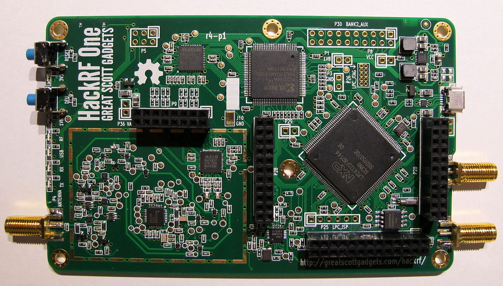

[HackRF-One](https://github.com/dodgymike/hackrf-wiki/blob/master/HackRF-One.md)
 — це програмоване радіо, що дозволяє працювати з широким діапазоном частот (від 1 MHz до 6 GHz). Цей пристрій є потужним інструментом для досліджень і застосувань у бездротових комунікаціях, криптографії, виявленні та аналізі радіосигналів.

Переваги:

* Широкий діапазон частот: підтримка від 1 MHz до 6 GHz дозволяє працювати з практично всіма радіочастотними спектрами.
* Програмування: можливість налаштовувати частоти і параметри роботи за допомогою відкритого програмного забезпечення.
* Мобільність: HackRF-One має компактний розмір, що дозволяє використовувати його у польових умовах.

Недоліки:

* Потребує спеціалізованих знань: використання потребує знань у галузі радіоелектроніки та програмування.
* Обмежена потужність: HackRF-One не підходить для високоякісних і далекобійних передавальних пристроїв.

2. RTL-SDR v3

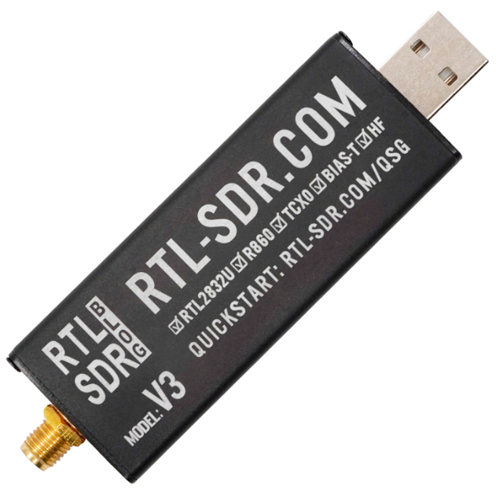

[RTL-SDR](https://www.rtl-sdr.com/buy-rtl-sdr-dvb-t-dongles/)
 — це недорогий USB-приймач SDR, побудований на базі RTL2832U. Хоча він не підтримує передавання сигналів, його можна використовувати для широкого спектру задач моніторингу — від аналізу спектру до прийому супутникових або авіаційних сигналів.

Переваги:

* Дуже низька вартість — ідеально підходить для початківців.
* Покриває частоти від 500 kHz (через модифікацію) до 1.7 GHz.
* Працює з популярними програмами, такими як SDR#, GQRX, GNURadio.

Недоліки:

* Тільки приймач — неможливо передавати сигнали.
* Вужчий діапазон частот порівняно з HackRF.
* Нижча точність та динамічний діапазон.

3. LimeSDR Mini v2

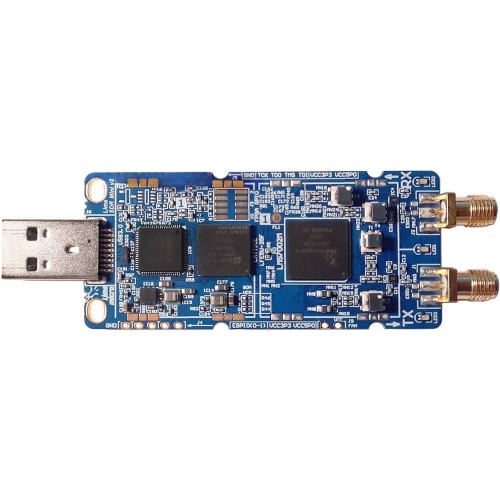

[LimeSDR Mini](https://limemicro.com/products/boards/limesdr-mini/)
 — це компактний SDR із повною підтримкою прийому та передачі сигналів. Працює в діапазоні від 10 MHz до 3.5 GHz та підтримує USB 3.0 для високої швидкості передачі даних. Відмінно підходить для мобільних проєктів з аналізу та трансляції сигналів.

Переваги:

* Повноцінна підтримка TX/RX.
* Вища якість сигналу, ніж у HackRF, особливо при цифровій модуляції.
* Відкрите ПЗ та активна спільнота.

Недоліки:

* Вужчий частотний діапазон: до 3.5 GHz проти 6 GHz у HackRF-One.
* Дорожчий, ніж RTL-SDR, і трохи складніший у використанні.

4. [ADALM-Pluto (PlutoSDR)](https://wiki.analog.com/university/tools/pluto)

PlutoSDR від Analog Devices — це потужна SDR-платформа з підтримкою прийому і передачі в діапазоні 325 MHz – 3.8 GHz (можна розширити до 70 MHz – 6 GHz через прошивку). Використовується в освітніх та наукових цілях, з дуже якісною документацією та підтримкою від виробника.

Переваги:

* Надійна апаратна реалізація від Analog Devices.
* TX/RX з хорошим рівнем чистоти спектру.
* Можливість розширення частотного діапазону програмно.

Недоліки:

* Складніше у налаштуванні для новачків.
* Менш компактний форм-фактор, ніж у HackRF-One.

5. BladeRF 2.0 micro xA4 SDR трансівер 47 МГц-6 ГГц 49 КЛЕ ПЛІС

[BladeRF 2.0 micro xA4](https://selteq.com.ua/ru/bladerf-2-0/) 
програмно-визначене радіо (SDR) нового покоління з частотним діапазоном від 47 МГц до 6 ГГц, 2×2 MIMO, ПЛІС із 49К логічних елементів.

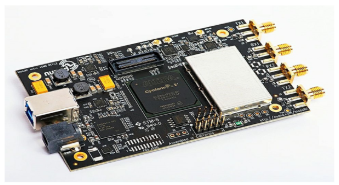

bladeRF 2.0 micro xA4 – це програмно-визначене радіо (SDR) нового покоління з частотним діапазоном від 47 до 6 ГГц, частотою дискретизації 61,44 МГц (з можливістю збільшення до 122,88 МГц) та потоковою передачею 2×2 MIMO. Будучи упакованим у невеликий форм-фактор, bladeRF 2.0 micro був розроблений для високопродуктивних та мобільних додатків. Завдяки libbladeRF bladeRF 2.0 micro сумісний з GNURadio, GQRX, SDR-Radio, SDR#, gr-fosphor, SoapySDR і т.д. під Windows, Linux та MacOS.

Екрануючий кожух захищає чутливі радіочастотні компоненти від електромагнітних перешкод (EMI) та забезпечує додаткове тепловідведення, дозволяючи bladeRF 2.0 micro працювати у складних умовах.

Всі радіочастотні SMA-порти здатні забезпечити живлення широкосмугових та попередніх підсилювачів за схемою струмового інжектора. Живлення периферійних пристроїв струмовим інжектором управляється програмно, що забезпечує максимальну експлуатаційну гнучкість.

В основі мікросхеми bladeRF 2.0 лежить ПЛІС останнього покоління Cyclone V від Intel (раніше Altera). xA4 використовується ПЛІС, що містить 49 логічних елементів.

Удосконалений тактовий генератор

Удосконалена архітектура синхронізації дозволяє bladeRF 2.0 micro приймати від інших пристроїв та передавати сигнал тактового генератора з частотою 38,4 МГц. Крім того, вбудована схема ФАПЧ дозволяє мікроконтролеру bladeRF 2.0 синхронізувати вбудований тактовий генератор із зовнішнім сигналом опорної частоти 10 МГц. У моделі xA4 використовують високоточний, стабільний тактовий генератор. Вбудований ЦАП управляє регулюванням підстроювання частоти генератора для заводського калібрування.

Ланцюги живлення модуля bladeRF 2.0 micro є складною комбінацією малошумливих і високоефективних імпульсних і лінійних регуляторів потужності. Хоча bladeRF 2.0 micro може живитися виключно від USB шини, для забезпечення максимальної лінійності периферійних пристроїв, що живляться через інжектор, необхідно підключити зовнішнє джерело живлення. Ланцюги живлення мають схему автоматичного перемикання для оптимізації споживання потужності між шиною USB та зовнішнім постійним живленням.

Модуль bladeRF 2.0 micro може працювати в некерованому автономному режимі, не вимагаючи підключення до зовнішнього контролера або комп'ютера. Об'єм вбудованої флеш-пам'яті досить великий, щоб вмістити образ ПЛІС будь-якого розміру xA4.

Можливості та функції

* РЧ-ХАРАКТЕРИСТИКИ:
    * Діапазон частот: від 47 МГц до 6 ГГц
    * 2 × 2 MIMO
    * Частота дискретизації: 61,44 МГц
    * Ширина смуги ПЧ: до 56 МГц
    * Автоматичне регулювання посилення (АРП)
    * Автоматична корекція IQ та зміщення по постійному струму

* ПІДТРИМКА СВЕРХХІДНОГО ІНТЕРФЕЙСУ USB 3.0:
    * Процесор ARM926EJ-S із частотою 200 МГц
    * Повністю живиться по шині USB 3.0
    * Зовнішнє живлення 5 В постійного струму з автоматичним перемиканням

* ПЛІС ALTERA CYCLONE V FPGA:
    * 49 кЛЕ для користувальницької обробки сигналів та апаратних прискорювачів

* VCTCXO ІЗ ЗАВОДСЬКИМ КАЛІБРУВАННЯМ:
    * Управління ланцюгом ФАПЧ 12-розрядним ЦАП
    * Заводське калібрування тактової частоти 38,4 МГц

Висновок

BladeRF 2.0 micro xA4 — це найкращий вибір для пристрою захоплення радіосигналу завдяки поєднанню широкого частотного діапазону (47 МГц – 6 ГГц), підтримки повноцінного прийому та передачі (2×2 MIMO), високої якості сигналу та сучасної елементної бази (FPGA Cyclone V, USB 3.0). BladeRF забезпечує більшу гнучкість у налаштуванні, стабільну роботу навіть у складних умовах, а також підтримку професійних інтерфейсів і програмного забезпечення (GNURadio, SDR#, SoapySDR тощо). Завдяки екрануванню, можливості автономної роботи, розширеним функціям живлення та високій точності синхронізації, bladeRF 2.0 micro xA4 ідеально підходить для мобільних і польових рішень, де важливі надійність, продуктивність і масштабованість. У порівнянні з іншими SDR-пристроями, він пропонує оптимальний баланс між функціональністю, якістю та можливістю розширення, що робить його найкращим вибором для даного проєкту.

### Центральне ядро обчислень

1. Raspberry Pi Compute Module 4

[Raspberry Pi Compute Module 4 (CM4)](https://www.raspberrypi.com/products/compute-module-4/?variant=raspberry-pi-cm4108032)
— це компактний та потужний комп'ютер на базі процесора Broadcom BCM2711, який використовується в різноманітних вбудованих системах. Це основний компонент, який виконує обчислювальні операції у проекті. CM4 пропонує широку гнучкість завдяки варіативності в обсягах пам'яті (від 1 ГБ до 8 ГБ) і можливості додаткового зберігання через eMMC або microSD картки.

Переваги:

* Висока потужність: чотириядерний процесор Cortex-A72 дозволяє запускати інтенсивні додатки, зокрема обробку відео та даних у реальному часі.
* Гнучкість: доступні варіанти з різними об'ємами пам'яті та зберігання.
* Широка підтримка периферії: можливість підключення різноманітних пристроїв через GPIO, HDMI, USB, Ethernet, а також підтримка стандартних Raspberry Pi HAT.
* Підтримка бездротового зв'язку: вбудовані модулі Wi-Fi та Bluetooth дозволяють організувати мобільний зв'язок і передачу даних без дротів.

Недоліки:

* Високі вимоги до живлення: потребує постійного підключення до джерела живлення, що може бути проблемою в автономних рішеннях.
* Відсутність вбудованого монітора: необхідно підключати зовнішній дисплей.
* Обмеження за типами зберігання: відсутність стандартного жорсткого диска обмежує швидкість зберігання даних при великих об'ємах.

2. NVIDIA Jetson Nano

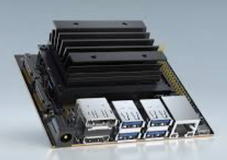

[NVIDIA Jetson Nano](https://developer.nvidia.com/embedded/jetson-nano)
— це мікрокомп'ютер, орієнтований на проекти, що потребують обробки даних з використанням штучного інтелекту (AI). Він оснащений чотириядерним ARM Cortex-A57 процесором та графічним процесором NVIDIA Maxwell із 128 ядрами CUDA, що робить його ідеальним для задач комп'ютерного зору, машинного навчання та автономних систем.

Переваги:

* Потужний GPU: підтримує глибоке навчання, AI, відеоаналітику в реальному часі.
* Висока продуктивність у AI-завданнях: оптимізований під TensorFlow, PyTorch, OpenCV.
* Підтримка дисплеїв через HDMI та MIPI DSI, а також камер через CSI.

Недоліки:

* Високе енергоспоживання, що не ідеально для автономних рішень.
* Обмежена спільнота у порівнянні з Raspberry Pi.
* Потребує активного охолодження при тривалому навантаженні.

3. Radxa CM3

[Radxa CM3](https://wiki.radxa.com/CM3) — це сумісний за розмірами модуль з Raspberry Pi CM4, але базується на SoC Rockchip RK3566 (4x Cortex-A55 до 2.0 ГГц) і орієнтований на вбудовані та мультимедійні рішення. Він підтримує до 8 ГБ LPDDR4 RAM і до 128 ГБ eMMC.

Переваги:

* Висока енергоефективність: Cortex-A55 забезпечує хорошу продуктивність при низькому споживанні енергії.
* Розширені можливості відео: підтримка 4K відео, кодеків H.265/H.264.
* Повна сумісність по роз'єму з Raspberry Pi CM4.

Недоліки:

* Менш розвинена екосистема (менше доступного ПЗ, менше підтримки спільноти).
* Підтримка Linux дещо обмежена в порівнянні з Raspberry Pi OS.
* Немає вбудованого Wi-Fi/Bluetooth у базовій конфігурації.

<!-- 4. Banana Pi BPI-CM4

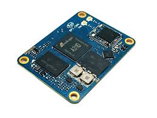

[Banana Pi BPI-CM4](https://wiki.banana-pi.org/Banana_Pi_BPI-CM4)
— ще один сумісний із Raspberry Pi Compute Module 4 варіант, який використовує Rockchip RK3568 (4x Cortex-A55). Він орієнтований на промислові рішення, що потребують високої стабільності та надійності.

Переваги:

* Великий набір інтерфейсів: SATA, PCIe, USB 3.0, MIPI DSI/CSI.
* Підтримка eMMC до 128 ГБ, до 8 ГБ RAM.
* Хороша термостійкість і надійність — придатний для польових умов.

Недоліки:

* Не настільки добре підтримується спільнотою, як Raspberry Pi.
* Відсутність офіційної підтримки деяких популярних дистрибутивів Linux.
* Деякі користувачі відзначають нестабільність програмного забезпечення. -->

Висновок

Попри наявність конкурентів, Raspberry Pi Compute Module 4 залишається найкращим вибором для через баланс між продуктивністю, гнучкістю, широкою підтримкою та стабільністю. Його багаторічна репутація, величезна спільнота користувачів, сумісність з великою кількістю периферійних модулів і чудова документація роблять його ідеальним ядром для проєктів, де важливі стабільність, підтримка і масштабованість.

### Пристрій захоплення аналогового відеосигналу

1. USB карта відеозахоплення LUX EasyCap

EasyCap — це бюджетний USB-адаптер для захоплення відеосигналу з аналогових джерел, таких як камери, DVD-плеєри чи ігрові консолі. Він підтримує передачу відео і аудіо через USB, що робить його універсальним рішенням для запису відео та моніторингу.

Переваги:

* Низька ціна: один із найекономніших варіантів для відеозахоплення.
* Легкість у використанні: підключається через USB і сумісний з більшістю операційних систем.
* Універсальність: можна використовувати з різними аналоговими джерелами відео.

Недоліки:

* Обмеження якості: відео може бути обмежене в роздільній здатності та якості порівняно з сучасними цифровими рішеннями.

2. Digitnow USB 2.0 Video Capture Card

[Digitnow USB 2.0 Video Capture Card](https://www.amazon.com/Digitnow-Video-Capture-Converter-VHS/dp/B01HEQZ66U)
це пристрій, що є повним аналогом EasyCap, але має покращений чипсет і часто постачається з власним ПЗ для захоплення відео. Призначений для роботи з аналоговими джерелами через композитні та S-Video входи.

Переваги:

* Покращена сумісність з Windows 10 і 11.
* Часто має краще ПЗ для редагування/запису відео в комплекті.
* Легке підключення через USB.

Недоліки:

* Все ще обмежена якість відео (SD, 720x576 max).
* Більш висока ціна порівняно з EasyCap без суттєвих переваг.

<!-- #### [August VGB100 USB Video Capture Stick](https://www.augustint.com/uk/productmsg-103-0.html)

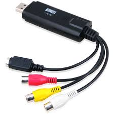

August VGB100 — це більш преміальний адаптер з підвищеною стабільністю з'єднання, кращим чипсетом і зменшеним шумом у відео. Ідеально підходить для захоплення відео з аналогових камер у реальному часі.

Переваги:

* Вища якість відео у порівнянні з бюджетними рішеннями.
* Менше артефактів та шуму при записі.
* USB 2.0 сумісність та підтримка PAL/NTSC.

Недоліки:

* Вартість значно вища за EasyCap.
* Все ще обмежений до SD-якості. -->

Висновок

LUX EasyCap забезпечує оптимальне співвідношення ціни та функціональності для задач захоплення аналогового відео в DIY-проєкті. Попри скромну якість відео (яка характерна для всіх адаптерів цього класу), він легкий у використанні, доступний, сумісний з Linux/Windows, і не потребує складного налаштування. У контексті польового планшета, де важлива мобільність, економія енергії та простота, LUX EasyCap стає ідеальним бюджетним вибором для роботи з аналоговими камерами або відеосигналами.

### Пристрій GPS

1. GPS модуль NEO-6M v2

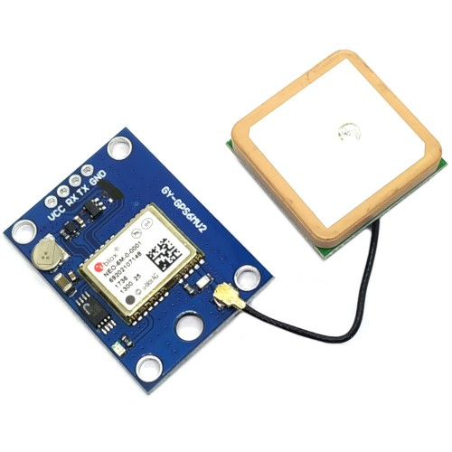
  
[GPS модуль u-blox NEO-6M](https://uamper.com/products/datasheet/NEO-6.pdf)
забезпечує точне визначення географічних координат і може використовуватися для синхронізації часу або визначення місця розташування. Він є важливим компонентом для проектів, де необхідно точно визначати позицію детекованого сигналу, наприклад, у системах моніторингу або геолокації.

Переваги:  

* Висока точність: забезпечує точність до кількох метрів, що ідеально підходить для геолокаційних задач.  
* Швидкий старт: підтримує функцію швидкого холодного та гарячого старту для швидкого визначення координат.  
* Низьке енергоспоживання: оптимізований для роботи в енергоефективних системах.  
* Широка сумісність: підтримує стандартні інтерфейси UART і I2C, що дозволяє легко інтегрувати модуль у різні системи.  

Недоліки:  

* Залежність від сигналу: потребує відкритого доступу до неба для отримання точних координат.  
* Додаткові антени: для покращення прийому сигналу може знадобитися зовнішня антена.  

2. u-blox NEO-M8N

NEO-M8N — більш сучасна модель від u-blox з розширеною функціональністю. Підтримує одразу декілька навігаційних систем (GPS, GLONASS, Galileo), що значно підвищує точність і надійність у складних умовах.

Переваги:

* Підтримка кількох GNSS систем.
* Вища точність і стабільність у міських або лісистих місцевостях.
* Висока швидкість оновлення (до 10 Гц).

Недоліки:

* Вища ціна.
* Потребує якіснішої антени для досягнення повної продуктивності.

3. Quectel L86 GPS/GNSS модуль

L86 — компактний GNSS модуль із вбудованою патч-антеною. Підтримує GPS, QZSS і SBAS. Має вбудовану флеш-пам’ять для збереження даних та швидкого старту.

Переваги:

* Надзвичайно компактний форм-фактор.
* Вбудована антена — не потребує зовнішньої (але можна підключити).
* Підтримка AGPS (завантаження ефемерид через інтернет).

Недоліки:

* Нижча чутливість у порівнянні з модулями з повноцінною антеною.
* Вужчий діапазон GNSS протоколів, ніж у M8N.

<!-- #### Beitian BN-220

BN-220 — це готовий до використання GPS-модуль у пластиковому корпусі з вбудованою керамічною антеною. Він особливо популярний у дронах та автономних роботах.

Переваги:

* Просте підключення (UART, plug-n-play).
* Надійний прийом сигналу.
* Вбудована антена з хорошими характеристиками.

Недоліки:

* Менше можливостей кастомізації, ніж у NEO-серії.
* Складніше інтегрувати у тонкий корпус планшета через корпус модуля. -->

Висновок

NEO-6M v2 — це перевірене, надійне та доступне рішення для проєктів, де важлива точність позиціювання та простота інтеграції. Він має відкриту документацію, велику спільноту підтримки, добре працює з Raspberry Pi, Arduino і STM32, а також легко підключається до зовнішньої активної антени. На відміну від новіших моделей (M8N, L86), NEO-6M не потребує додаткового програмного налаштування, що робить його найкращим варіантом для прототипів і польових DIY-рішень із фокусом на стабільну роботу та простоту.

### Пристрій збереження данних

1. SSD диск Transcend MTS420S 240GB M.2 2242 SATAIII 3D NAND TLC

[SSD MTS420S](https://hard.rozetka.com.ua/ua/transcend-ts240gmts420s/p436737317/)
диск забезпечує високу швидкість читання та запису завдяки використанню 3D NAND технології та інтерфейсу SATAIII. Ідеальний для зберігання операційної системи, даних та програм у вашому пристрої.

Переваги:

* Висока швидкість: забезпечує швидке завантаження та збереження даних.
* Надійність: 3D NAND пам'ять є більш стійкою до зносу, ніж традиційна 2D NAND.
* Енергоефективність: знижене споживання енергії в порівнянні з механічними жорсткими дисками.

Недоліки:

* Ціна: хоча ціни на SSD знижуються, вони все ще дорожчі, ніж звичайні жорсткі диски.
* Обмежена ємність: хоча 240 ГБ — достатньо для стандартних задач, для великих даних знадобиться диск більшої ємності.

2. KingSpec M.2 2242 SATAIII 256GB

KingSpec — китайський виробник SSD-дисків, який пропонує бюджетні рішення з форм-фактором M.2 2242. Цей SSD має інтерфейс SATAIII і базується на TLC NAND, що забезпечує швидкий доступ до даних.

Переваги:

* Вигідна ціна.
* Продуктивність на рівні більшості SATAIII SSD.
* Широка доступність на AliExpress та локальних ринках.

Недоліки:

* Менша надійність і тривалість служби у порівнянні з брендовими рішеннями.
* Часті варіації якості між партіями.

3. ADATA SU650 M.2 2280 SATAIII 240GB

ADATA — відомий виробник із більш стабільною якістю продукції. SU650 — це SATA SSD, який має трохи більший форм-фактор (2280), але може використовуватись у 2242 слотах із адаптером або вільним місцем на платі.

Переваги:

* Стабільна якість і хороша підтримка бренду.
* Надійність в роботі навіть при підвищених навантаженнях.
* Добре підходить для Linux- або Android-платформ.

Недоліки:

* Форм-фактор 2280 — не підходить для компактних систем без адаптера.
* Немає високих швидкостей як у NVMe SSD.

<!-- #### Transcend MTS430S 256GB M.2 2242 SATAIII

Оновлена версія MTS420S, цей диск має вищу ємність (256 ГБ), покращену продуктивність і той самий компактний форм-фактор M.2 2242. Оснащений 3D NAND TLC і підтримує DevSleep для зниженого енергоспоживання.

Переваги:

* Офіційна підтримка Transcend.
* Енергоефективний і довговічний.
* Швидкість читання до 560 МБ/с.

Недоліки:

* Трохи дорожчий, ніж MTS420S.
* Різниця в продуктивності не завжди помітна в реальному використанні. -->

Висновок

Transcend MTS420S забезпечує ідеальний баланс розміру (2242), швидкості, енергоефективності та надійності. У порівнянні з KingSpec, він має значно вищу якість збірки і стабільність роботи, а на відміну від рішень формату 2280 (як ADATA SU650), легко інтегрується в компактні проєкти, зокрема планшети. Крім того, підтримка 3D NAND TLC гарантує довший термін служби без шкоди для продуктивності. Це робить Transcend MTS420S найкращим вибором для польових і DIY-рішень, де важливі компактність, надійність та витривалість.

### Дисплей

1. Сенсорний дисплей IBM Lenovo Wacom 12.1in XGA LCD Touch Screen

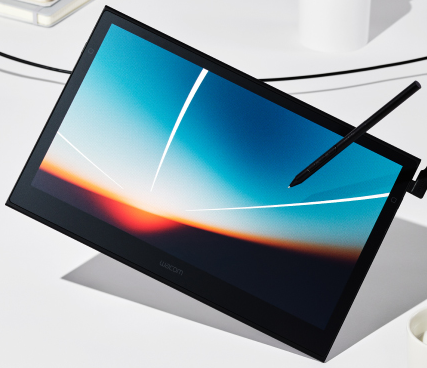

[IBM Lenovo Wacom 12.1in](https://www.alancomputech.com/ibm-lenovo-wacom-12-1in-xga-lcd-touch-screen-13n7241-laptop-su5r-12s05as-02x-13n7241.html) 
цей сенсорний дисплей має XGA роздільну здатність (1024x768 пікселів) і підтримує технологію стилусного введення. Його можна використовувати для розробки інтерфейсів користувача, де необхідний високий рівень точності введення. Використання стилуса дозволяє отримати більш точні результати, що важливо в польових умовах або при роботі з картами та іншими детальними графіками.

Переваги:

* Сенсорне введення: підтримує ввід як пальцем, так і стилусом, що є важливим для інтерактивних додатків.
* Висока точність: точність введення за допомогою стилуса дозволяє використовувати дисплей у складних робочих умовах.
* Компактність і зручність: зручний розмір для портативних рішень.

Недоліки:

* Малий розмір екрана: може бути недостатньо великим для відображення складних графічних інтерфейсів.
* Вартість: дисплей високої якості може бути дорожчим порівняно з іншими дисплеями.

2. Waveshare 10.1" HDMI LCD with Capacitive Touch

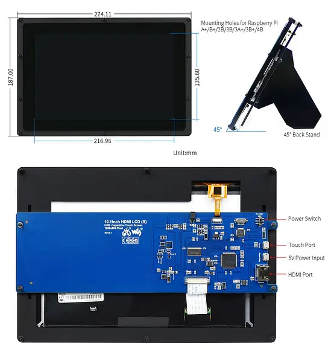

[Waveshare 10.1"](https://www.waveshare.com/10.1inch-hdmi-lcd.htm)
це 10.1-дюймовий дисплей із роздільною здатністю 1280x800 пікселів підтримує ємнісне сенсорне введення до 10 дотиків одночасно. Він підключається через HDMI для відео і через USB для сенсорного інтерфейсу, що робить його простим у використанні з Raspberry Pi Compute Module 4.

Переваги:

* Вища роздільна здатність, ніж XGA — зручніше для сучасних UI.
* Ємнісний multitouch: підтримка до 10 торкань, плавна взаємодія.
* Просте підключення (HDMI + USB), без складного налаштування драйверів.

Недоліки:

* Не підтримує стилус з точністю Wacom.
* Не має MIPI-інтерфейсу — потребує HDMI, що не завжди зручно в планшетах.

3. Official Raspberry Pi 7" Touchscreen Display

[RPi 7" Touchscreen Display](https://www.raspberrypi.com/products/raspberry-pi-touch-display/)
має роздільну здатність 800x480 та підтримує ємнісний multitouch. Підключається через DSI-інтерфейс, тому не займає HDMI-порт, що критично у компактних системах.

Переваги:

* DSI-підключення: не займає HDMI, що залишає порт для додаткового дисплея або інших задач.
* Компактний: ідеально підходить для невеликих корпусів планшету.
* Хороша інтеграція з Raspberry Pi: драйвери та підтримка з коробки.

Недоліки:

* Низька роздільна здатність (800x480) — обмеження при роботі з великими UI.
* Малий розмір — не завжди зручно для складних інтерфейсів.

<!-- #### [BOE 10.1" MIPI DSI IPS LCD Touch Screen](https://www.panelook.com/TV101WXM-NH0_BOE_10.1_LCM_overview_26806.html)

Цей дисплей з IPS-матрицею має роздільну здатність 1280x800 або 1920x1200, підтримує інтерфейс MIPI DSI і часто використовується у промислових планшетах. Підтримує ємнісне сенсорне введення, є моделі з підтримкою стилуса (пасивного або активного).

Переваги:

* Повна підтримка MIPI DSI — без потреби у HDMI, що критично для CM4.
* Висока роздільна здатність, широкі кути огляду (IPS).
* Опціонально — підтримка стилуса або перо.

Недоліки:

* Потребує контролера або виводу з CM4 через DSI-конектор (іноді складне підключення).
* Немає стандартизованої підтримки — залежить від конкретної моделі. -->

Висновок

Цей дисплей виділяється завдяки підтримці активного стилуса з технологією Wacom, що забезпечує високу точність введення, критичну для військових або інженерних додатків, картографії та роботи в складних умовах. Його співвідношення сторін (4:3) зручно для читання технічної документації та створення інтерфейсів, орієнтованих на точність, а не на розваги. Крім того, його корпус і призначення дозволяють використовувати дисплей у надійних польових рішеннях, що робить його кращим варіантом серед альтернатив.

### Батарея

Літій-іонні (Li-ion) елементи та зібрані із них акумуляторні батареї (АБ) за останні роки повністю довели свою ефективність використання у різноманітних галузях людського виробництва техніки та майже замінили кислотні (КБ) і лужні (ЛБ) батареї, котрі використовувалися раніше. А деякі виробництва пристроїв загалом неможливі без новітніх Li-ion джерел струму. Так більшість переносних засобів комунікації (смартфонів), портативних комп'ютерів (ноутбуків, планшетів), засобів руху (моноколіс, GyroScooter, Hoverboard, е-байків), різноманітних побутових та складських роботів (роботів-пилосмоків, роботів для миття вікон), різних портативних та виробничих електростанцій (powerbank, UPS, сонячних станцій) та інших сучасних гаджетів обов’язково створені на основі Li-ion АБ.

Переваги такої технології виробництва над технологіями свинцево-кислотних та лужних (alkaline) хімічних елементів живлення сьогодні стали нормою і базою для створення сучасної техніки у світі. Необхідно відзначити найбільш вагомі особливості Li-ion джерел живлення:

* **Щільність енергії на одиницю маси та об’єму** — розміри елементів і АБ у 2–4 рази менші.
* **Швидка перезарядка** від 0 до 100% за 1–2 години, що дає більш ефективно використовувати пристрої на Li-ion живленні.
* **Циклічність заряду/розряду** від 1000 до 8000 разів, що дозволяє експлуатувати батареї у декілька разів довше: від 5 до 25 років.
* **Низький саморозряд** — енергія у таких батареях зберігається у декілька разів довше без експлуатації.
* **Екологічність** — відсутність у будові токсичних металів (кадмій, свинець, ртуть) згідно сучасних екологічних стандартів.

Принцип роботи

Основа конструкції Li-ion елементів — анод, виготовлений з вуглецю пористого на мідній фользі, і катод, виконаний з оксиду літію на алюмінієвій фользі. Розділювачем виступає пористий поліпропіленовий сепаратор, який просочений електролітом, що виконує роль провідника. Всі елементи укладені в герметичний корпус. Електроди підключаються до струмознімачів. У деяких моделях передбачений клапан, який відповідає за скидання тиску всередині конструкції.

Мідні та алюмінієві пластини, змащені електролітом та розділені пористим шаром, згорнуті у рулон. Корпус набуває циліндричної форми. Якщо пластини укладені по-іншому, елемент чи батарея мають форму призм та пакетиків. Моделі різняться складом катода. Незалежно від матеріалу, що в ньому використовується, принцип дії літієвих акумуляторів однаковий для агрегатів усіх видів. Під час подачі напруги на електроди позитивно заряджені іони літію від'єднуються від молекул оксиду та переміщуються на вуглецеву пластину. Це призводить до окисної реакції та заряду батареї. Коли Li-ion працює під навантаженням, спостерігається зворотна дія — іони Li+ переходять на пластину з оксиду літію у звичайне положення.

Літієві джерела живлення чутливі до перезаряду. Надмірний заряд призводить до нагромадження металевого літію на поверхні анода. Цей осад може розпочинати реакцію з електролітом. При цьому на катоді починає активно виділятися кисень, про що свідчить інтенсивне нагрівання, підвищення тиску та можлива розгерметизація АКБ.

Заряджання елементів та батарей проходить у два етапи:

1. **Перший** — здійснюється при стабільному струмі 0,2С–1С до напруги 4,2 В і займає приблизно 40 хвилин.
2. **Другий** — виконується при незмінній напрузі. Заряджання завершується, коли зарядний струм знижується до значення, що становить 3% від номінального.

Щоб літієва батарея прослужила довго, її необхідно заряджати струмом, що становить 50% від ємності (0,5С).

Згодом АКБ Li-ion «старіють», усередині накопичуються продукти окислення, втрачається частина ємності. Економічно доцільно життєвий цикл акумулятора завершити, коли він втрачає 30% вихідної ємності. Ресурс моделей у середньому становить 1000 зарядів та розрядів. Щоб продовжити термін експлуатації, рекомендується не перевищувати оптимальний струм заряду 0,5С (50% номінальної ємності пристрою). Також важливо уникати глибокого розряду та перезаряду АКБ, виключити переохолодження та перегрів, не зберігати розрядженим протягом тривалого часу.

 Типи та різновиди

[Типи літій-іонних акумуляторів](https://deps.ua/ua/knowegable-base/reference-information/10591.html#q3-2)
мають багато різних варіацій із різними елементами у складі катода. У деяких модифікаціях в аноді може повністю або частково замінюватись графіт.

* Літій-кобальтові (LiCo)

Такі елементи і батареї призначаються для живлення високотехнологічних гаджетів завдяки високій питомій енергоємності. Їх встановлюють у смартфони, лептопи, цифрові фотоапарати тощо.

Літій-кобальтові осередки оснащуються спеціальним захистом, необхідним для обмеження заряду та швидкості розряду до безпечного рівня. 

Недоліки LiCoO2: порівняно невеликий термін служби, низька термічна стабільність та лімітована кількість циклів.

* Літій-марганцеві (LiMn)

Низький опір гарантує можливість швидкої зарядки та дозволяє витримувати протягом кількох секунд імпульси до 50А. Гнучка конструкція дає можливість адаптувати властивості АКБ під різні завдання, покращуючи її характеристики. Літій-марганцеві моделі використовуються для електроінструментів з високою потужністю, медичної техніки, а також електричного та гібридного транспорту.

* Літій-полімерні (Li-Pol, Li-polymer, Li-Po)

Пристрої можуть виготовлятися майже у будь-якій формі та конфігурації. У приладів низький рівень саморозряду, слабкий ефект пам'яті та висока ємність. 

Недолік моделей – електричні параметри помітно погіршуються за умов низької температури (можлива кристалізація полімеру).

Акумулятори Li-polymer випускаються у двох варіантах — стандартні та швидкорозрядні. Вони відрізняються максимальним струмом розряду: для стандартних моделей показник становить трохи більше 3С, у швидкорозрядних може досягати 10С. Ці пристрої ефективніше працюють при інтенсивній експлуатації у частих циклах розряду-заряду. Їх встановлюють у мобільну техніку (смартфони, електронні книги, планшети), радіокеровані апарати, портативні електроінструменти, деякі електромобілі.

*  [Літій-залізо-фосфатні (LiFePO4)](https://deps.ua/ua/katalog/accumulators-batteries.html?f=l1928)

Вони стійкі до критичних температур (від \-30 до \+50 °C), тому їх можна використовувати поза приміщеннями. Ці елементи живлення безпечні в експлуатації: не спалахують і не вибухають від перенапруги. Пристрої стійкі до перезарядки та перепадів в електромережі. Витримують піковий розрядний струм до 25С і тривалий вплив високої напруги. За місяць саморозряджаються лише на 1,5%. Прилади довговічні: робочий цикл — 2000, термін зберігання — до 15 років. Завдяки стабільності ферофосфатні моделі підтримують прискорену зарядку великими струмами. Їх заряджають спеціальними зарядними адаптерами, котрі несумісні з іншими типами акумуляторів. З недоліків: відносно більша вага, розміри та ціна. Зберігати прилади необхідно за заряду 40–60%. Заповнити запас енергії до 80% можна приблизно за 1,5 години.

Літій-залізо-фосфатні батареї випускаються у формі паралелепіпеда, циліндра та плоского корпусу. Їх використовують для вітрогенераторів, сонячних панелей, водного та електричного транспорту, складської техніки, ігрового обладнання тощо. Вони не бояться довгих періодів простою. До кінця експлуатаційного терміну втрачають до 20% ємності.

* Літій-титанатні (LTO)

Акумулятор LTO нормально працює при морозі. За рахунок відсутності вуглецю у складі виключається перегрів. Знижена напруга комірки робить АКБ безпечною у використанні. У моделях немає ефекту пам'яті. Недоліком LTO є невелика щільність енергії (від 30 до 110 Вт·год/кг), пов'язана з низькою напругою 2,4 В.

Літій-титанатні акумулятори використовуються як основне джерело живлення в електротранспорті, а також у бензинових машинах як заміна АКБ для стартера, автозвуку та освітлення. Також їх встановлюють у побутовій техніці, медичному та телекомунікаційному обладнанні. За допомогою LTO організовують внутрішнє та зовнішнє освітлення на базі сонячних панелей.

* Літій-нікель-марганець-кобальт-оксидні (Li-NMC, NMC)

Ефективність пристроїв забезпечується вдалим поєднанням марганцю та нікелю. Перший елемент має шпинельну структуру, але високий внутрішній опір, що знижує енергоємність. Другий — нестабільний, але енергоємний. Водночас ці матеріали компенсують недоліки один одного, посилюючи переваги. Основні плюси: хімічна стабільність, високий рівень струмовіддачі, мінімальні показники саморозряду, легка переносимість глибокої розрядки, стійкість до температурних перепадів. Пристрої не схильні до спалахів, що робить їх відмінним варіантом для використання як UPS. Проте основна сфера експлуатації — електротранспорт.

Підсумовуючи всі вищевказані особливості різних Li-ion елементів, їх можна звести у таблицю для наочності та легшого порівняння переваг і недоліків. (У таблицю не внесено максимальну ємність АБ, оскільки технологія Li-ion дозволяє виготовляти потужні джерела енергії шляхом з'єднання елементів послідовно або паралельно. Тому максимальна ємність АБ залежить від багатьох технологічних складників: параметрів певних елементів, їх кількості у складі батареї, способу експлуатації тощо.)

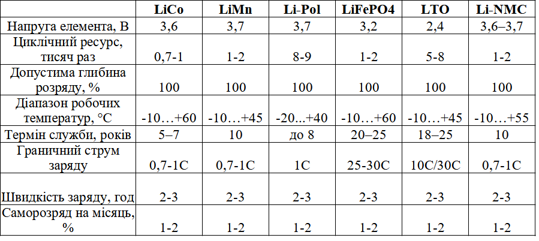

* [Акумулятор літій-полімерний 10000 mAh, 3.7v, 1260110](https://alphapower.com.ua/ua/p1184584341-akkumulyator-litij-polimernyj.html)

* Країна виробник: Китай
* Тип акумулятора: Li-Pol
* Напруга акумулятору; 3.7 V
* Ємність: 10000 мА/год
* Довжина: 110 мм
* Ширина: 60 мм
* Товщина 12 мм

Висновок

Проаналізувавши відомі властивості Li-ion елементів очевидним є вибір літій-полімерного (Li-Pol) акумулятору. Це перевірене, надійне та доступне живлення для переносних приладів, котре має такі важливі характеристики як: висока ємність і, відповідно, продуктивність; малі габаритні розміри і плоска тонка форма виготовлення; мала вага; низький рівень саморозряду і слабкий ефект пам'яті; висока безпека та екологічність; доступність.

Згідно до вимог живлення розробленого мною приладу, найоптимальнішим вибором буде акумулятор Li-Pol типу 10000 mAh, 3.7v у кількості 6 штук, з’єднаних паралельно і послідовно відповідно до визначеного принциповою схемою способу експлуатації (зарядки та розрядки). (Див. Додаток …. Рис 6.6 USB)

Даний акумулятор доступний, що дасть змогу при необхідності його швидко замінити. І на відміну від інших типів акумулятолрів: LiCo, LiMn, LiFePO4, LTO, Li-NMC від різних фірм та форм виготовлення, він відносно дешевий, має тонку плоску форму виконання та вбудовану плату керування зарядом/розрядом. Що робить його найкращим варіантом для живлення мого приладу. І тому гарантує стабільну роботу та простоту виконання загальної конструкції.

### Материнська плата

1. Compute Module 4 IO Board

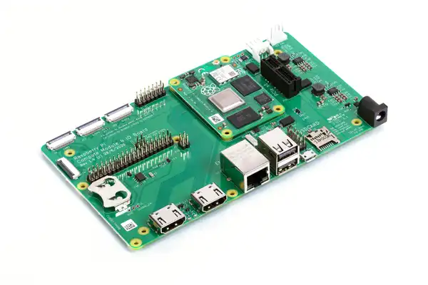

[CM4 IO Board](https://www.raspberrypi.com/products/compute-module-4-io-board/) 
це основна плата для підключення Raspberry Pi Compute Module 4 до різних периферійних пристроїв. Вона надає різноманітні порти та можливості підключення: HDMI, USB, Ethernet, слот для microSD, PCIe слот для розширення і підтримку камер через MIPI CSI-2.

Переваги:

* Розширення можливостей: надає доступ до всіх основних інтерфейсів для підключення периферії.
* Інтерфейси для дисплеїв і камер: підтримує MIPI DSI для дисплеїв та MIPI CSI-2 для камер, що дозволяє створювати мультимедійні системи.
* Підтримка PoE: можливість живлення через Ethernet (PoE) спрощує монтаж і зменшує потребу в додаткових живильних кабелях.

Недоліки:

* Потрібен додатковий обв'язок: вимагає підключення Compute Module 4, що збільшує складність розробки та інтеграції.
* Обмеження по кількості портів: деякі інтерфейси, такі як USB, обмежені в портах.

2. Waveshare CM4 IO Base Board B

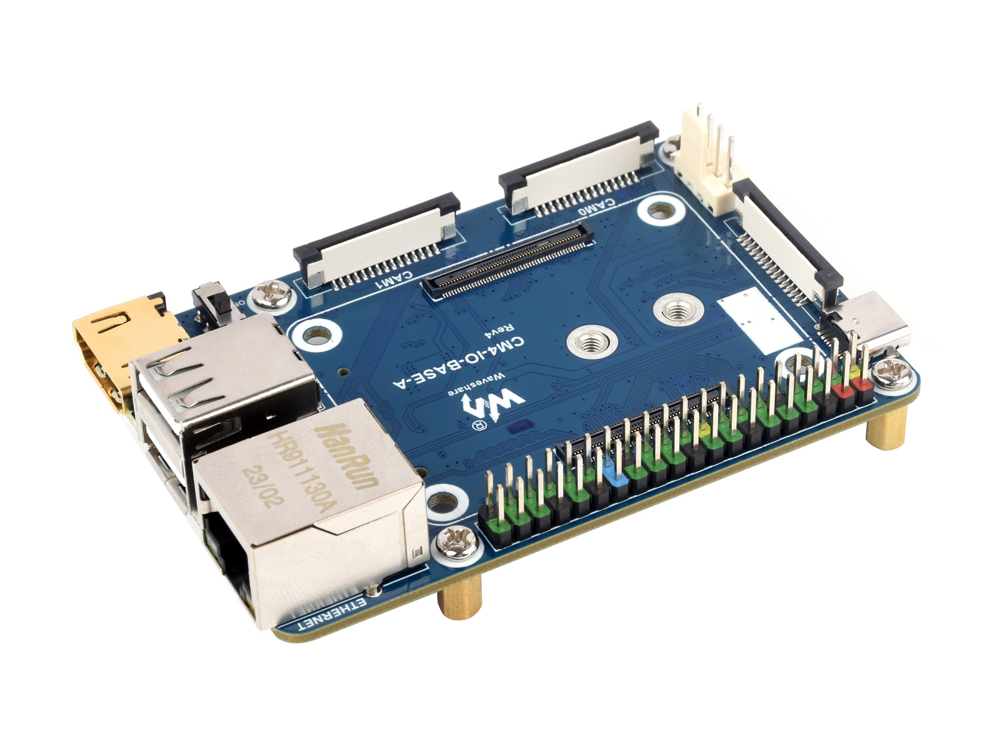

Ця плата розроблена компанією [Waveshare](https://www.waveshare.com/cm4-io-base-b.htm) спеціально для Raspberry Pi Compute Module 4. Вона має компактний форм-фактор, зручний для вбудованих рішень, а також надає доступ до основних портів: HDMI, USB, Ethernet, камери та дисплеїв через MIPI.

Переваги:

* Компактний розмір: зручно вбудовується у портативні пристрої, включаючи планшети.
* Повна підтримка CM4: має слот для eMMC-версій, слот microSD для Lite-версій.
* Виводи для GPIO: можна підключати сенсори, кнопки, інші периферійні пристрої.

Недоліки:

* Обмежені можливості розширення: відсутній PCIe слот.
* Відсутність PoE: не підтримується живлення через Ethernet.

3. Seeed Studio reComputer CM4 IO Board

Розроблена компанією [Seeed Studio](https://www.seeedstudio.com/reComputer-IO-Board-p-5279.html) для використання з CM4, плата reComputer IO Board орієнтована на промислові рішення та мультимедійні пристрої. Має повноцінний набір інтерфейсів, включаючи HDMI, USB 3.0, GbE Ethernet, слот PCIe, RTC, і підтримує до 2 камер.

Переваги:

* Підтримка PCIe: дозволяє розширити функціональність через NVMe диски або інші модулі.
* Підтримка RTC: можливість точного відстеження часу без зовнішнього джерела.
* Гарна якість збірки та розведення.

Недоліки:

* Трохи більші габарити — не ідеально для тонких планшетів.
* Вища ціна у порівнянні з базовими платами.

<!-- #### [DFRobot Raspberry Pi CM4 IoT Router Carrier Board Mini](https://www.dfrobot.com/product-2590.html)

Хоча ця плата орієнтована на побудову маршрутизаторів на базі CM4, вона має компактний розмір і чудово підходить для мініатюрних планшетів з функціями зв’язку. Має два гігабітні порти, слот для microSD, USB 2.0, UART, і GPIO.

Переваги:

* Дуже компактна: ідеально підходить для планшетів та мобільних пристроїв.
* Добре підходить для мережевих рішень: два гігабітні Ethernet порти.
* GPIO на місці — для підключення сенсорів і модулів.

Недоліки:

* Обмежена мультимедійна підтримка: відсутній HDMI і роз'єм для дисплеїв.
* Немає PCIe і слотів для камер. -->

Висновок

Compute Module 4 IO Board — це еталонна плата від Raspberry Pi Foundation, яка надає найбільшу гнучкість для розробників. Вона підтримує всі ключові інтерфейси, включно з PCIe, двома камерами, двома дисплеями, PoE та великим числом GPIO. Завдяки офіційній підтримці, надійності та великій кількості доступної документації, ця плата є найкращою базою для побудови прототипів і повноцінних DIY-пристроїв.

Однак для досягнення оптимального результату у фінальному пристрої доцільно розробити власну материнську плату, яка буде враховувати специфічні вимоги проєкту: компактність, розташування розʼємів, мінімізацію зайвих компонентів та оптимізацію енергоспоживання. Власна плата дозволить інтегрувати лише необхідні інтерфейси, зменшити габарити та вагу пристрою, а також підвищити надійність і зручність експлуатації у польових умовах.

Висновок по розділу  2.2

У цьому розділі було розглянуто основні компоненти, які можуть бути використані для побудови проекту. Raspberry Pi Compute Module 4 забезпечує високу продуктивність і гнучкість, а Compute Module 4 IO Board розширює можливості підключення периферійних пристроїв. Сенсорний дисплей IBM Lenovo Wacom дозволяє створювати інтерактивні інтерфейси, а HackRF-One відкриває можливості для роботи з радіочастотними сигналами. USB карта відеозахоплення LUX EasyCap є бюджетним рішенням для захоплення відео, а SSD диск Transcend MTS420S забезпечує швидке та надійне зберігання даних. Кожен із цих компонентів має свої переваги та недоліки, що слід враховувати при виборі елементної бази для конкретного застосування.