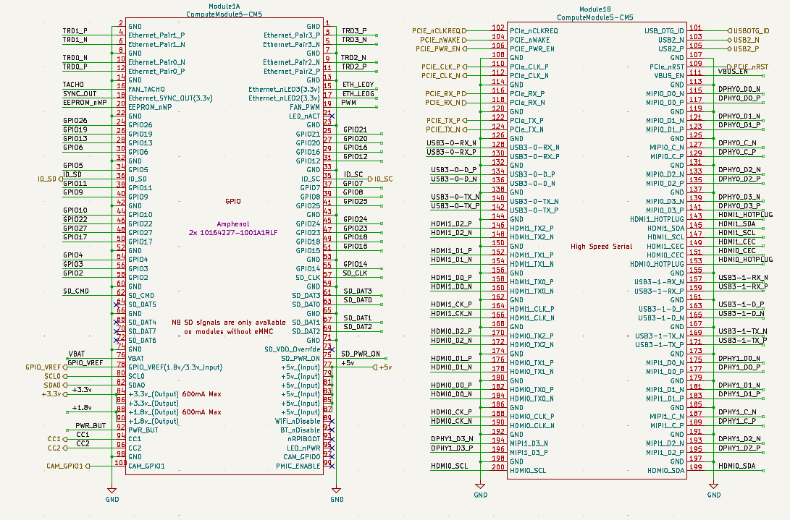
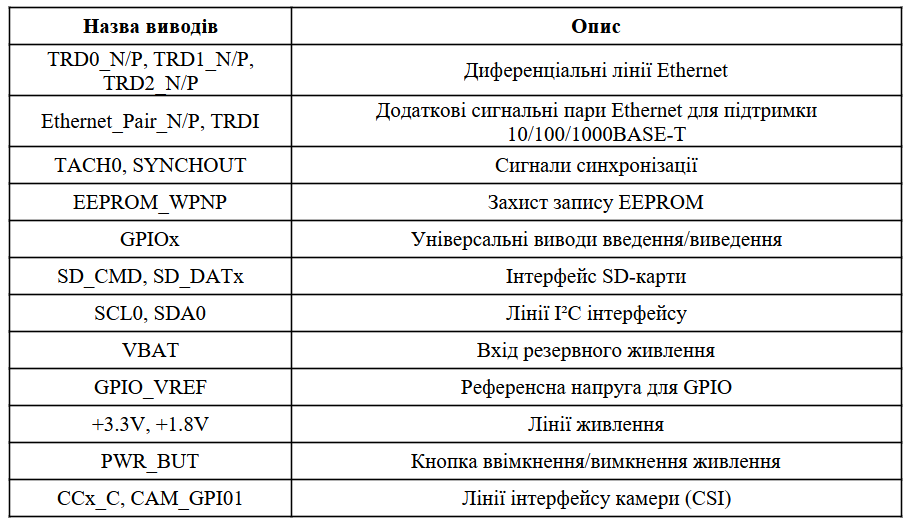
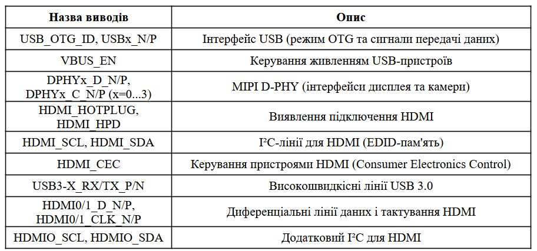
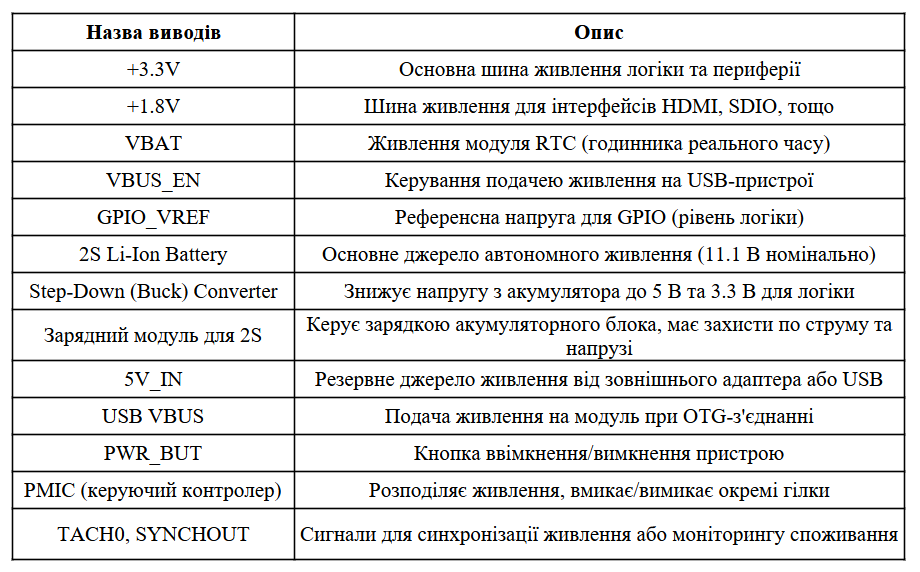
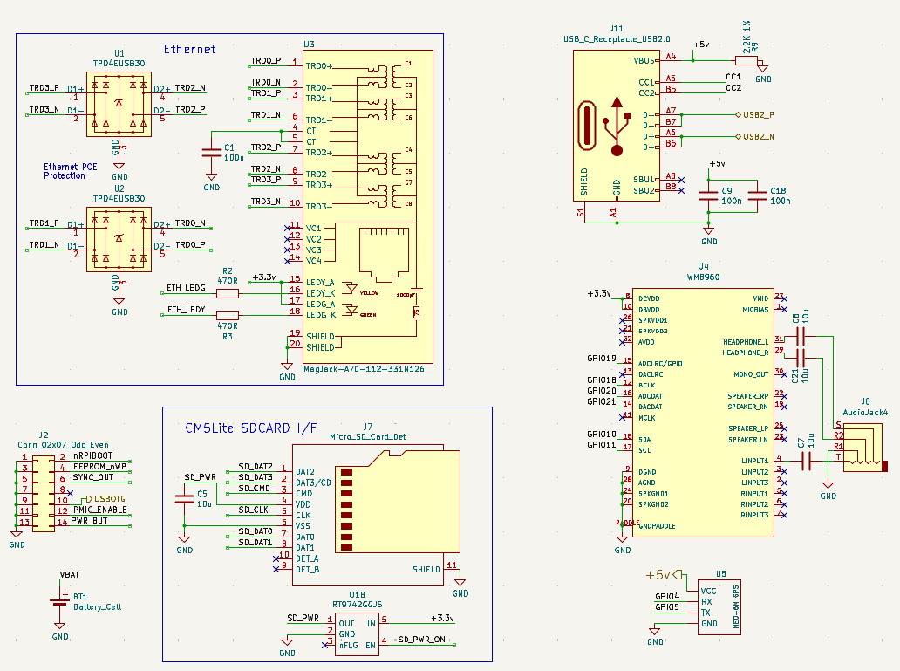
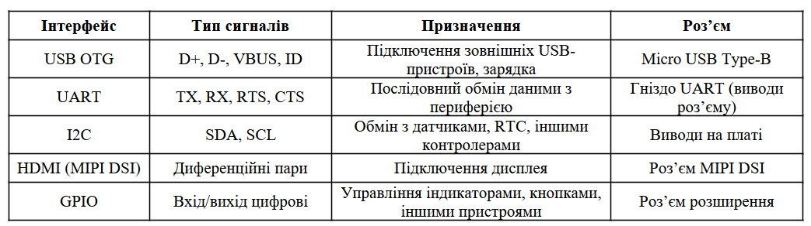
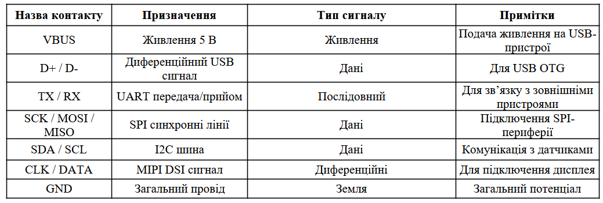
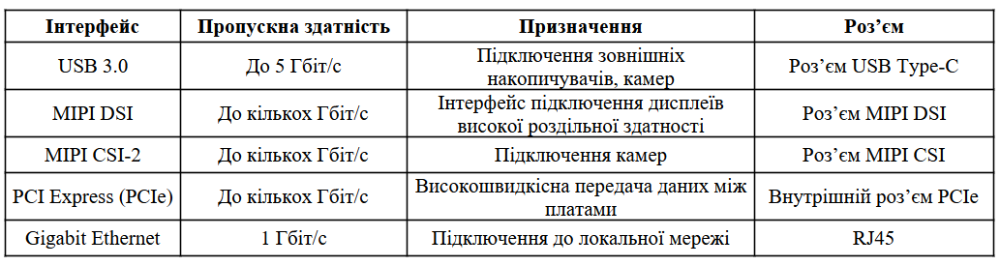
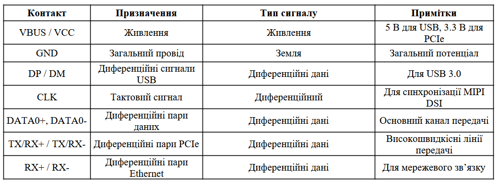
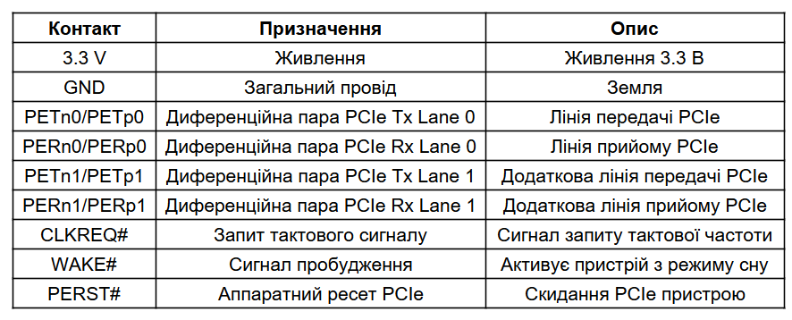

## Розробка електричної принципової схеми

В основі розроблюваної системи лежить процесорний модуль Raspberry Pi Compute Module 5. Цей модуль є центральним елементом, що забезпечує обробку даних та керування всіма функціями пристрою.

### Процесорний модуль та його інтерфейси:

Для розробки друкованої плати ніобхідно правильно викоритовувати ніжки процесорного модуля та розуміти його можливості. 

### Організація кола живлення

Надійна система живлення є критично важливою для стабільної роботи будь-якого електронного пристрою. Система живлення розроблена для роботи від зовнішнього джерела постійного струму та включає кілька етапів перетворення та стабілізації напруги.

Кола фільтрації та розв'язки:

По всій схемі розкидані конденсатори малої ємності (наприклад, 10n, 100n, 10u), які служать для блокування високочастотних шумів (decoupling capacitors) та згладжування пульсацій на лініях живлення поблизу мікросхем (C64, C65, C67, C68 поблизу U17). Це допомагає забезпечити стабільне та чисте живлення для чутливих цифрових та аналогових схем.

### Реалізація інтерфейсів та роз'ємів

Для забезпечення взаємодії автоматизованого портативного комплексу з зовнішніми пристроями застосовано низку апаратних інтерфейсів. Вибір конкретних типів інтерфейсів базувався на їх поширеності, енергоспоживанні та підтримці сучасними мікроконтролерами і процесорними модулями. Кожен інтерфейс реалізований через відповідні роз’єми та підключений до контролера через спеціалізовані сигнальні лінії, що дозволяє ефективно передавати дані, керувати пристроями і підключати додаткові модулі
>>> Analog Devices. Software-Defined Radio Handbook. [Електронний ресурс]. – Analog Devices, Inc. – Режим доступу: https://www.analog.com/media/en/technical-documentation/handbooks/SDR_Handbook.pdf
.

### Реалізація високошвидкісних інтерфейсів та роз'ємів

Для забезпечення високої пропускної здатності передачі даних у портативному комплексі використовуються високошвидкісні інтерфейси, які дозволяють передавати великі обсяги інформації з мінімальними затримками. Такі інтерфейси застосовуються для підключення дисплеїв, периферійних модулів, камер, а також для обміну даними з зовнішніми пристроями. Вибір інтерфейсів базується на стандартах, які підтримують сучасні процесорні модулі, та забезпечують надійний фізичний рівень передачі даних.

### Реалізація інтерфейсу M2

Інтерфейс M.2 (раніше відомий як Next Generation Form Factor, NGFF) є сучасним високошвидкісним роз’ємом, призначеним для підключення різноманітних модулів розширення, таких як SSD накопичувачі, модулі Wi-Fi, Bluetooth, LTE та інші периферійні пристрої. Інтерфейс підтримує різні протоколи передачі даних, зокрема PCI Express, SATA та USB, що забезпечує гнучкість у виборі та інтеграції компонентів.

M.2 має компактний форм-фактор, що дозволяє ефективно використовувати простір у портативних пристроях та ноутбуках, а також забезпечує високу швидкість передачі даних завдяки підтримці ліній PCIe 3.0 і вище.

### Загальна компоновка та 3D вигляд друкованої плати

Після розробки принципової електричної схеми наступним етапом є компоновка компонентів на друкованій платі (PCB) та її фізичне проектування. Цей підрозділ надає 3D вигляд розробленої плати, демонструючи розташування ключових функціональних блоків та роз'ємів, що забезпечує інтуїтивне розуміння фізичної реалізації пристрою.

<!-- Ключові елементи та їх розташування на платі:

Процесорний модуль (Compute Module 5):
    Розташований у верхній правій частині плати. Це центральний елемент, що підключається до системного роз'єму (SO-DIMM-подібний роз'єм). Його близьке розташування до високошвидкісних інтерфейсів (таких як HDMI, MIPI D-PHY, PCIe) мінімізує довжину доріжок, що критично для цілісності сигналу.

Роз'єми USB 3.0 (USB3):
    Два роз'єми USB 3.0 розташовані у верхній лівій частині плати. Це дозволяє зручно підключати зовнішні високошвидкісні периферійні пристрої, такі як накопичувачі або камери.

GPS-модуль (NEO-6M GPS):
    Розташований у центральній лівій частині плати. Ймовірно, це модуль UBLOX NEO-6M, що забезпечує функціональність визначення місцезнаходження. Його розташування на краю плати або в зоні з мінімальними перешкодами допомагає покращити прийом супутникового сигналу. Поруч, імовірно, знаходиться роз'єм для зовнішньої GPS-антени (маленький золотий роз'єм).

Кола живлення (Power In, Battery CR2032, Battery 6.2V):
    "Power In" (Barrel Jack): Розташований у нижній лівій частині плати. Це основний вхід для живлення пристрою від зовнішнього адаптера.
    "Battery CR2032": Тримач для батареї CR2032, ймовірно, для живлення годинника реального часу (RTC) процесорного модуля. Розташований біля роз'ємів USB3.
    "Battery 6.2V-24V": Гвинтові клеми або аналогічний роз'єм для підключення зовнішнього джерела живлення в діапазоні 6.2В-24В, що забезпечує гнучкість у виборі джерела живлення. Розташований у верхній центральній частині плати.
    Навколо цих роз'ємів розташовані компоненти, що відповідають за стабілізацію та фільтрацію живлення, як описано в підрозділі 2.2.

Інтерфейси Ethernet, HDMI, USB Device, SD Card:
    Ethernet: Роз'єм RJ45 для дротового мережевого підключення.
    HDMI: Роз'єм для підключення зовнішнього дисплея.
    Type-C: може використовуватися як для живлення, так і для підключення пристрою в режимі USB-пристрою (наприклад, для завантаження ОС або дебагування).
    SD Card: Слот для MicroSD-карти, що служить для зберігання операційної системи та даних.

M.2 M Key:
    Роз'єм M.2 M Key розташований у нижній правій частині плати. Це дозволяє підключати високошвидкісні NVMe SSD або інші сумісні M.2 модулі (наприклад, 4G/5G модеми), значно розширюючи можливості пристрою. -->

<!-- 
Висновок до розділу 2.3

Компоновка друкованої плати виконана з урахуванням оптимального розміщення компонентів для досягнення високої функціональності та надійності. Центральне розташування процесорного модуля та грамотне розміщення високошвидкісних інтерфейсів, таких як PCIe, HDMI та USB 3.0, є ключовим для забезпечення цілісності сигналу. Інтегровані рішення для живлення та захисту, а також підтримка широкого спектру периферійних інтерфейсів, роблять цю плату гнучким та потужним рішенням для різних вбудованих застосувань. Цей 3D вигляд наочно демонструє результати етапу розробки принципової електричної схеми та є основою для подальшого виробництва.
 -->
