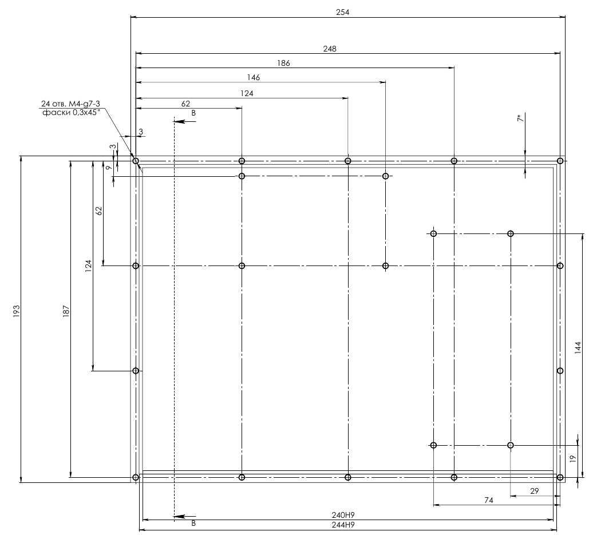
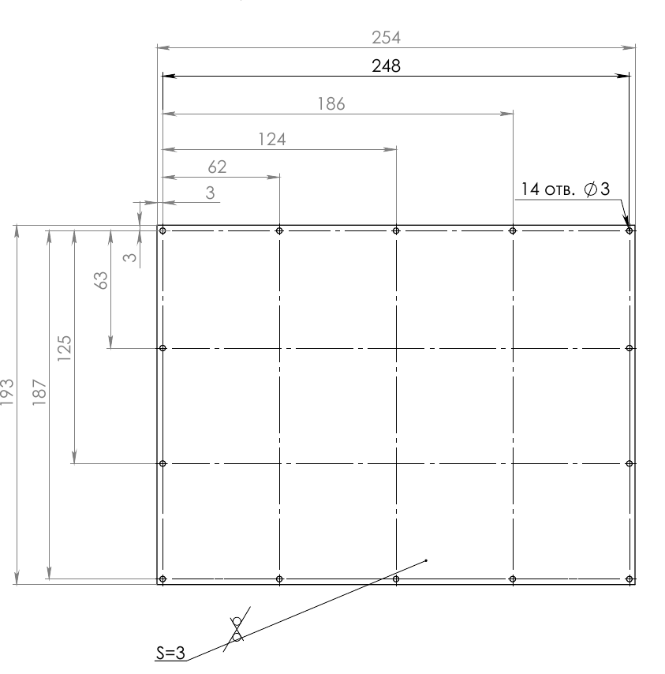
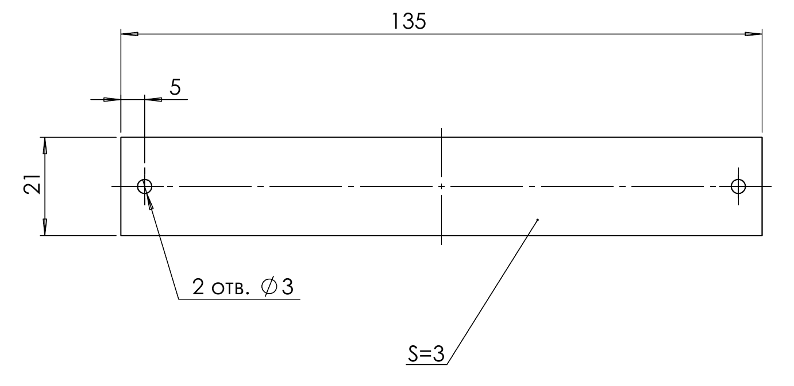

##  Розробка корпусу

Корпус є важливою складовою будь-якого електронного пристрою, оскільки забезпечує механічний захист внутрішніх компонентів від впливу зовнішнього середовища, пилу, вологи та механічних пошкоджень. Окрім захисної функції, корпус визначає ергономіку, зручність експлуатації, а також сприяє ефективному розміщенню та охолодженню елементів системи. Якісно спроєктований корпус дозволяє забезпечити надійність, довговічність і безпеку роботи пристрою в різних умовах.

Для створення корпусу було застосовано програмний комплекс [SolidWorks](https://www.solidworks.com/). Це CAD-система, яка дозволяє моделювати тривимірні об'єкти, здійснювати віртуальне компонування всіх деталей, перевіряти їхню взаємодію та вдосконалювати конструкцію ще до виготовлення прототипу. SolidWorks забезпечує оперативне внесення змін у проєкт, автоматичне формування виробничих креслень і виконання базового аналізу міцності, що суттєво підвищує точність і якість розробки корпусу.

## Висновок по розділу  2

В межах розділу виконано побудову структурної схеми, підбір та обґрунтування елементної бази, створення електричної принципової схеми й розробку конструкції корпусу пристрою.

На етапі розробки структурної схеми визначено основні функціональні вузли комплексу та їх взаємозв’язки. Сформовано архітектуру пристрою з центральним обчислювальним модулем, радіоприймачем, системами навігації, живлення, інтерфейсами введення-виведення, сенсорним дисплеєм і підсистемою збереження даних.

Особливу увагу приділено підбору елементної бази, оскільки саме вона визначає функціональність, енергоефективність, масштабованість і надійність системи. Зокрема:

* Радіомодуль BladeRF обрано за його широкий частотний діапазон, підтримку як прийому, так і передачі, відкритість ПЗ та здатність до роботи в польових умовах.
* Обчислювальний модуль Raspberry Pi Compute Module 5 забезпечує високу продуктивність, підтримку Linux, модульність та інтеграцію з різноманітними інтерфейсами, включно з GPIO, HDMI, USB і MIPI.
* GPS-модуль u-blox NEO-M8N надає підтримку кількох GNSS-систем, високу точність позиціонування та стабільність навіть у складних умовах прийому.
* SSD-диск M.2 SATA (наприклад, Transcend MTS420S 240GB) обрано для забезпечення швидкого зберігання ОС, даних спектрального аналізу та логів.
* Сенсорний дисплей Waveshare 10.1" HDMI забезпечує зручний багатоточковий інтерфейс користувача, просте підключення та високу роздільну здатність.
* Модуль живлення на базі 3S Li-Ion батарей із відповідною системою керування зарядом і захистом забезпечує автономну роботу пристрою в польових умовах.
* Материнська плата реалізована як багатошарова друкована плата з розведенням живлення, інтерфейсів та екрануванням, адаптована до складного середовища експлуатації.

Кожен компонент було обрано на основі порівняльного аналізу варіантів за технічними характеристиками, вартістю, наявністю підтримки, сумісністю та придатністю до автономного застосування. Комплекс характеризується відкритістю, гнучкістю та можливістю оновлення й модернізації.

На основі підібраної елементної бази створено детальну електричну принципову схему, що відображає логіку роботи та з’єднання всіх модулів системи. Окремо спроєктовано підсистему живлення, інтерфейси периферійних пристроїв, а також канали високошвидкісного обміну даними та інтерфейс M.2 для зберігання інформації.

У завершальній частині розділу виконано розробку корпусу пристрою, який відповідає вимогам до захисту від пилу, вологи, вібрацій та механічних навантажень. Враховано ергономічні параметри, теплообмін, доступ до портів і модульність внутрішнього компонування.

Загалом, проведена робота дозволила створити цілісну апаратну платформу для реалізації функціонального, портативного та енергоефективного комплексу аналізу радіосигналів з відкритою архітектурою.
