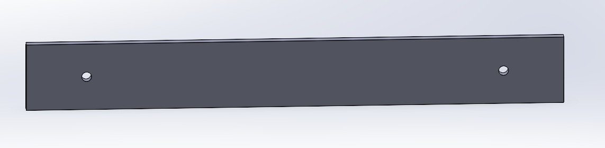

##  Розробка корпусу

Корпус є важливою складовою будь-якого електронного пристрою, оскільки забезпечує механічний захист внутрішніх компонентів від впливу зовнішнього середовища, пилу, вологи та механічних пошкоджень. Окрім захисної функції, корпус визначає ергономіку, зручність експлуатації, а також сприяє ефективному розміщенню та охолодженню елементів системи. Якісно спроєктований корпус дозволяє забезпечити надійність, довговічність і безпеку роботи пристрою в різних умовах.

Для створення корпусу було застосовано програмний комплекс [SolidWorks](https://www.solidworks.com/). Це CAD-система, яка дозволяє моделювати тривимірні об'єкти, здійснювати віртуальне компонування всіх деталей, перевіряти їхню взаємодію та вдосконалювати конструкцію ще до виготовлення прототипу. SolidWorks забезпечує оперативне внесення змін у проєкт, автоматичне формування виробничих креслень і виконання базового аналізу міцності, що суттєво підвищує точність і якість розробки корпусу.

### Деталі корпусу

1. Корпус 

2. Захисна кришка з органічного скла

3. Захисна кришка роз'ємів

Висновок по розділу 2.4

У цьому підрозділі було розглянуто процес проєктування корпусу пристрою, визначено основні вимоги до його конструкції та обґрунтовано вибір програмного забезпечення для 3D-моделювання. Використання SolidWorks дозволило створити ергономічний, захищений і технологічний корпус, що забезпечує надійне розміщення всіх компонентів системи та сприяє їхній безпечній експлуатації. Розроблені деталі корпусу відповідають вимогам міцності, зручності обслуговування та естетики, що є важливими для подальшого виготовлення та впровадження пристрою.

## Висновок по розділу  2

Розглянуто процес розробки автоматизованого портативного комплексу виявлення та аналізу радіосигналів (АПКВАР), що має на меті забезпечення надійного збору, обробки та збереження інформації в умовах відсутності стаціонарної інфраструктури.

На основі попереднього аналізу технічних вимог, прикладних сценаріїв використання та сучасних технологічних можливостей, було сформовано структурну схему комплексу, яка забезпечує логічну взаємодію основних компонентів: SDR-модуля для прийому та передачі радіосигналів, обчислювального ядра, сенсорного інтерфейсу, накопичувача даних, GPS-модуля, елементів живлення та бездротових модулів зв'язку. Розроблена схема дозволяє реалізувати гнучку та адаптивну архітектуру, орієнтовану на модульність і масштабованість системи.

Особливу увагу було приділено підбору елементної бази, що ґрунтувався на критеріях енергоефективності, продуктивності, сумісності та наявності відкритого програмного забезпечення. Як обчислювальну платформу обрано Raspberry Pi Compute Module 4, який забезпечує достатню потужність для виконання задач аналізу сигналів та зручну інтеграцію з іншими модулями. Для реалізації прийому та обробки радіосигналів обрано BladeRF 2.0 micro xA4 — як оптимальне рішення за критеріями частотного діапазону, якості обробки сигналу та підтримки професійного ПЗ.

Було розглянуто і обґрунтовано вибір інших критичних компонентів: GPS-модуля NEO-6M, SSD-накопичувача, антенного комплексу, акумуляторної системи живлення. Усі ці елементи забезпечують повну автономність, стабільність та функціональність роботи пристрою в польових умовах.

Таким чином, розділ 2 демонструє всебічно продуману технічну концепцію та обґрунтований підхід до побудови АПКВАР. Визначена структура та складові системи створюють надійну основу для подальшої розробки, тестування і практичного впровадження пристрою. Отримані результати дозволяють впевнено перейти до наступних етапів — прототипування, оптимізації та впровадження комплексу в реальні умови експлуатації.