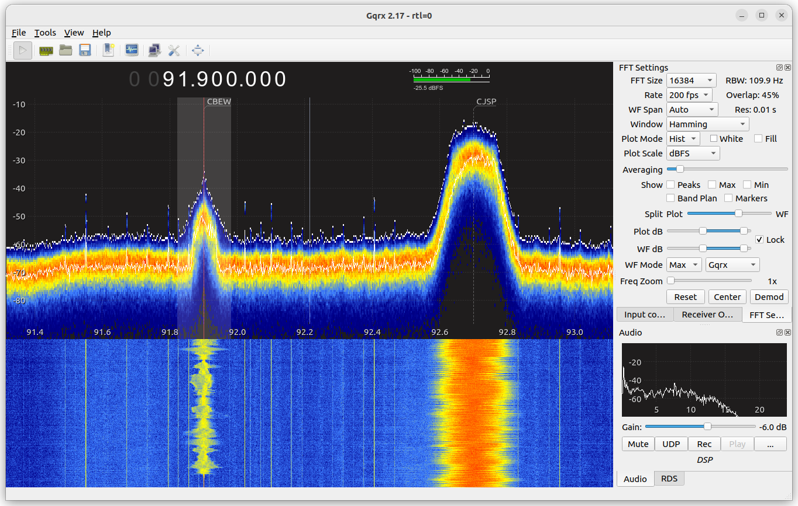
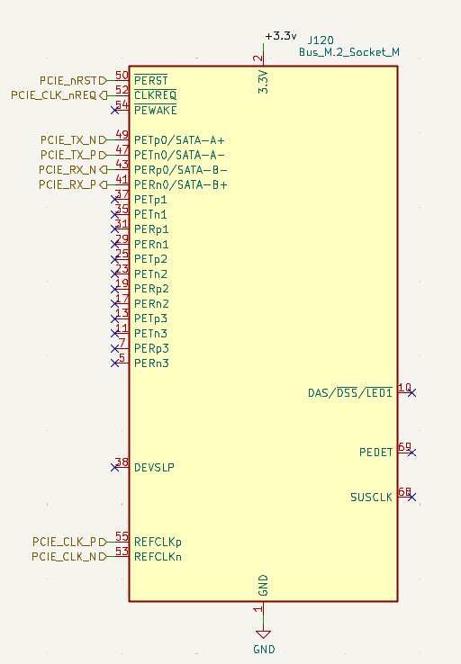
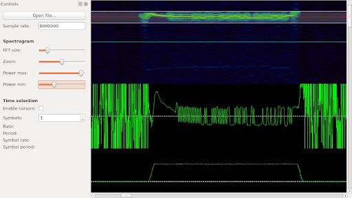
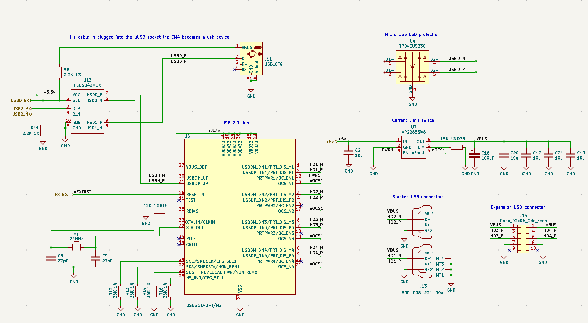
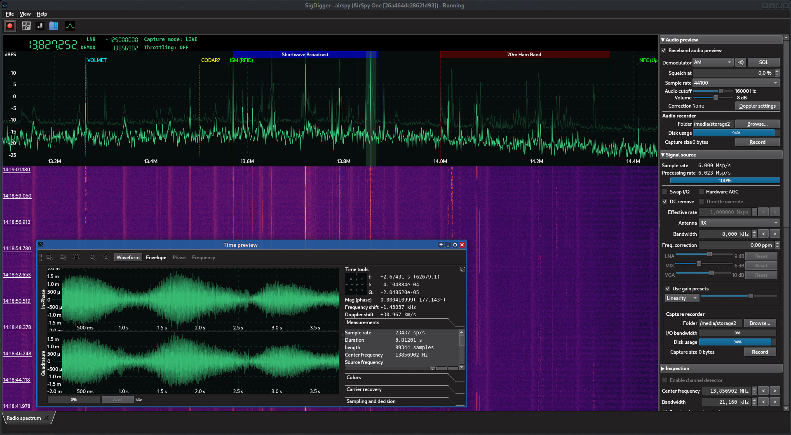
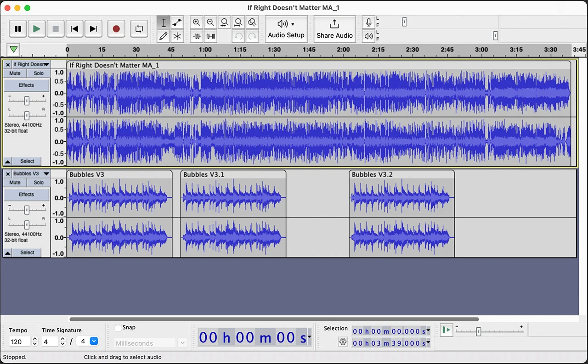

# **МЕТОДОЛОГІЯ РОБОТИ АПКВАР**

У цьому розділі розглядаються основні підходи, інструменти та принципи, що використовуються при розробці та дослідженні автоматизованої програмно-керованої варіантної радіосистеми (АПКВАР). Описано вибір апаратних і програмних засобів, методи збору, обробки та аналізу даних, а також обґрунтовано застосування сучасних технологій, таких як SDR і алгоритми штучного інтелекту. Особлива увага приділяється практичним аспектам реалізації системи, що забезпечують її гнучкість, масштабованість і надійність у різних умовах експлуатації.

## Загальні принципи роботи SDR

Програмно-визначуване радіо (SDR, Software-Defined Radio)
>>> Tranter, W. H., Reed, J. H., Fette, B. A. Software Defined Radio: Enabling Technologies. Hoboken : Wiley-Interscience, 2008. 416 p.
є новітньою концепцією в галузі радіозв’язку, що дозволяє виконувати більшість функцій традиційного радіоприймача програмними засобами. Головний принцип — перетворення аналогового сигналу в цифровий одразу після приймання та подальшій обробці цього сигналу програмно, що забезпечує виняткову гнучкість системи.

Сучасні SDR-системи складаються з високошвидкісного аналого-цифрового перетворювача (АЦП), цифрового сигнального процесора (DSP), комп’ютера або мікроконтролера та ПЗ обробки сигналів. Це дозволяє змінювати параметри приймання та обробки сигналу, такі як частота, тип модуляції, смуга пропускання та інші, без втручання в апаратну частину системи
>>>Couch, L. W. Digital and Analog Communication Systems. 8th ed. Boston : Pearson, 2013. 736 p.
.

У праці 
>>> Mahmoud S. A., Ismail A. A., Elhoseny M. et al. Software defined radio: operation, challenges and possible solutions \[Електронний ресурс] // International Journal of Communication Networks and Information Security. — 2016. — Т. 8, № 3. — Режим доступу: https://www.researchgate.net/publication/309777143
підкреслюється, що одним з головних викликів при реалізації SDR є необхідність використання надшвидких процесорів, здатних обробляти в реальному часі великі обсяги цифрової інформації. Також важливу роль відіграє точність АЦП та вибір аналогового фронтенду — першого каскаду приймання сигналу.

Апаратні платформи SDR
>>> Mitola, J. Software Radios: Architecture, Systems and Functions. New York : Wiley, 2000. 576 p.

Найбільш поширеною платформою для побутового та дослідницького використання є RTL-SDR — недорогий USB-тюнер на базі мікросхеми RTL2832U. Цей пристрій здатен приймати сигнали в діапазоні від 24 МГц до 1766 МГц. Завдяки відкритим драйверам та підтримці великої кількості програмного забезпечення (наприклад, SDR# або GQRX), RTL-SDR знайшов широке застосування у багатьох проєктах.

У дослідженні 
>>> Khan S., Anjum M., Masood A. Receiving ADS-B Signals on Embedded Linux using RTL-SDR: A Practical Guide \[Електронний ресурс] // Frontiers in Computer and Information Science. — 2022. — Т. 2, № 2. — Режим доступу: https://drpress.org/ojs/index.php/fcis/article/view/14059
було описано використання RTL-SDR на вбудованій Linux-системі для прийому сигналів авіаційної служби спостереження ADS-B. Автори навели практичні аспекти конфігурації та прийому, що є цінним для розробників портативних систем спостереження.

Іншою поширеною платформою є HackRF One — одноканальний SDR трансивер з діапазоном частот від 1-6 гіга герц. Його відкритий дизайн дозволяє глибоку модифікацію як на рівні прошивки, що робить його привабливим для науковців і розробників військових рішень.

Техніки приймання слабких сигналів

Однією з переваг SDR є можливість ефективного приймання слабких сигналів за умов наявності сильних перешкод. У роботі
>>> McFarlin D. Weak Signal Reception Using Software Defined Radios and a Two-Element Antenna Array \[Електронний ресурс] : дис. ... M.Sc. — Auburn University, 2009. — Режим доступу: https://holocron.lib.auburn.edu/handle/10415/613
досліджено використання двоелементного антеного масиву у поєднанні з адаптивними алгоритмами цифрової обробки сигналів для покращення співвідношення сигнал/шум. Запропонована система продемонструвала здатність до просторового фільтрування сигналів та зменшення впливу завад.

Цей підхід особливо актуальний у військових системах зв’язку, де часто необхідно приймати сигнали зі слабкою потужністю на фоні активного радіоелектронного протиборства.

SDR як засіб тестування вразливостей

Завдяки широкому діапазону частот та можливості генерувати сигнали, SDR використовується також для тестування захищеності радіосистем. У статті 
>>> Zhang Y., Zhao J., Zhang W. GPS Signal Reception and Spoofing Based on Software-Defined Radio Devices // ResearchGate. — 2023. Vol. 10, No. 7.  — DOI: https://10.1109/RIVF55975.2022.10013839
представлено реалізацію атаки типу spoofing на GPS-приймач з використанням SDR-пристрою. За допомогою генерації синтетичних GPS-сигналів дослідники змогли обдурити навігаційний модуль пристрою Android, змусивши його визначити фальшиве місцеположення.

Цей приклад показує як SDR може застосовуватись не лише для приймання сигналів, а й для їх аналізу, генерації та модифікації з метою підвищення безпеки систем навігації.

Інтеграція SDR з елементами штучного інтелекту

Сучасні дослідження активно впроваджують машинне навчання в SDR-системи. У публікації 
>>> Mihai C., Gontean A., Rusu C. Signals Intelligence System with Software-Defined Radio // Applied Sciences. — 2023. — Vol. 13, No. 8. — DOI: https://doi.org/10.3390/app13085199
описано систему інтелектуального аналізу сигналів, що здатна автоматично визначати протокол кодування за допомогою ШІ. Для цього було використано хмарну інфраструктуру Microsoft Azure, що забезпечило масштабованість та високу продуктивність.

Використання методів штучного інтелекту дає змогу автоматизувати аналіз спектра радіочастот і виявлення нетипових сигналів, що особливо важливо для задач радіоелектронної протидії або оперативного моніторингу ефіру.

Приклад застосування: аналіз Wi-Fi сигналів

Технологія SDR також може використовуватись для вивчення сигналів побутових бездротових систем. У дослідженні 
>>> Kumar R., Prasad M. Analysis of Wi-Fi Signal Transmission and Reception Using Software-Defined Radio \[Електронний ресурс] // International Journal of Multidisciplinary Research. — 2022. — Режим доступу: https://www.multiresearchjournal.com/admin/uploads/archives/archive-1743160648.pdf
описано методику аналізу потужності Wi-Fi сигналу при наявності різних фізичних перешкод. Було встановлено, що тіло людини значною мірою впливає на стабільність з’єднання, особливо при використанні спрямованих антен.

У статті також було вивчено ефективність односторонньої передачі даних в умовах обмеженого покриття, що може бути корисним у створенні енергоефективних мереж для IoT-пристроїв.

Висновки до розділу

SDR є потужним інструментом для побудови гнучких і адаптивних систем зв’язку. Завдяки програмній реалізації основних функцій приймання та обробки сигналу, SDR дає можливість створювати пристрої з широким спектром можливостей: від простого радіоприймача до складної системи аналізу ефіру з використанням штучного інтелекту. Застосування SDR у військових, наукових та побутових системах підтверджує його універсальність та перспективність.

## Приймання та обробка радіосигналів за допомогою технології SDR

Загальні принципи роботи SDR

Програмно-визначуване радіо (SDR, Software-Defined Radio) — це концепція, яка передбачає реалізацію основних функцій радіоапаратури за допомогою програмного забезпечення. Традиційні радіоприймачі використовують апаратні фільтри, модулятори та демодулятори. У SDR більшість цих функцій виконується програмно після оцифрування можлиовстями АЦП.

Основні складові SDR-системи.

* Аналоговий фронтенд: приймає сигнал з ефіру і подає його на АЦП.
* АЦП: перетворює аналоговий сигнал у цифрову форму.
* Цифровий сигнальний процесор (DSP) або ЦП/ГП комп’ютера: виконує фільтрацію, демодуляцію, декодування.
* Програмне забезпечення: забезпечує візуалізацію, обробку та збереження сигналів.

Програмне забезпечення для обробки SDR-сигналів

Для повноцінної роботи з SDR використовуються різні програми, які мають широкий функціонал і застосовуються для різних задач: спостереження за спектром, демодуляції, запису, декодування цифрових протоколів, аналізу тощо.

[SDR#](https://airspy.com/download/) — популярна Windows-програма обробки сигналу SDR.

* Спектр та waterfall.
* AM, FM, SSB, CW, WFM, NFM демодуляція.
* Плагіни: декодування AIS, ADS-B, TETRA, DMR тощо.
* Запис сигналів у WAV/IQ форматах.
* Підтримка вбудованих фільтрів, зміщення частоти, автоналаштування.

[GQRX](https://www.gqrx.dk/) — кросплатформний SDR-інтерфейс на базі GNU Radio для Linux/macOS.

* Графічний інтерфейс з FFT/Waterfall.
* AM/FM/SSB/CW/RAW демодуляція.
* Запис аудіо та IQ-даних.
* Підтримка RTL-SDR, HackRF, USRP, BladeRF, PlutoSDR тощо.

[GNU Radio](https://www.gnuradio.org/) — фреймворк для створення SDR-додатків у вигляді графічного середовища (GRC)
>>> Blossom, E. GNU Radio: Tools for Exploring the Radio Frequency Spectrum. // Linux Journal. – 2004. – Vol. 2004, No. 122. – [Електронний ресурс]. – Режим доступу: https://www.linuxjournal.com/article/7505
.

* Побудова потоку обробки сигналу з блоків: джерело, фільтр, демодулятор, декодер.
* Підтримка мови Python для користувацької логіки.
* Застосовується для наукових, військових, комерційних задач.
* Можливість симуляції складних систем (MIMO, фазовий масив, модуляція QAM, OFDM тощо).

[Universal Radio Hacker](https://github.com/jopohl/urh) — інструмент для аналізу цифрових протоколів.

* Захоплення, перегляд, декодування і повторна передача сигналів.
* Аналіз бітових послідовностей, протоколів (манчестер, NRZ, ASK, OOK).
* Підтримка багатьох SDR пристроїв.

[Inspectrum](https://github.com/miek/inspectrum) — програма для аналізу IQ-сигналів.

* Розширене відображення спектру та фазового простору.
* Можливість розмітки імпульсів і виявлення манчестерського кодування.
* Застосовується для реверс-інжинірингу радіопротоколів.

<!-- [SDR++](https://github.com/AlexandreRouma/SDRPlusPlus) — легкий, мультиплатформний SDR клієнт.

* Працює під Windows, macOS, Linux.
* Підтримка декількох SDR одночасно.
* Швидкий спектрограф, підтримка плагінів.

 -->

<!-- [SigDigger](https://batchdrake.github.io/SigDigger/) — аналітична SDR-програма з підтримкою широкого спектру сигналів.

* FFT, демодуляція, запис.
* Підтримка векторного аналізу та власних демодуляторів.

 -->

Audacity та інші звукові редактори

Для аналізу та обробки демодульованого сигналу у форматі WAV використовують звукові редактори, наприклад [Audacity](https://www.audacityteam.org/).

* Розгортка сигналу по часу.
* Спектральний аналіз.
* Виділення, вирізання, фільтрація підсигналів.

Обробка сигналу в SDR-системах відбувається поетапно: спочатку здійснюється приймання сигналу з ефіру з вибором необхідної частоти та смуги пропускання, після чого аналоговий сигнал перетворюється в цифровий (IQ-дані) за допомогою АЦП. Далі проводиться попередня обробка — фільтрація (наприклад, низькочастотна або смуговапропускна), усунення частотного зміщення та нормалізація амплітуди. Після цього демодуляція відповідно до типу сигналу (AM, FM, SSB, FSK, QAM, PSK) для виділення корисної інформації — аудіо або даних. Після цього дані декодуються: бітові потоки інтерпретуються у вигляді пакетів чи протоколів, які можуть бути представлені у текстовому або графічному форматі. Завершальним етапом є аналіз і зберігання результатів — збереження IQ-даних або аудіо для подальшої обробки, побудова спектрограм, логів чи діаграм для детального аналізу сигналів.

Обробка сигналів, отриманих через SDR, є гнучким, адаптивним процесом, що може бути автоматизований і масштабований. Завдяки розвинутому набору інструментів, користувач може аналізувати ефір у реальному часі, виявляти цифрові сигнали, тестувати протоколи, а також здійснювати зворотну інженерію. SDR — це інструмент не лише для спостереження, а й для глибокого розуміння принципів роботи сучасних радіосистем.

## Висновок по розділу 3

У цьому розділі було розглянуто ключові методологічні підходи до розробки та дослідження автоматизованих програмно-керованих варіантних радіосистем із використанням SDR. Описано апаратні платформи, програмне забезпечення та сучасні техніки приймання й обробки сигналів, включаючи інтеграцію алгоритмів штучного інтелекту. Наведені приклади практичного застосування SDR у різних сферах — від аналізу Wi-Fi до тестування вразливостей GPS — демонструють універсальність і гнучкість цієї технології. Використання SDR забезпечує масштабованість, адаптивність і можливість швидкої модернізації систем зв’язку, що є критично важливим для сучасних наукових, військових та побутових задач. Таким чином, SDR виступає фундаментальним інструментом для побудови інноваційних радіосистем нового покоління.