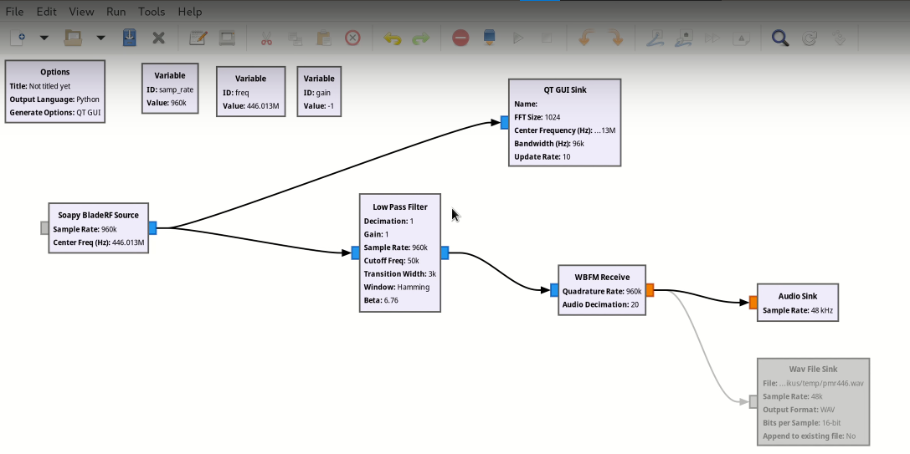
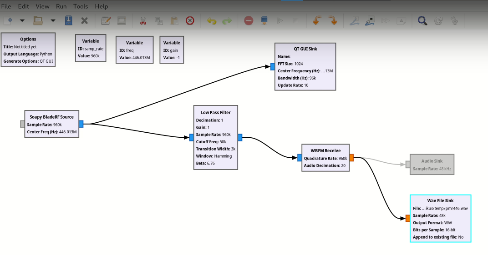

# **Експеремент/результат дослідження**

<!-- дякую автору https://www.youtube.com/watch?v=IaThnn2r1no -->

## Прийом радіосигналу аналогової рації

Обладнання:

* Джерело сигналу - рація Baofeng
* Приймач сигналу - BladeRF
* Обробник сигналу - GNU Radio

**Baofeng ключові технічні характеристики та функціонал**
Більшість моделей Baofeng мають схожі базові характеристики, але є і відмінності. Зазначте їх узагальнено, а потім можете додати приклади.

**Діапазони частот:**

* Переважно **дводіапазонні** (Dual Band) рації, що працюють у **VHF** (136-174 МГц) та **UHF** (400-520 МГц) діапазонах. Це дозволяє використовувати їх для різних цілей та з різними типами інших радіостанцій.
* Деякі моделі підтримують також прийом FM-радіо (для розваги).
* **Вихідна потужність:** Зазвичай від 1 до 8 Вт. Потужність впливає на дальність зв'язку. Важливо зазначити, що рекламована потужність не завжди відповідає фактичній, але навіть 5 Вт достатньо для більшості аматорських та побутових потреб.
* **Модуляція:** **FM (частотна модуляція)** – стандарт для портативних рацій, забезпечує гарну якість звуку.
* **Кількість каналів:** Зазвичай від 128 до 200 каналів, що програмуються, дозволяючи зберігати багато різних частот.
* **Функціональні особливості:**
* **Два канали одночасно (Dual Watch/Dual Receive):** Можливість одночасного моніторингу двох частот.
* **VOX (Voice Operated eXchange):** Активація передачі голосом, без натискання кнопки PTT.
* **CTCSS/DCS (Tone Squelch):** Кодовий шумоподавлювач, що дозволяє фільтрувати небажані сигнали і чути тільки абонентів своєї групи.

**1. Налаштування програми GNU Radio для прослуховування:**

* Встановлюються параметри, такі як частота (на прикладі 446.13 МГц) та частота дискретизації (Sample Rate).
* Посилення (Gain) встановлено на мінімальне значення (-1).
* Використовується блок Osmocom Source з параметрами, адаптованими для конкретного SDR-приймача (BladeRF).
* Для візуалізації спектра використовується блок GUI Sink.

**2. Налаштування для прослуховування через аудіосистему комп'ютера:**

* Для виведення звуку на комп'ютер необхідно додати блоки обробки аудіо.
* Встановлення фільтра низьких частот (Low Pass Filter) для виділення потрібного каналу.
    * Встановлення параметри фільтра: Sample Rate, Cutoff Frequency (на прикладі 50 кГц) та Transition Width (на прикладі 3 кГц).
* Додаємо блок FM Demod для демодуляції FM-сигналу.
    * Параметри FM Demod: Sample Rate та Audio Decimation.
* Використовуємо блок Audio Sink для виведення звуку на аудіосистему.
    * Встановлення Sample Rate аудіовиходу (на прикладі 48 кГц).

**3. Запис ефіру у файл:**

* Для запису ефіру блок Audio Sink вимикається.
* Замість нього вмикається блок Wave File Sink.
* Вказується шлях до файлу для збереження, кількість каналів (1 для моно) та Sample Rate (48000 Гц).

Висновок

У ході експерименту було успішно прийнято та оброблено аналоговий радіосигнал за допомогою SDR-приймача BladeRF та програмного забезпечення GNU Radio. Проведено налаштування параметрів прийому, демодуляції та виводу аудіосигналу, а також здійснено запис ефіру у файл. Отримані результати підтверджують можливість використання SDR для аналізу та обробки аналогових радіосигналів, а також демонструють гнучкість та функціональність сучасних цифрових систем радіоприйому.

Цікавий задум! Якщо ми плануємо експеримент з прийому супутникових зображень за допомогою **WebSDR**, наш план буде дещо відрізнятися від того, що показано у відео, оскільки ми не будемо фізично підключати обладнання та встановлювати спеціалізоване ПЗ для керування радіо. WebSDR вже надає нам доступ до радіо з антеною.

Ось адаптований план експерименту:

<!-- дякую https://www.youtube.com/watch?v=cjClTnZ4Xh4 -->

##  Прийом супутникових зображень

Обладнання

* **[WebSDR](http://websdr.org/):**  який має можливість прийому на частотах метеорологічних супутників. Важливо, щоб обраний WebSDR мав **антену Double Cross** або іншу антену з круговою поляризацією для кращого прийому.
* **Програмне забезпечення:**
    * **SDR#** (SDRSharp) – ці програми не підключатимуться до WebSDR напряму, але ми використовуватимемо їх для **демодуляції аудіосигналу** з WebSDR.
    * **[LRPTDecoder](https://www.rtl-sdr.com/m2_lrpt_decoder-version-59-released/)** – для декодування сигналу.
    * **Orbitron** або **Gpredict** – програми для відстеження супутників і прогнозування їх проходження над нашим місцезнаходженням.
    * **Віртуальний аудіокабель** [VB-Cable](https://vb-audio.com/Cable/) – програма для перенаправлення аудіо з браузера (де працює WebSDR) до програм декодування (LRPTDecoder).
* **Супутник:**
    * **[NOAA 15, 18, 19](https://uk.wikipedia.org/wiki/NOAA-19):**

**1. Підключення до WebSDR та захоплення сигналу**

1.  **Вибір WebSDR:** Ми знайдемо відповідний WebSDR. Шукатимемо в пошуку за запитом "WebSDR 137 MHz" або "WebSDR NOAA Meteor". Переконаємося, що він активний та має хорошу антену.
2.  **Відстеження супутника:** Запустимо **[Orbitron](https://www.stoff.pl/)**. Введемо наші координати та додамо TLE-дані для NOAA 15/18/19 . Програма покаже нам час проходження супутників над зоною покриття WebSDR.
3.  **Налаштування WebSDR:** За кілька хвилин до проходження супутника налаштуємо частоту WebSDR на відповідну частоту супутника 137.9125 МГц . Використовуватимемо **режим NFM** (narrowband FM) для NOAA та **широкосмуговий FM** (WFM) або **пряме захоплення IQ-сигналу** (якщо WebSDR це підтримує) для Meteor M2.
4.  **Запис аудіосигналу:** Під час проходження супутника записуватимемо аудіосигнал з WebSDR. Якщо WebSDR має функцію запису, використаємо її. В іншому випадку, нам потрібно буде перенаправити аудіо з браузера через **Віртуальний аудіокабель** в програму запису аудіо Audacity.

**2. Декодування зображення**

* Відкриємо LRPTDecoder.
* Якщо ми записували аудіофайл, конвертуємо його в потрібний формат за допомогою SDR#.
* Завантажимо файл до LRPTDecoder.
* Запустимо процес демодуляції та декодування. LRPTDecoder створить зображення.

Висновок:

У ході експерименту було успішно прийнято та декодовано супутникове зображення за допомогою WebSDR та спеціалізованого програмного забезпечення. Використання WebSDR дозволило отримати сигнал без необхідності власного радіообладнання, а програмні інструменти забезпечили обробку та декодування даних у зображення. Результати підтверджують ефективність дистанційного прийому супутникових сигналів і демонструють доступність сучасних SDR-технологій для аматорських досліджень у сфері радіозв'язку та супутникової метеорології.

## Висновок по розділу 4

У цьому розділі було розглянуто практичні аспекти роботи з SDR (Software Defined Radio) для прийому та обробки аналогових і супутникових радіосигналів. Проведені експерименти показали, що SDR-платформи забезпечують гнучкість, універсальність і доступність для дослідників та аматорів. Відсутність необхідності у спеціалізованому апаратному забезпеченні (завдяки WebSDR) значно спрощує процес отримання та аналізу сигналів. Використання сучасного програмного забезпечення дозволяє не лише приймати сигнали, а й виконувати їхню демодуляцію, декодування та подальшу обробку. Таким чином, SDR-технології відкривають широкі можливості для експериментів у сфері радіозв'язку, навчання та досліджень, а також сприяють популяризації радіоелектроніки серед широкого кола користувачів.