Вступ
=====

У сучасних умовах стрімкого розвитку технологій, створення універсальних
портативних комп'ютерних комплексів (КПК) стає важливим завданням. Такі
пристрої повинні відповідати вимогам сучасності, забезпечуючи високу
продуктивність, надійність та здатність працювати в екстремальних
умовах. Вони мають швидко адаптуватися до змін ситуації, що є критично
важливим у багатьох сферах, включаючи військову, рятувальну та
дослідницьку діяльність.

Основною метою цього дослідження є розробка компактного та
багатофункціонального КПК, який зможе виконувати широкий спектр завдань
у польових умовах. Такий пристрій повинен забезпечувати автономність
роботи, що дозволить використовувати його у віддалених місцях без
доступу до стаціонарної інфраструктури. Крім того, важливим аспектом є
зручність використання та можливість швидкого налаштування під конкретні
потреби.

Особливістю розроблюваного КПК є використання відкритих технологій та
програмного забезпечення. Це дозволяє забезпечити високий рівень безпеки
даних, оскільки користувач отримує повний контроль над функціональністю
пристрою. Такий підхід також зменшує ризики кібератак, що є важливим
фактором у сучасному світі, де інформаційна безпека відіграє ключову
роль. Крім того, відкриті технології сприяють довготривалій експлуатації
пристрою, оскільки вони дозволяють легко оновлювати та модифікувати
систему.

Запропонований КПК має широкий спектр застосувань. У військовій сфері
він може використовуватися для оперативного планування, аналізу даних та
координації дій. У надзвичайних ситуаціях пристрій стане незамінним
інструментом для забезпечення комунікації та координації дій у разі
відсутності стаціонарної інфраструктури. Крім того, КПК може бути
корисним для операторів дронів, зв'язківців та інших спеціалістів, які
потребують надійного інструменту для виконання своїх завдань.

**Аналітичний огляд існуючих портативних комплексів виявлення та аналізу радіосигналів**
========================================================================================

У цьому розділі розглядаються сучасні портативні комплекси для
виявлення, аналізу та обробки радіосигналів, що використовуються для
моніторингу, тестування та дослідження у сфері радіозв'язку. Особлива
увага приділяється програмно-визначуваним радіостанціям (SDR), які
забезпечують гнучкість, багатофункціональність та можливість роботи у
широкому діапазоні частот.

Опис технологій
---------------

Програмно-визначуване радіо (SDR, Software Defined Radio) --- це підхід,
при якому більшість функцій традиційного радіоапаратного забезпечення
(наприклад, фільтрація, демодуляція, обробка сигналу) реалізується
програмно, а не апаратно. Це дозволяє змінювати режими роботи пристрою,
підтримувати різні протоколи та стандарти без необхідності заміни
апаратної частини. Основні переваги SDR:

-   Універсальність --- можливість роботи з різними типами сигналів та
    протоколів.
-   Гнучкість --- швидка зміна налаштувань, частот, режимів роботи через
    програмне забезпечення.
-   Компактність і портативність --- сучасні SDR-пристрої мають невеликі
    розміри та можуть працювати автономно.
-   Масштабованість --- можливість оновлення функціоналу шляхом зміни
    або доповнення програмного забезпечення.
-   Широкий спектр застосування --- від моніторингу стільникових мереж і
    аналізу бездротових протоколів до тестування безпеки, наукових
    досліджень та навчання.

SDR-комплекси дозволяють здійснювати прийом, аналіз, запис, відтворення
та передачу радіосигналів у широкому частотному діапазоні, що робить їх
незамінними інструментами для фахівців у сфері радіозв'язку,
радіоаматорів, дослідників та інженерів.

### Радіостанція Hack RF One Portapack H4 Mayhem SDR 1 МГц -- 6 ГГц.

Програмно-визначувана радіостанція HackRF One з додатковим модулем
PortaPack H4 та програмним забезпеченням Mayhem -- універсальне
портативне рішення для роботи, передачі і аналізу радіосигналів в
широкому діапазоні частот. Цей пристрій створено на відкритому вихідному
коді та володіє великим спектром застосування: моніторинг стільникових
мереж, аналіз бездротових протоколів, програмування та експлуатація
радіочастот, тестування безпеки бездротових мереж і багато іншого
[HackRF One
!](https://fd24.com.ua/ua/p1044872164-sdr-radiostantsiya-antennami.html?source=merchant_center&gad_source=1&gad_campaignid=16695681573&gbraid=0AAAAACqF10_-rY4lJZlaJmtpxI3HFCwSQ&gclid=CjwKCAjw56DBBhAkEiwAaFsG-tMrTVbThssU7Zpa5kQyvDk9m0I4ZMkaidrQvP96XgwxpQHuhkZQ7RoCglAQAvD_BwE).

Оновлений модуль PortaPack H2 додає до функціоналу HackRF One кольоровий
сенсорний дисплей, навігаційні кнопки і енкодер для керування. А
встановлене програмне забезпечення Mayhem розширює можливості аналізу,
експлуатації та тестування бездротових мереж.

На відміну від попередньої версії, H4 володіє покращеним матовим
екраном, портом GPIO для додаткових аксесуарів, екранів та датчиків.
Також переробленою системою живлення: один перемикач вкл/викл живлення;
покращеною архітектурою керування батареєю: швидкою зарядкою через
Type-C; відсутністю витоку живлення і розрядки акумулятора.

Вбудований повзунковий перемикач для швидкого перемикання між внутрішнім
і зовнішнім мікрофоном/навушниками. Новий вбудований мікрофон дозволить
використовувати H4 в якості повноцінного голосового приємопередавача.

Характеристики

-   Версія: v2.0.2
-   Робота в режимі: напівдуплекс
-   Діапазон частот: 1 МГц -- 6 ГГц
-   Підтримувана частота дискретизації: від 2 до 20 млн семплів в
    секунду
-   Програмно-керуючий смуговий фільтр на прийом і передачу
-   Програмно-контрольоване живлення антенного порта (до 50 мА на 3.3 В)
-   Сенсорний кольоровий РК-екран з діагоналлю 3.2"
-   Вбудований динамік
-   Зручні кнопки для програмування
-   Роз'єм антени: SMA-мама
-   Роз'єм для навушників/мікрофона: 3.5 мм
-   Роз'єм GPIO для підключення
-   Живлення: вбудований акумулятор, ємністю 2500 мАг
-   Матеріал корпусу: АВС-пластик
-   Розміри: 8 x 12.5 x 2.5 см

### Радіостанція Libre SDR PLUTO з Zynq 7020 70 МГц -- 6 ГГц.

LibreSDR є аналогом популярного SDR-модуля ADALM-PLUTO (або PlutoSDR),
який зроблений у металевому корпусі для ефективнішого розсіювання тепла
та міцності[LibreSDR
!](https://fd24.com.ua/ua/p2465955107-sdr-radiostantsiya-antennami.html).

Пристрій спроєктований на друкованій платі з використанням 8-бітної
мікросхеми ЦАП. На самій платі містяться наступні роз'єми:

-   два коаксіальні роз'єми MMCX (мама) для інтерфейсів синхронізації 1
    PPS і 10 МГц;
-   роз'єм RJ-45 для інтерфейсу Gigabit Ethernet, через який
    відбувається передавання IQ-складників сигналу та доступ у консоль
    вбудованої ОС Linux;
-   два роз'єми Type-C (OTG і Debug):
    -   OTG для доступу в консоль вбудованої Linux з послідовного порту
    -   Debug для налагодження та завантаження вбудованого ПЗ засобами
        Xilinx через інтерфейс JTAG
    -   обидва роз'єми також використовуються для живлення LibreSDR
-   роз'єм MicroSD;
-   4 коаксіальні роз'єми SMA (мама) для двох приймальних і двох
    передавальних каналів.

Також на пристрої є прихована кнопка DFU для відновлення заводського
вбудованого ПЗ. У LibreSDR інтегрований радіочастотний трансивер AD9363.

Характеристики

-   Використання чіпа XC7Z020-2CLG400I xc7z020-2I
-   Чип AD9363 налаштований на використання чипа AD9361 з діапазоном
    частот 70 МГц \~ 6 ГГц
-   Канали: 2 TX, 2 RX
-   Розрядність ЦАП/АЦП: 12 біт
-   Діапазон частот: 70 МГц -- 6 ГГц
-   Вихідна частота: VCTCXO 40 МГц 0.5 стор./хв
-   SOC: для Zynq7010 FPGA: 28 Кб
-   ОЗП: 512 Mб
-   FLASH: 32 Mб
-   USB: 2.0, підтримка OTG
-   Ethernet: 1000 Mб
-   MicroSD можна використовувати для завантаження
-   Вхід постійного струму: 5 В, 2 А, MicroUSB
-   Підтримка дуплексів: TDD, FDD
-   Смуга пропускання: від 200 кГц до 20 МГц
-   Матеріал: алюміній
-   Розмір: 11.3 х 7.2 х 3 см
-   Вага: 565 г

### Радіостанція 1.10D DSP SDR 10 МГц-2 ГГц

[Приймач 1.10D DSP
SDR](https://www.joom.com/uk/products/67b2acd0683d8101ba932088?variant_id=67b2acd0683d815eba93208a)
від 10 кГц до 2 ГГц має наступні особливості:

1.  Режим демодуляції: Приймач DSP SDR з використанням AM, SSB, NFM,
    WFM, CW. На основі архітектури SDR, використовуючи передній кінець
    msi001 RF для 12-бітної кількісної вибірки, використовуючи процесор
    stm32h743, основна частота до 480 МГц.
2.  Чутливість і тривалий термін служби батареї: Цей приймач DSP SDR має
    частотний діапазон 10 кГц--2,0 ГГц (Зареєстрована версія 1.10d) з
    s,w 0,3 мікровольт 10 дБ на частоті до 250 МГц. Вбудований
    акумулятор ємністю 3000мАг забезпечує тривале відтворення.
3.  Фільтри: Приймач DSP SDR радіо підтримує подвійний антенний вхід,
    модуль фільтра загасання переднього кінця, загасання до 30 дБ,
    високий опір введення, поліпшену короткохвильову чутливість, додати
    чотири додаткових фронтальних фільтра.
4.  Багатофункціональна: Цей короткохвильовий радіоприймач DSP SDR має
    потужні вбудовані функції зі змінною шириною фільтра, адаптивного
    шумозаглушувача, порогового шумозаглушувача, шумозаглушувача, AGC,
    еквалайзера.
5.  Підключення до USB: 3,5-дюймовий ємнісний сенсорний екран. Корпус
    друкованої плати, краща радіочастотна продуктивність, через
    USB-підключення до комп'ютера, для кота, IQ і звуковий зв'язок може
    бути реалізований.

Специфікація:

-   Тип елемента: приймач DSP SDR
-   Матеріал: PCB
-   Акумулятор: літій-іонний акумулятор 503450 (Побудований в), Ємність:
    3000mAh
-   Екран: 3,5-дюймовий IPS ємнісний сенсорний екран
-   Демодуляція: AM, SSB, NFM, WFM, CW
-   Значення частоти: діапазон від 50 кГц до 49,999 МГц, від 50,001 МГц
    до 249,999 ГГц, від 400 МГц до 2 ГГц
-   MCU: потужний stm32h743 із тактовою частотою 480 МГц.
-   Потужні функції: змінна ширина фільтра, адаптивний шумоподавлювач,
    пороговий шумоподавлювач, шумоподавлювач, AGC, еквалайзер.
-   Мікросхема демодуляції: використовуйте повністю функціональну,
    високоінтегровану та надійну мікросхему msi001.
-   Підключено: через USB-з'єднання з комп'ютером, для коду, IQ та
    звукового зв'язку можна реалізувати.

### Радіостанція Amator SDR 1 МГц - 6 ГГц.

[Радіостанція Amator SDR 1 МГц - 6
ГГц.](https://www.joom.com/uk/products/67ea3b1a35422d011b0f5a93?variant_id=67ea3b1a35422dbc1b0f5a95)
має наступні особливості:

1.  3,5 мм звуковий роз'єм: Цей радіотрансивер використовує 3,5-мм
    аудіороз'єм, тому, підключивши мікрофон, ви можете просто натиснути
    та утримувати праву бічну кнопку, щоб здійснити дзвінок.
2.  Прийом кількох голосових повідомлень: Цей радіотрансивер підтримує
    прийом голосу в діапазонах SSB, AM, вузькосмугового FM,
    широкосмугового FM зі спектральним водоспадом.
3.  Спіймати та відтворити: Цей радіоприймач дуже спрощує прийом та
    відтворення бездротових сигналів з пультів дистанційного керування
    діапазону ISM.
4.  Апаратне забезпечення завершено: Цей радіотрансивер оснащений
    3,2-дюймовим резистивним сенсорним екраном, навігаційними
    перемикачами, радіо-виходами, мікрофонними входами, інтерфейсом DC
    2.1 та 4-шаровим позолоченим покриттям.
5.  Широке застосування: Цей радіоприймач має широкий спектр
    застосування та може використовуватися на кораблях, автомобілях,
    електронних лічильниках комунальних послуг, для моніторингу
    транспондерів тощо.

Специфікація:

-   Тип пристрою: Радіоприймач
-   Матеріал: Алюмінієвий сплав
-   Тип батареї: Літієва батарея 3,7 В 2000 мАг x1 (Поставляється з
    вбудованою батареєю)
-   Антена прийому частотного діапазону: 1 МГц -- 6 ГГц

Зловити повтор:

Одна з найкращих переваг радіотрансивера полягає в тому, що він дозволяє
дуже легко вловлювати та відтворювати бездротові сигнали з пультів
дистанційного керування діапазону ISM.\
Створіть улов. Все, що вам потрібно зробити, це зайти в меню лову,
встановити частоту клавішею пульта дистанційного керування, натиснути
червону кнопку запису R та натиснути клавішу на пульті дистанційного
керування.\
Потім зупиніть запис, щоб зберегти його на карту пам'яті.\
Тепер ви можете перейти до меню Відтворення, вибрати щойно записаний
файл і натиснути кнопку Відтворити. Точно такий же сигнал буде
передаватися по повітрю, ефективно замінюючи ваш віддалений ключ.

Приймач:

Ви можете легко прослуховувати стандартні радіосигнали NFM та WFM,
підключивши динамік до 3,5-мм радіороз'єму Portapack.\
Прийом ADS B легко вмикається на радіопередавачі, вибравши символ
індуктора та блискавки у верхньому правому куті.

Апаратної конфігурації:

-   Мікрофон TX
-   3,2-дюймовий, 240 x 320 RGB РК-дисплей з резистивним сенсорним
    екраном
-   Навігаційні перемикачі
-   Радіовихід
-   Вхід мікрофона
-   Роз'єм постійного струму 2.1
-   4-шарове позолота

Функції HAVOC включають:

-   Відтворення файлів IQ
-   Мікрофонна FM-передача з CTCSS
-   Декодер CTCSS
-   Частотний менеджер (Збереження та завантаження з карти пам'яті з
    категоріями та коментарями)
-   Файловий менеджер
-   Програвач звукових файлів Soundboard Wave (Зберігає 8-бітні
    монофайли) Карта пам'яті, каталог Wav
-   Приймач ADS B з видом карти
-   Передавач SSTV
-   Повністю налаштовувані сигнали передавача
-   Передавач POCSAG
-   Приймач, декодер POCSAG
-   Передавач Морзе (FM-тон та CW)
-   Передавачі OOK для звичайних дистанційних кодерів (PT2262, Дверні
    дзвінки, Віддалені розетки, Деякі гаражі)
-   RDS (Система радіоданих) Передавачі PSN, радіотексту та групового
    зв'язку за часом
-   Приймачі метеорологічних радіоехолотів для M10 та M2K2
-   Приймач AFSK
-   Передавач АФСК (Дзвінок202)
-   Передавач синхронізації Nuoptix DTMF
-   Універсальний пульт дистанційного керування TouchTunes Jukebox
-   LCR (Language de Commande Routier) Генератор повідомлень
-   Передавач управління вуличним освітленням (Тони CCIR)
-   Прикидатися мертвим у надзвичайних ситуаціях
-   Повністю налаштовуваний генератор радіочастотних сигналів
-   Вихід радіо RSSI для висоти тону (для пошуку напрямку)

Особливості:

-   4-сторонні кнопки зі стрілками, колесо прокручування та кнопки
    вибору
-   Батарейка-таблетка для збереження налаштувань, дати й часу
-   Слот для мікрокартки пам'яті для зберігання даних та коду
-   SSB, AM, вузькосмуговий FM, широкосмуговий FM-радіоприйом з
    каскадним спектром
-   Високошвидкісне підключення (18 МГц) Спектральний та каскадний
    аналіз
-   Моніторинг суден (AIS), автомобілів (TPMS), Транспондери електронних
    лічильників комунальних послуг (ІТРОН ЕРТ)
-   Для режиму запуску прошивки для використання з програмним
    забезпеченням хоста SDR
-   Калібрує PPM для точніших налаштувань
-   Режим сну економить енергію, вимикаючи лише дисплей

### Радіостанція Malahit DSP2 SDR Radio Firmware 2.40 Receiver 10 кГц - 2 ГГц.

[Malahit-DSP2
SDR](https://www.joom.com/uk/products/67399c645aa1e901d90ed87c?variant_id=67399c645aa1e9c2d90ed87e)
, оригінальний приймач другого покоління, 10 кГц-380 МГц, 404 МГц-2 ГГц.
Найновіша прошивка версії 2.40 абсолютно новий оригінальний приймач
Malahit-DSP2.

Основні параметри:

-   Діапазон частот: 10 кГц-380 МГц, 404 МГц-2 ГГц.
-   Ширина панорами: 192 кГц, 96 кГц, 48 кГц.
-   Тип модуляції: AM, SSB, DSB, CW, NFM, WFM.
-   Чутливість: 0,3 мкВ до 1 ГГц.
-   Динамічна смуга пропускання: 82 дБ.
-   Антена: роз'єм SMA з внутрішньою різьбою 50 Ом.
-   Режим високого імпедансу (DSP2 або DSP1 з додатковою платою)
-   Активна антена Bias Tee (DSP2 або DSP1 з додатковою платою)
-   Джерело живлення: літій-іонний акумулятор 5000 мА\*г.
-   Екран: сенсорний РК-дисплей 3,5 дюйма.
-   Характеристики програмного забезпечення
-   Адаптивне шумозаглушення (NR)
-   Порогове шумозаглушення
-   Шумозаглушення (NB)
-   Автоматичне регулювання підсилення (AGC)
-   Автоматичний режекторний фільтр (ANF)
-   Стерео FM підтримує аналогове стерео RDS
-   Еквалайзер

Цей радіоприймач має широкий спектр застосування та може
використовуватися на кораблях, автомобілях, електронних лічильниках
комунальних послуг, для моніторингу транспондерів тощо. 3,5-дюймовий IPS
ємнісний сенсорний екран.

Висновок по розділу 1
---------------------

У результаті проведеного аналітичного огляду можна зробити висновок, що
сучасні портативні комплекси виявлення та аналізу радіосигналів, зокрема
програмно-визначувані радіостанції (SDR), є потужними, гнучкими та
багатофункціональними інструментами. Їхні можливості значною мірою
залежать від реалізованого апаратного забезпечення та програмного
забезпечення, що дозволяє адаптувати пристрої до різноманітних сценаріїв
використання --- від професійного моніторингу радіочастотного спектра до
наукових досліджень та аматорських проєктів.

Оглянуті пристрої --- Hack RF One з PortaPack H4, Libre SDR PLUTO, 1.10D
DSP SDR та Amator SDR --- демонструють різні підходи до реалізації
SDR-рішень. Вони відрізняються функціональністю, діапазоном частот,
інтеграцією інтерфейсів, типами екранів, автономністю та можливостями
програмного налаштування. Зокрема, HackRF One з PortaPack H4 виділяється
універсальністю і компактністю, LibreSDR --- потужним обчислювальним
модулем та високою пропускною здатністю, 1.10D DSP SDR --- простотою
використання та широким функціоналом, а Amator SDR --- зручністю роботи
з голосовими повідомленнями та аналізом ISM-сигналів.

Таким чином, вибір конкретного комплексу залежить від специфічних
завдань користувача, технічних вимог і умов експлуатації. Загалом,
розвиток SDR-технологій відкриває нові горизонти у сфері бездротових
комунікацій, підвищуючи ефективність, мобільність і функціональність
систем радіозв'язку.

Розробка АПКВАР (автоматизованого портативного комплексу)
=========================================================

Розробка --- це комплексний процес створення нового пристрою або
системи, що включає аналіз вимог, проєктування, виготовлення, тестування
та впровадження. Метою розробки є отримання функціонального, надійного
та ефективного продукту, який відповідає поставленим завданням і вимогам
користувача.

Основні цілі розробки

-   Задоволення потреб користувача: створення пристрою, який вирішує
    конкретні задачі, наприклад, виявлення та аналіз радіосигналів.
-   Оптимізація функціональності: забезпечення максимальної ефективності
    роботи системи при мінімальних витратах ресурсів.
-   Інтеграція сучасних технологій: використання новітніх апаратних і
    програмних рішень для підвищення продуктивності та зручності
    експлуатації.

Етапи розробки автоматизованого портативного комплексу 1. Розробка
структурної схеми - Визначення основних функціональних блоків системи. -
Встановлення взаємозв'язків між компонентами. - Формування загальної
архітектури пристрою.

2.  Підбір елементної бази
    -   Вибір необхідних апаратних компонентів (мікроконтролери, модулі
        зв'язку, накопичувачі тощо).
    -   Оцінка технічних характеристик та сумісності елементів.
    -   Формування специфікації компонентів для подальшого проєктування.
3.  Розробка принципової електричної схеми
    -   Створення детальної електричної схеми пристрою.
    -   Визначення електричних з'єднань між усіма елементами.
    -   Перевірка коректності схеми та підготовка до виготовлення
        прототипу.

    4.  Розробка корпусу
        -   Визначення вимог до габаритів, ергономіки та матеріалів
            корпусу.
        -   Створення 3D-моделі корпусу з урахуванням розміщення всіх
            компонентів.
        -   Аналіз тепловідведення, захисту від пилу, вологи та
            механічних впливів.
        -   Підготовка креслень і специфікацій для виготовлення
            прототипу корпусу.

Значення розробки

Ретельно організований процес розробки дозволяє мінімізувати ризики,
скоротити час виходу продукту на ринок і забезпечити відповідність
пристрою сучасним стандартам. Для автоматизованого портативного
комплексу це особливо важливо, оскільки система повинна бути надійною,
мобільною, енергоефективною та зручною у використанні.

Розробка структурної схеми
--------------------------

Структурна схема --- це графічне зображення, яке відображає основні
компоненти системи та зв'язки між ними. Вона дозволяє отримати загальне
уявлення про організацію елементів пристрою, їх функції та взаємодію.
Завдяки такому підходу можна легко аналізувати систему, виявляти зайві
або відсутні елементи, а також оптимізувати її роботу.

Структурна схема є важливою частиною документації, яка слугує ефективним
засобом комунікації між розробниками, інженерами та іншими зацікавленими
сторонами.

На рисунку представлена структурна схема автоматизованого портативного
комплексу для виявлення та аналізу радіосигналів.

Опис роботи системи

1.  Центральний модуль:
    -   Виконує обчислювальні операції, обробку даних та управління
        всіма компонентами системи.
    -   Підключений до периферійних пристроїв через IO Board.
    -   Інтегрує функції комунікаційного модуля (Wi-Fi/Bluetooth).
2.  Сенсорний дисплей:
    -   Забезпечує інтерфейс користувача для управління системою.
    -   Відображає дані, отримані від інших компонентів, та дозволяє
        вводити команди.
3.  Модуль радіо прийому передачі:
    -   Виконує прийом та передачу радіосигналів у діапазоні від 1 МГц
        до 6 ГГц.
    -   Передає отримані дані на центральний модуль для подальшого
        аналізу.
4.  GPS-модуль:
    -   Визначає координати пристрою та передає їх до центрального
        модуля.
    -   Використовується для геопросторового аналізу та синхронізації.
5.  SSD-диск:
    -   Використовується для зберігання операційної системи, програмного
        забезпечення та даних, отриманих під час роботи.

<!-- 6. USB карта відеозахоплення:
    * Використовується для захоплення відеосигналу з аналогових джерел, таких як камери або інші пристрої.
    * Дозволяє передавати відео та аудіо через USB для подальшого аналізу або збереження.
    * Забезпечує можливість інтеграції аналогових відеоджерел у систему для моніторингу або запису. -->

Висновок по розділу 2.1

Структурна схема дозволяє зрозуміти загальну організацію системи, її
функціональні можливості та взаємодію компонентів. Вона є основою для
подальшого проектування, тестування та впровадження автоматизованого
портативного комплексу.

Підбір елементної бази
----------------------

Підбір елементної бази --- це ключовий етап у розробці будь-якого
електронного пристрою, особливо якщо йдеться про складні
багатофункціональні системи, такі як польовий планшет для збору, обробки
та передачі даних. Від правильного вибору компонентів залежить не лише
функціональність, а й надійність, енергоефективність, масштабованість і
вартість кінцевого виробу.

Головна мета --- забезпечити оптимальне поєднання апаратних компонентів,
які відповідають вимогам проєкту за такими критеріями: -
Функціональність: кожен елемент повинен виконувати свою роль (наприклад,
прийом радіосигналу, обробка даних, зберігання інформації, відображення
результатів, автономне живлення тощо). - Сумісність: компоненти мають
бути електрично та програмно сумісними між собою, щоб забезпечити
стабільну роботу системи. - Енергоефективність: важливо мінімізувати
споживання енергії, особливо для портативних і автономних пристроїв. -
Масштабованість і гнучкість: можливість розширення функціоналу або
заміни окремих модулів без повної переробки пристрою. - Надійність і
довговічність: вибір перевірених рішень із хорошою репутацією та
підтримкою. - Вартість і доступність: компоненти повинні бути доступними
на ринку, а їх ціна --- відповідати бюджету проєкту.

Етапи підбору елементної бази:

1.  Аналіз вимог: визначення основних задач пристрою (наприклад, прийом
    і аналіз радіосигналів, GPS-навігація, відеозахоплення, зберігання
    даних, відображення інформації, автономна робота).
2.  Вибір ключових модулів: підбір основних функціональних блоків
    (SDR-приймач, центральний процесор, GPS-модуль, накопичувач,
    дисплей, акумулятор, материнська плата).
3.  Порівняння альтернатив: аналіз переваг і недоліків різних варіантів
    кожного модуля з урахуванням технічних характеристик, сумісності,
    ціни, підтримки та наявності.
4.  Інтеграція: перевірка можливості спільної роботи обраних
    компонентів, оцінка потреб у додаткових адаптерах, платах
    розширення, драйверах тощо.
5.  Прототипування: складання тестового зразка для перевірки
    працездатності всієї системи.
6.  Оптимізація: за необхідності --- заміна або доопрацювання окремих
    елементів для досягнення кращих показників.

Грамотний підбір елементної бази дозволяє: - Забезпечити стабільну та
ефективну роботу пристрою в реальних умовах експлуатації. - Мінімізувати
ризики виникнення апаратних і програмних проблем. - Спростити подальше
обслуговування, ремонт і модернізацію. - Досягти балансу між
продуктивністю, автономністю, розмірами та вартістю. - Гарантувати
масштабованість і адаптивність системи під нові задачі.

У цьому розділі детально розглядаються всі основні компоненти, їхні
характеристики, переваги та недоліки, а також обґрунтовується вибір
кожного елемента для конкретного застосування. Такий підхід дозволяє
створити оптимальну апаратну платформу для реалізації поставлених
функціональних і експлуатаційних вимог.

### Антени

Антени --- це ключовий елемент системи прийому та передачі
радіосигналів, оскільки саме вони забезпечують ефективний зв'язок
пристрою з навколишнім радіочастотним середовищем. У контексті польового
планшета для збору, обробки та передачі даних антени виконують такі
основні функції:

-   Прийом радіосигналів: антена вловлює електромагнітні хвилі з ефіру
    та перетворює їх на електричний сигнал, який далі обробляється
    SDR-приймачем або іншим радіомодулем. Якість прийому залежить від
    типу антени, її розміру, налаштування та відповідності робочому
    діапазону частот.
-   Передача радіосигналів: при необхідності антена випромінює
    сформований електричний сигнал у вигляді радіохвиль, забезпечуючи
    зв'язок із зовнішніми пристроями, мережами або іншими системами.
-   Забезпечення оптимальної роботи SDR: для широкосмугових
    SDR-приймачів важливо мати антену, яка покриває необхідний частотний
    діапазон і має відповідну діаграму спрямованості (всенаправлену чи
    спрямовану --- залежно від задачі).
-   Гнучкість і масштабованість: можливість підключення різних типів
    антен дозволяє адаптувати пристрій під різні сценарії використання
    --- від моніторингу широкого спектра до точкового прийому слабких
    або далеких сигналів.
-   Зниження рівня шуму та перешкод: правильно підібрана антена зменшує
    вплив зовнішніх завад, підвищує чутливість системи та покращує
    якість прийому.

У польових умовах особливо важливо враховувати компактність, міцність,
простоту монтажу та можливість швидкої заміни або налаштування антени
під конкретні задачі. Вибір типу антени (телескопічна, дипольна, дискон,
спрямована, петльова тощо) визначається робочим діапазоном частот,
вимогами до дальності зв'язку, рівнем сигналу та специфікою застосування
(моніторинг, аналіз, передача даних, геолокація тощо).

Таким чином, антена є невід'ємною частиною апаратної платформи, що
безпосередньо впливає на ефективність і функціональність пристрою для
прийому та передачі радіосигналів.

[Види
антен](https://sprotyvg7.com.ua/wp-content/uploads/2023/05/Osnovni-harakterystyky-anten_ukr.pdf):

1.  Телескопічна антена (Whip Antenna) Частотний діапазон: \~30 МГц -- 1
    ГГц (залежно від довжини) Переваги: регульована довжина,
    компактність Недоліки: погано працює на частотах нижче 20 МГц або
    вище 1 ГГц Ідеальна для загального моніторингу, прослуховування
    FM-радіо, авіадіапазону тощо.

2.  Дипольна антена Частотний діапазон: залежить від довжини плечей
    (резонансна) Переваги: хороша ефективність на налаштовану частоту
    Недоліки: потребує місця для встановлення, вузькосмугова Підходить
    для прийому короткохвильових (HF) та деяких VHF сигналів.

3.  Антена Discone Частотний діапазон: \~25 МГц -- 1.3 ГГц Переваги:
    надширокий діапазон, всенаправлена Недоліки: габаритна, складна у
    транспортуванні Популярна для загального спектрального аналізу або
    моніторингу кількох діапазонів.

4.  Спрямовані антени (Yagi, Log-periodic) Частотний діапазон: залежить
    від конструкції Переваги: велике підсилення, вузька діаграма
    направленості Недоліки: потрібно точно наводити, габарити
    Використовується для направленого прийому, наприклад, супутникових
    або цифрових наземних сигналів.

5.  Петльова антена (Loop Antenna) Частотний діапазон: від LW до HF
    Переваги: низький рівень шуму, малий розмір Недоліки: вузькосмугова,
    потребує підстроювання Чудово підходить для прийому слабких сигналів
    у діапазоні коротких хвиль.

6.  Антена типу "вухо кролика" (Rabbit Ears) Частотний діапазон: 50 --
    800 МГц Переваги: дешева, проста Недоліки: неефективна поза
    телевізійними діапазонами Може використовуватись для прийому DVB-T,
    FM або експериментів.

### Пристрій захоплення радіосигналу

1.  HackRF-One

[HackRF-One](https://github.com/dodgymike/hackrf-wiki/blob/master/HackRF-One.md)
--- це програмоване радіо, що дозволяє працювати з широким діапазоном
частот (від 1 MHz до 6 GHz). Цей пристрій є потужним інструментом для
досліджень і застосувань у бездротових комунікаціях, криптографії,
виявленні та аналізі радіосигналів.

Переваги:

-   Широкий діапазон частот: підтримка від 1 MHz до 6 GHz дозволяє
    працювати з практично всіма радіочастотними спектрами.
-   Програмування: можливість налаштовувати частоти і параметри роботи
    за допомогою відкритого програмного забезпечення.
-   Мобільність: HackRF-One має компактний розмір, що дозволяє
    використовувати його у польових умовах.

Недоліки:

-   Потребує спеціалізованих знань: використання потребує знань у галузі
    радіоелектроніки та програмування.
-   Обмежена потужність: HackRF-One не підходить для високоякісних і
    далекобійних передавальних пристроїв.

2.  RTL-SDR v3

[RTL-SDR](https://www.rtl-sdr.com/buy-rtl-sdr-dvb-t-dongles/) --- це
недорогий USB-приймач SDR, побудований на базі RTL2832U. Хоча він не
підтримує передавання сигналів, його можна використовувати для широкого
спектру задач моніторингу --- від аналізу спектру до прийому
супутникових або авіаційних сигналів.

Переваги:

-   Дуже низька вартість --- ідеально підходить для початківців.
-   Покриває частоти від 500 kHz (через модифікацію) до 1.7 GHz.
-   Працює з популярними програмами, такими як SDR\#, GQRX, GNURadio.

Недоліки:

-   Тільки приймач --- неможливо передавати сигнали.
-   Вужчий діапазон частот порівняно з HackRF.
-   Нижча точність та динамічний діапазон.

3.  LimeSDR Mini v2

[LimeSDR Mini](https://limemicro.com/products/boards/limesdr-mini/) ---
це компактний SDR із повною підтримкою прийому та передачі сигналів.
Працює в діапазоні від 10 MHz до 3.5 GHz та підтримує USB 3.0 для
високої швидкості передачі даних. Відмінно підходить для мобільних
проєктів з аналізу та трансляції сигналів.

Переваги:

-   Повноцінна підтримка TX/RX.
-   Вища якість сигналу, ніж у HackRF, особливо при цифровій модуляції.
-   Відкрите ПЗ та активна спільнота.

Недоліки:

-   Вужчий частотний діапазон: до 3.5 GHz проти 6 GHz у HackRF-One.
-   Дорожчий, ніж RTL-SDR, і трохи складніший у використанні.

4.  [ADALM-Pluto
    (PlutoSDR)](https://wiki.analog.com/university/tools/pluto)

PlutoSDR від Analog Devices --- це потужна SDR-платформа з підтримкою
прийому і передачі в діапазоні 325 MHz -- 3.8 GHz (можна розширити до 70
MHz -- 6 GHz через прошивку). Використовується в освітніх та наукових
цілях, з дуже якісною документацією та підтримкою від виробника.

Переваги:

-   Надійна апаратна реалізація від Analog Devices.
-   TX/RX з хорошим рівнем чистоти спектру.
-   Можливість розширення частотного діапазону програмно.

Недоліки:

-   Складніше у налаштуванні для новачків.
-   Менш компактний форм-фактор, ніж у HackRF-One.

5.  BladeRF 2.0 micro xA4 SDR трансівер 47 МГц-6 ГГц 49 КЛЕ ПЛІС

[BladeRF 2.0 micro xA4](https://selteq.com.ua/ru/bladerf-2-0/)
програмно-визначене радіо (SDR) нового покоління з частотним діапазоном
від 47 МГц до 6 ГГц, 2×2 MIMO, ПЛІС із 49К логічних елементів.

bladeRF 2.0 micro xA4 -- це програмно-визначене радіо (SDR) нового
покоління з частотним діапазоном від 47 до 6 ГГц, частотою дискретизації
61,44 МГц (з можливістю збільшення до 122,88 МГц) та потоковою передачею
2×2 MIMO. Будучи упакованим у невеликий форм-фактор, bladeRF 2.0 micro
був розроблений для високопродуктивних та мобільних додатків. Завдяки
libbladeRF bladeRF 2.0 micro сумісний з GNURadio, GQRX, SDR-Radio,
SDR\#, gr-fosphor, SoapySDR і т.д. під Windows, Linux та MacOS.

Екрануючий кожух захищає чутливі радіочастотні компоненти від
електромагнітних перешкод (EMI) та забезпечує додаткове тепловідведення,
дозволяючи bladeRF 2.0 micro працювати у складних умовах.

Всі радіочастотні SMA-порти здатні забезпечити живлення широкосмугових
та попередніх підсилювачів за схемою струмового інжектора. Живлення
периферійних пристроїв струмовим інжектором управляється програмно, що
забезпечує максимальну експлуатаційну гнучкість.

В основі мікросхеми bladeRF 2.0 лежить ПЛІС останнього покоління Cyclone
V від Intel (раніше Altera). xA4 використовується ПЛІС, що містить 49
логічних елементів.

Удосконалений тактовий генератор

Удосконалена архітектура синхронізації дозволяє bladeRF 2.0 micro
приймати від інших пристроїв та передавати сигнал тактового генератора з
частотою 38,4 МГц. Крім того, вбудована схема ФАПЧ дозволяє
мікроконтролеру bladeRF 2.0 синхронізувати вбудований тактовий генератор
із зовнішнім сигналом опорної частоти 10 МГц. У моделі xA4
використовують високоточний, стабільний тактовий генератор. Вбудований
ЦАП управляє регулюванням підстроювання частоти генератора для
заводського калібрування.

Ланцюги живлення модуля bladeRF 2.0 micro є складною комбінацією
малошумливих і високоефективних імпульсних і лінійних регуляторів
потужності. Хоча bladeRF 2.0 micro може живитися виключно від USB шини,
для забезпечення максимальної лінійності периферійних пристроїв, що
живляться через інжектор, необхідно підключити зовнішнє джерело
живлення. Ланцюги живлення мають схему автоматичного перемикання для
оптимізації споживання потужності між шиною USB та зовнішнім постійним
живленням.

Модуль bladeRF 2.0 micro може працювати в некерованому автономному
режимі, не вимагаючи підключення до зовнішнього контролера або
комп'ютера. Об'єм вбудованої флеш-пам'яті досить великий, щоб вмістити
образ ПЛІС будь-якого розміру xA4.

Можливості та функції

-   РЧ-ХАРАКТЕРИСТИКИ:
    -   Діапазон частот: від 47 МГц до 6 ГГц
    -   2 × 2 MIMO
    -   Частота дискретизації: 61,44 МГц
    -   Ширина смуги ПЧ: до 56 МГц
    -   Автоматичне регулювання посилення (АРП)
    -   Автоматична корекція IQ та зміщення по постійному струму
-   ПІДТРИМКА СВЕРХХІДНОГО ІНТЕРФЕЙСУ USB 3.0:
    -   Процесор ARM926EJ-S із частотою 200 МГц
    -   Повністю живиться по шині USB 3.0
    -   Зовнішнє живлення 5 В постійного струму з автоматичним
        перемиканням
-   ПЛІС ALTERA CYCLONE V FPGA:
    -   49 кЛЕ для користувальницької обробки сигналів та апаратних
        прискорювачів
-   VCTCXO ІЗ ЗАВОДСЬКИМ КАЛІБРУВАННЯМ:
    -   Управління ланцюгом ФАПЧ 12-розрядним ЦАП
    -   Заводське калібрування тактової частоти 38,4 МГц

Висновок

BladeRF 2.0 micro xA4 --- це найкращий вибір для пристрою захоплення
радіосигналу завдяки поєднанню широкого частотного діапазону (47 МГц --
6 ГГц), підтримки повноцінного прийому та передачі (2×2 MIMO), високої
якості сигналу та сучасної елементної бази (FPGA Cyclone V, USB 3.0).
BladeRF забезпечує більшу гнучкість у налаштуванні, стабільну роботу
навіть у складних умовах, а також підтримку професійних інтерфейсів і
програмного забезпечення (GNURadio, SDR\#, SoapySDR тощо). Завдяки
екрануванню, можливості автономної роботи, розширеним функціям живлення
та високій точності синхронізації, bladeRF 2.0 micro xA4 ідеально
підходить для мобільних і польових рішень, де важливі надійність,
продуктивність і масштабованість. У порівнянні з іншими SDR-пристроями,
він пропонує оптимальний баланс між функціональністю, якістю та
можливістю розширення, що робить його найкращим вибором для даного
проєкту.

### Центральне ядро обчислень

1.  Raspberry Pi Compute Module 4

[Raspberry Pi Compute Module 4
(CM4)](https://www.raspberrypi.com/products/compute-module-4/?variant=raspberry-pi-cm4108032)
--- це компактний та потужний комп'ютер на базі процесора Broadcom
BCM2711, який використовується в різноманітних вбудованих системах. Це
основний компонент, який виконує обчислювальні операції у проекті. CM4
пропонує широку гнучкість завдяки варіативності в обсягах пам'яті (від 1
ГБ до 8 ГБ) і можливості додаткового зберігання через eMMC або microSD
картки.

Переваги:

-   Висока потужність: чотириядерний процесор Cortex-A72 дозволяє
    запускати інтенсивні додатки, зокрема обробку відео та даних у
    реальному часі.
-   Гнучкість: доступні варіанти з різними об'ємами пам'яті та
    зберігання.
-   Широка підтримка периферії: можливість підключення різноманітних
    пристроїв через GPIO, HDMI, USB, Ethernet, а також підтримка
    стандартних Raspberry Pi HAT.
-   Підтримка бездротового зв'язку: вбудовані модулі Wi-Fi та Bluetooth
    дозволяють організувати мобільний зв'язок і передачу даних без
    дротів.

Недоліки:

-   Високі вимоги до живлення: потребує постійного підключення до
    джерела живлення, що може бути проблемою в автономних рішеннях.
-   Відсутність вбудованого монітора: необхідно підключати зовнішній
    дисплей.
-   Обмеження за типами зберігання: відсутність стандартного жорсткого
    диска обмежує швидкість зберігання даних при великих об'ємах.

2.  NVIDIA Jetson Nano

[NVIDIA Jetson Nano](https://developer.nvidia.com/embedded/jetson-nano)
--- це мікрокомп'ютер, орієнтований на проекти, що потребують обробки
даних з використанням штучного інтелекту (AI). Він оснащений
чотириядерним ARM Cortex-A57 процесором та графічним процесором NVIDIA
Maxwell із 128 ядрами CUDA, що робить його ідеальним для задач
комп'ютерного зору, машинного навчання та автономних систем.

Переваги:

-   Потужний GPU: підтримує глибоке навчання, AI, відеоаналітику в
    реальному часі.
-   Висока продуктивність у AI-завданнях: оптимізований під TensorFlow,
    PyTorch, OpenCV.
-   Підтримка дисплеїв через HDMI та MIPI DSI, а також камер через CSI.

Недоліки:

-   Високе енергоспоживання, що не ідеально для автономних рішень.
-   Обмежена спільнота у порівнянні з Raspberry Pi.
-   Потребує активного охолодження при тривалому навантаженні.

3.  Radxa CM3

[Radxa CM3](https://wiki.radxa.com/CM3) --- це сумісний за розмірами
модуль з Raspberry Pi CM4, але базується на SoC Rockchip RK3566 (4x
Cortex-A55 до 2.0 ГГц) і орієнтований на вбудовані та мультимедійні
рішення. Він підтримує до 8 ГБ LPDDR4 RAM і до 128 ГБ eMMC.

Переваги:

-   Висока енергоефективність: Cortex-A55 забезпечує хорошу
    продуктивність при низькому споживанні енергії.
-   Розширені можливості відео: підтримка 4K відео, кодеків H.265/H.264.
-   Повна сумісність по роз'єму з Raspberry Pi CM4.

Недоліки:

-   Менш розвинена екосистема (менше доступного ПЗ, менше підтримки
    спільноти).
-   Підтримка Linux дещо обмежена в порівнянні з Raspberry Pi OS.
-   Немає вбудованого Wi-Fi/Bluetooth у базовій конфігурації.

<!-- 4. Banana Pi BPI-CM4

[Banana Pi BPI-CM4](https://wiki.banana-pi.org/Banana_Pi_BPI-CM4)
— ще один сумісний із Raspberry Pi Compute Module 4 варіант, який використовує Rockchip RK3568 (4x Cortex-A55). Він орієнтований на промислові рішення, що потребують високої стабільності та надійності.

Переваги:

* Великий набір інтерфейсів: SATA, PCIe, USB 3.0, MIPI DSI/CSI.
* Підтримка eMMC до 128 ГБ, до 8 ГБ RAM.
* Хороша термостійкість і надійність — придатний для польових умов.

Недоліки:

* Не настільки добре підтримується спільнотою, як Raspberry Pi.
* Відсутність офіційної підтримки деяких популярних дистрибутивів Linux.
* Деякі користувачі відзначають нестабільність програмного забезпечення. -->

Висновок

Попри наявність конкурентів, Raspberry Pi Compute Module 4 залишається
найкращим вибором для через баланс між продуктивністю, гнучкістю,
широкою підтримкою та стабільністю. Його багаторічна репутація,
величезна спільнота користувачів, сумісність з великою кількістю
периферійних модулів і чудова документація роблять його ідеальним ядром
для проєктів, де важливі стабільність, підтримка і масштабованість.

<!-- ### Пристрій захоплення аналогового відеосигналу

1. USB карта відеозахоплення LUX EasyCap

EasyCap — це бюджетний USB-адаптер для захоплення відеосигналу з аналогових джерел, таких як камери, DVD-плеєри чи ігрові консолі. Він підтримує передачу відео і аудіо через USB, що робить його універсальним рішенням для запису відео та моніторингу.

Переваги:

* Низька ціна: один із найекономніших варіантів для відеозахоплення.
* Легкість у використанні: підключається через USB і сумісний з більшістю операційних систем.
* Універсальність: можна використовувати з різними аналоговими джерелами відео.

Недоліки:

* Обмеження якості: відео може бути обмежене в роздільній здатності та якості порівняно з сучасними цифровими рішеннями.

2. Digitnow USB 2.0 Video Capture Card

[Digitnow USB 2.0 Video Capture Card](https://www.amazon.com/Digitnow-Video-Capture-Converter-VHS/dp/B01HEQZ66U)
це пристрій, що є повним аналогом EasyCap, але має покращений чипсет і часто постачається з власним ПЗ для захоплення відео. Призначений для роботи з аналоговими джерелами через композитні та S-Video входи.

Переваги:

* Покращена сумісність з Windows 10 і 11.
* Часто має краще ПЗ для редагування/запису відео в комплекті.
* Легке підключення через USB.

Недоліки:

* Все ще обмежена якість відео (SD, 720x576 max).
* Більш висока ціна порівняно з EasyCap без суттєвих переваг.

#### [August VGB100 USB Video Capture Stick](https://www.augustint.com/uk/productmsg-103-0.html)

August VGB100 — це більш преміальний адаптер з підвищеною стабільністю з'єднання, кращим чипсетом і зменшеним шумом у відео. Ідеально підходить для захоплення відео з аналогових камер у реальному часі.

Переваги:

* Вища якість відео у порівнянні з бюджетними рішеннями.
* Менше артефактів та шуму при записі.
* USB 2.0 сумісність та підтримка PAL/NTSC.

Недоліки:

* Вартість значно вища за EasyCap.
* Все ще обмежений до SD-якості. 

Висновок

LUX EasyCap забезпечує оптимальне співвідношення ціни та функціональності для задач захоплення аналогового відео в DIY-проєкті. Попри скромну якість відео (яка характерна для всіх адаптерів цього класу), він легкий у використанні, доступний, сумісний з Linux/Windows, і не потребує складного налаштування. У контексті польового планшета, де важлива мобільність, економія енергії та простота, LUX EasyCap стає ідеальним бюджетним вибором для роботи з аналоговими камерами або відеосигналами. -->

### Пристрій GPS

1.  GPS модуль NEO-6M v2

[GPS модуль u-blox
NEO-6M](https://uamper.com/products/datasheet/NEO-6.pdf) забезпечує
точне визначення географічних координат і може використовуватися для
синхронізації часу або визначення місця розташування. Він є важливим
компонентом для проектів, де необхідно точно визначати позицію
детекованого сигналу, наприклад, у системах моніторингу або геолокації.

Переваги:

-   Висока точність: забезпечує точність до кількох метрів, що ідеально
    підходить для геолокаційних задач.\
-   Швидкий старт: підтримує функцію швидкого холодного та гарячого
    старту для швидкого визначення координат.\
-   Низьке енергоспоживання: оптимізований для роботи в енергоефективних
    системах.\
-   Широка сумісність: підтримує стандартні інтерфейси UART і I2C, що
    дозволяє легко інтегрувати модуль у різні системи.

Недоліки:

-   Залежність від сигналу: потребує відкритого доступу до неба для
    отримання точних координат.\
-   Додаткові антени: для покращення прийому сигналу може знадобитися
    зовнішня антена.

2.  u-blox NEO-M8N

NEO-M8N --- більш сучасна модель від u-blox з розширеною
функціональністю. Підтримує одразу декілька навігаційних систем (GPS,
GLONASS, Galileo), що значно підвищує точність і надійність у складних
умовах.

Переваги:

-   Підтримка кількох GNSS систем.
-   Вища точність і стабільність у міських або лісистих місцевостях.
-   Висока швидкість оновлення (до 10 Гц).

Недоліки:

-   Вища ціна.
-   Потребує якіснішої антени для досягнення повної продуктивності.

3.  Quectel L86 GPS/GNSS модуль

L86 --- компактний GNSS модуль із вбудованою патч-антеною. Підтримує
GPS, QZSS і SBAS. Має вбудовану флеш-пам'ять для збереження даних та
швидкого старту.

Переваги:

-   Надзвичайно компактний форм-фактор.
-   Вбудована антена --- не потребує зовнішньої (але можна підключити).
-   Підтримка AGPS (завантаження ефемерид через інтернет).

Недоліки:

-   Нижча чутливість у порівнянні з модулями з повноцінною антеною.
-   Вужчий діапазон GNSS протоколів, ніж у M8N.

<!-- #### Beitian BN-220

BN-220 — це готовий до використання GPS-модуль у пластиковому корпусі з вбудованою керамічною антеною. Він особливо популярний у дронах та автономних роботах.

Переваги:

* Просте підключення (UART, plug-n-play).
* Надійний прийом сигналу.
* Вбудована антена з хорошими характеристиками.

Недоліки:

* Менше можливостей кастомізації, ніж у NEO-серії.
* Складніше інтегрувати у тонкий корпус планшета через корпус модуля. -->

Висновок

NEO-6M v2 --- це перевірене, надійне та доступне рішення для проєктів,
де важлива точність позиціювання та простота інтеграції. Він має
відкриту документацію, велику спільноту підтримки, добре працює з
Raspberry Pi, Arduino і STM32, а також легко підключається до зовнішньої
активної антени. На відміну від новіших моделей (M8N, L86), NEO-6M не
потребує додаткового програмного налаштування, що робить його найкращим
варіантом для прототипів і польових DIY-рішень із фокусом на стабільну
роботу та простоту.

### Пристрій збереження данних

1.  SSD диск Transcend MTS420S 240GB M.2 2242 SATAIII 3D NAND TLC

[SSD
MTS420S](https://hard.rozetka.com.ua/ua/transcend-ts240gmts420s/p436737317/)
диск забезпечує високу швидкість читання та запису завдяки використанню
3D NAND технології та інтерфейсу SATAIII. Ідеальний для зберігання
операційної системи, даних та програм у вашому пристрої.

Переваги:

-   Висока швидкість: забезпечує швидке завантаження та збереження
    даних.
-   Надійність: 3D NAND пам'ять є більш стійкою до зносу, ніж традиційна
    2D NAND.
-   Енергоефективність: знижене споживання енергії в порівнянні з
    механічними жорсткими дисками.

Недоліки:

-   Ціна: хоча ціни на SSD знижуються, вони все ще дорожчі, ніж звичайні
    жорсткі диски.
-   Обмежена ємність: хоча 240 ГБ --- достатньо для стандартних задач,
    для великих даних знадобиться диск більшої ємності.

2.  KingSpec M.2 2242 SATAIII 256GB

KingSpec --- китайський виробник SSD-дисків, який пропонує бюджетні
рішення з форм-фактором M.2 2242. Цей SSD має інтерфейс SATAIII і
базується на TLC NAND, що забезпечує швидкий доступ до даних.

Переваги:

-   Вигідна ціна.
-   Продуктивність на рівні більшості SATAIII SSD.
-   Широка доступність на AliExpress та локальних ринках.

Недоліки:

-   Менша надійність і тривалість служби у порівнянні з брендовими
    рішеннями.
-   Часті варіації якості між партіями.

3.  ADATA SU650 M.2 2280 SATAIII 240GB

ADATA --- відомий виробник із більш стабільною якістю продукції. SU650
--- це SATA SSD, який має трохи більший форм-фактор (2280), але може
використовуватись у 2242 слотах із адаптером або вільним місцем на
платі.

Переваги:

-   Стабільна якість і хороша підтримка бренду.
-   Надійність в роботі навіть при підвищених навантаженнях.
-   Добре підходить для Linux- або Android-платформ.

Недоліки:

-   Форм-фактор 2280 --- не підходить для компактних систем без
    адаптера.
-   Немає високих швидкостей як у NVMe SSD.

<!-- #### Transcend MTS430S 256GB M.2 2242 SATAIII

Оновлена версія MTS420S, цей диск має вищу ємність (256 ГБ), покращену продуктивність і той самий компактний форм-фактор M.2 2242. Оснащений 3D NAND TLC і підтримує DevSleep для зниженого енергоспоживання.

Переваги:

* Офіційна підтримка Transcend.
* Енергоефективний і довговічний.
* Швидкість читання до 560 МБ/с.

Недоліки:

* Трохи дорожчий, ніж MTS420S.
* Різниця в продуктивності не завжди помітна в реальному використанні. -->

Висновок

Transcend MTS420S забезпечує ідеальний баланс розміру (2242), швидкості,
енергоефективності та надійності. У порівнянні з KingSpec, він має
значно вищу якість збірки і стабільність роботи, а на відміну від рішень
формату 2280 (як ADATA SU650), легко інтегрується в компактні проєкти,
зокрема планшети. Крім того, підтримка 3D NAND TLC гарантує довший
термін служби без шкоди для продуктивності. Це робить Transcend MTS420S
найкращим вибором для польових і DIY-рішень, де важливі компактність,
надійність та витривалість.

### Дисплей

1.  Сенсорний дисплей IBM Lenovo Wacom 12.1in XGA LCD Touch Screen

[IBM Lenovo Wacom
12.1in](https://www.alancomputech.com/ibm-lenovo-wacom-12-1in-xga-lcd-touch-screen-13n7241-laptop-su5r-12s05as-02x-13n7241.html)
цей сенсорний дисплей має XGA роздільну здатність (1024x768 пікселів) і
підтримує технологію стилусного введення. Його можна використовувати для
розробки інтерфейсів користувача, де необхідний високий рівень точності
введення. Використання стилуса дозволяє отримати більш точні результати,
що важливо в польових умовах або при роботі з картами та іншими
детальними графіками.

Переваги:

-   Сенсорне введення: підтримує ввід як пальцем, так і стилусом, що є
    важливим для інтерактивних додатків.
-   Висока точність: точність введення за допомогою стилуса дозволяє
    використовувати дисплей у складних робочих умовах.
-   Компактність і зручність: зручний розмір для портативних рішень.

Недоліки:

-   Малий розмір екрана: може бути недостатньо великим для відображення
    складних графічних інтерфейсів.
-   Вартість: дисплей високої якості може бути дорожчим порівняно з
    іншими дисплеями.

2.  Waveshare 10.1\" HDMI LCD with Capacitive Touch

[Waveshare 10.1\"](https://www.waveshare.com/10.1inch-hdmi-lcd.htm) це
10.1-дюймовий дисплей із роздільною здатністю 1280x800 пікселів
підтримує ємнісне сенсорне введення до 10 дотиків одночасно. Він
підключається через HDMI для відео і через USB для сенсорного
інтерфейсу, що робить його простим у використанні з Raspberry Pi Compute
Module 4.

Переваги:

-   Вища роздільна здатність, ніж XGA --- зручніше для сучасних UI.
-   Ємнісний multitouch: підтримка до 10 торкань, плавна взаємодія.
-   Просте підключення (HDMI + USB), без складного налаштування
    драйверів.

Недоліки:

-   Не підтримує стилус з точністю Wacom.
-   Не має MIPI-інтерфейсу --- потребує HDMI, що не завжди зручно в
    планшетах.

3.  Official Raspberry Pi 7\" Touchscreen Display

[RPi 7\" Touchscreen
Display](https://www.raspberrypi.com/products/raspberry-pi-touch-display/)
має роздільну здатність 800x480 та підтримує ємнісний multitouch.
Підключається через DSI-інтерфейс, тому не займає HDMI-порт, що критично
у компактних системах.

Переваги:

-   DSI-підключення: не займає HDMI, що залишає порт для додаткового
    дисплея або інших задач.
-   Компактний: ідеально підходить для невеликих корпусів планшету.
-   Хороша інтеграція з Raspberry Pi: драйвери та підтримка з коробки.

Недоліки:

-   Низька роздільна здатність (800x480) --- обмеження при роботі з
    великими UI.
-   Малий розмір --- не завжди зручно для складних інтерфейсів.

<!-- #### [BOE 10.1" MIPI DSI IPS LCD Touch Screen](https://www.panelook.com/TV101WXM-NH0_BOE_10.1_LCM_overview_26806.html)

Цей дисплей з IPS-матрицею має роздільну здатність 1280x800 або 1920x1200, підтримує інтерфейс MIPI DSI і часто використовується у промислових планшетах. Підтримує ємнісне сенсорне введення, є моделі з підтримкою стилуса (пасивного або активного).

Переваги:

* Повна підтримка MIPI DSI — без потреби у HDMI, що критично для CM4.
* Висока роздільна здатність, широкі кути огляду (IPS).
* Опціонально — підтримка стилуса або перо.

Недоліки:

* Потребує контролера або виводу з CM4 через DSI-конектор (іноді складне підключення).
* Немає стандартизованої підтримки — залежить від конкретної моделі. -->

Висновок

Цей дисплей виділяється завдяки підтримці активного стилуса з
технологією Wacom, що забезпечує високу точність введення, критичну для
військових або інженерних додатків, картографії та роботи в складних
умовах. Його співвідношення сторін (4:3) зручно для читання технічної
документації та створення інтерфейсів, орієнтованих на точність, а не на
розваги. Крім того, його корпус і призначення дозволяють використовувати
дисплей у надійних польових рішеннях, що робить його кращим варіантом
серед альтернатив.

### Батарея

Літій-іонні (Li-ion) елементи та зібрані із них акумуляторні батареї
(АБ) за останні роки повністю довели свою ефективність використання у
різноманітних галузях людського виробництва техніки та майже замінили
кислотні (КБ) і лужні (ЛБ) батареї, котрі використовувалися раніше. А
деякі виробництва пристроїв загалом неможливі без новітніх Li-ion джерел
струму. Так більшість переносних засобів комунікації (смартфонів),
портативних комп'ютерів (ноутбуків, планшетів), засобів руху (моноколіс,
GyroScooter, Hoverboard, е-байків), різноманітних побутових та
складських роботів (роботів-пилосмоків, роботів для миття вікон), різних
портативних та виробничих електростанцій (powerbank, UPS, сонячних
станцій) та інших сучасних гаджетів обов'язково створені на основі
Li-ion АБ.

Переваги такої технології виробництва над технологіями
свинцево-кислотних та лужних (alkaline) хімічних елементів живлення
сьогодні стали нормою і базою для створення сучасної техніки у світі.
Необхідно відзначити найбільш вагомі особливості Li-ion джерел живлення:

-   Щільність енергії на одиницю маси та об'єму --- розміри елементів і
    АБ у 2--4 рази менші.
-   Швидка перезарядка від 0 до 100% за 1--2 години, що дає більш
    ефективно використовувати пристрої на Li-ion живленні.
-   Циклічність заряду/розряду від 1000 до 8000 разів, що дозволяє
    експлуатувати батареї у декілька разів довше: від 5 до 25 років.
-   Низький саморозряд --- енергія у таких батареях зберігається у
    декілька разів довше без експлуатації.
-   Екологічність --- відсутність у будові токсичних металів (кадмій,
    свинець, ртуть) згідно сучасних екологічних стандартів.

Принцип роботи

Основа конструкції Li-ion елементів --- анод, виготовлений з вуглецю
пористого на мідній фользі, і катод, виконаний з оксиду літію на
алюмінієвій фользі. Розділювачем виступає пористий поліпропіленовий
сепаратор, який просочений електролітом, що виконує роль провідника. Всі
елементи укладені в герметичний корпус. Електроди підключаються до
струмознімачів. У деяких моделях передбачений клапан, який відповідає за
скидання тиску всередині конструкції.

Мідні та алюмінієві пластини, змащені електролітом та розділені пористим
шаром, згорнуті у рулон. Корпус набуває циліндричної форми. Якщо
пластини укладені по-іншому, елемент чи батарея мають форму призм та
пакетиків. Моделі різняться складом катода. Незалежно від матеріалу, що
в ньому використовується, принцип дії літієвих акумуляторів однаковий
для агрегатів усіх видів. Під час подачі напруги на електроди позитивно
заряджені іони літію від'єднуються від молекул оксиду та переміщуються
на вуглецеву пластину. Це призводить до окисної реакції та заряду
батареї. Коли Li-ion працює під навантаженням, спостерігається зворотна
дія --- іони Li+ переходять на пластину з оксиду літію у звичайне
положення.

Літієві джерела живлення чутливі до перезаряду. Надмірний заряд
призводить до нагромадження металевого літію на поверхні анода. Цей осад
може розпочинати реакцію з електролітом. При цьому на катоді починає
активно виділятися кисень, про що свідчить інтенсивне нагрівання,
підвищення тиску та можлива розгерметизація АКБ.

Заряджання елементів та батарей проходить у два етапи:

1.  **Перший** --- здійснюється при стабільному струмі 0,2С--1С до
    напруги 4,2 В і займає приблизно 40 хвилин.
2.  **Другий** --- виконується при незмінній напрузі. Заряджання
    завершується, коли зарядний струм знижується до значення, що
    становить 3% від номінального.

Щоб літієва батарея прослужила довго, її необхідно заряджати струмом, що
становить 50% від ємності (0,5С).

Згодом АКБ Li-ion «старіють», усередині накопичуються продукти
окислення, втрачається частина ємності. Економічно доцільно життєвий
цикл акумулятора завершити, коли він втрачає 30% вихідної ємності.
Ресурс моделей у середньому становить 1000 зарядів та розрядів. Щоб
продовжити термін експлуатації, рекомендується не перевищувати
оптимальний струм заряду 0,5С (50% номінальної ємності пристрою). Також
важливо уникати глибокого розряду та перезаряду АКБ, виключити
переохолодження та перегрів, не зберігати розрядженим протягом тривалого
часу.

Типи та різновиди

[Типи літій-іонних
акумуляторів](https://deps.ua/ua/knowegable-base/reference-information/10591.html#q3-2)
мають багато різних варіацій із різними елементами у складі катода. У
деяких модифікаціях в аноді може повністю або частково замінюватись
графіт.

-   Літій-кобальтові (LiCo)

Такі елементи і батареї призначаються для живлення високотехнологічних
гаджетів завдяки високій питомій енергоємності. Їх встановлюють у
смартфони, лептопи, цифрові фотоапарати тощо.

Літій-кобальтові осередки оснащуються спеціальним захистом, необхідним
для обмеження заряду та швидкості розряду до безпечного рівня.

Недоліки LiCoO2: порівняно невеликий термін служби, низька термічна
стабільність та лімітована кількість циклів.

-   Літій-марганцеві (LiMn)

Низький опір гарантує можливість швидкої зарядки та дозволяє витримувати
протягом кількох секунд імпульси до 50А. Гнучка конструкція дає
можливість адаптувати властивості АКБ під різні завдання, покращуючи її
характеристики. Літій-марганцеві моделі використовуються для
електроінструментів з високою потужністю, медичної техніки, а також
електричного та гібридного транспорту.

-   Літій-полімерні (Li-Pol, Li-polymer, Li-Po)

Пристрої можуть виготовлятися майже у будь-якій формі та конфігурації. У
приладів низький рівень саморозряду, слабкий ефект пам'яті та висока
ємність.

Недолік моделей -- електричні параметри помітно погіршуються за умов
низької температури (можлива кристалізація полімеру).

Акумулятори Li-polymer випускаються у двох варіантах --- стандартні та
швидкорозрядні. Вони відрізняються максимальним струмом розряду: для
стандартних моделей показник становить трохи більше 3С, у
швидкорозрядних може досягати 10С. Ці пристрої ефективніше працюють при
інтенсивній експлуатації у частих циклах розряду-заряду. Їх встановлюють
у мобільну техніку (смартфони, електронні книги, планшети),
радіокеровані апарати, портативні електроінструменти, деякі
електромобілі.

-   [Літій-залізо-фосфатні
    (LiFePO4)](https://deps.ua/ua/katalog/accumulators-batteries.html?f=l1928)

Вони стійкі до критичних температур (від -30 до +50 °C), тому їх можна
використовувати поза приміщеннями. Ці елементи живлення безпечні в
експлуатації: не спалахують і не вибухають від перенапруги. Пристрої
стійкі до перезарядки та перепадів в електромережі. Витримують піковий
розрядний струм до 25С і тривалий вплив високої напруги. За місяць
саморозряджаються лише на 1,5%. Прилади довговічні: робочий цикл ---
2000, термін зберігання --- до 15 років. Завдяки стабільності
ферофосфатні моделі підтримують прискорену зарядку великими струмами. Їх
заряджають спеціальними зарядними адаптерами, котрі несумісні з іншими
типами акумуляторів. З недоліків: відносно більша вага, розміри та ціна.
Зберігати прилади необхідно за заряду 40--60%. Заповнити запас енергії
до 80% можна приблизно за 1,5 години.

Літій-залізо-фосфатні батареї випускаються у формі паралелепіпеда,
циліндра та плоского корпусу. Їх використовують для вітрогенераторів,
сонячних панелей, водного та електричного транспорту, складської
техніки, ігрового обладнання тощо. Вони не бояться довгих періодів
простою. До кінця експлуатаційного терміну втрачають до 20% ємності.

-   Літій-титанатні (LTO)

Акумулятор LTO нормально працює при морозі. За рахунок відсутності
вуглецю у складі виключається перегрів. Знижена напруга комірки робить
АКБ безпечною у використанні. У моделях немає ефекту пам'яті. Недоліком
LTO є невелика щільність енергії (від 30 до 110 Вт·год/кг), пов'язана з
низькою напругою 2,4 В.

Літій-титанатні акумулятори використовуються як основне джерело живлення
в електротранспорті, а також у бензинових машинах як заміна АКБ для
стартера, автозвуку та освітлення. Також їх встановлюють у побутовій
техніці, медичному та телекомунікаційному обладнанні. За допомогою LTO
організовують внутрішнє та зовнішнє освітлення на базі сонячних панелей.

-   Літій-нікель-марганець-кобальт-оксидні (Li-NMC, NMC)

Ефективність пристроїв забезпечується вдалим поєднанням марганцю та
нікелю. Перший елемент має шпинельну структуру, але високий внутрішній
опір, що знижує енергоємність. Другий --- нестабільний, але енергоємний.
Водночас ці матеріали компенсують недоліки один одного, посилюючи
переваги. Основні плюси: хімічна стабільність, високий рівень
струмовіддачі, мінімальні показники саморозряду, легка переносимість
глибокої розрядки, стійкість до температурних перепадів. Пристрої не
схильні до спалахів, що робить їх відмінним варіантом для використання
як UPS. Проте основна сфера експлуатації --- електротранспорт.

Підсумовуючи всі вищевказані особливості різних Li-ion елементів, їх
можна звести у таблицю для наочності та легшого порівняння переваг і
недоліків. (У таблицю не внесено максимальну ємність АБ, оскільки
технологія Li-ion дозволяє виготовляти потужні джерела енергії шляхом
з'єднання елементів послідовно або паралельно. Тому максимальна ємність
АБ залежить від багатьох технологічних складників: параметрів певних
елементів, їх кількості у складі батареї, способу експлуатації тощо.)

[Акумулятор літій-полімерний 10000 mAh, 3.7v,
1260110](https://alphapower.com.ua/ua/p1184584341-akkumulyator-litij-polimernyj.html)

-   Країна виробник: Китай
-   Тип акумулятора: Li-Pol
-   Напруга акумулятору; 3.7 V
-   Ємність: 10000 мА/год
-   Довжина: 110 мм
-   Ширина: 60 мм
-   Товщина 12 мм

Висновок

Проаналізувавши відомі властивості Li-ion елементів очевидним є вибір
літій-полімерного (Li-Pol) акумулятору. Це перевірене, надійне та
доступне живлення для переносних приладів, котре має такі важливі
характеристики як: висока ємність і, відповідно, продуктивність; малі
габаритні розміри і плоска тонка форма виготовлення; мала вага; низький
рівень саморозряду і слабкий ефект пам'яті; висока безпека та
екологічність; доступність.

Згідно до вимог живлення розробленого мною приладу, найоптимальнішим
вибором буде акумулятор Li-Pol типу 10000 mAh, 3.7v у кількості 6 штук,
з'єднаних паралельно і послідовно відповідно до визначеного принциповою
схемою способу експлуатації (зарядки та розрядки). (Див. Додаток ....
Рис 6.6 USB)

Даний акумулятор доступний, що дасть змогу при необхідності його швидко
замінити. І на відміну від інших типів акумулятолрів: LiCo, LiMn,
LiFePO4, LTO, Li-NMC від різних фірм та форм виготовлення, він відносно
дешевий, має тонку плоску форму виконання та вбудовану плату керування
зарядом/розрядом. Що робить його найкращим варіантом для живлення мого
приладу. І тому гарантує стабільну роботу та простоту виконання
загальної конструкції.

### Материнська плата

1.  Compute Module 4 IO Board

[CM4 IO
Board](https://www.raspberrypi.com/products/compute-module-4-io-board/)
це основна плата для підключення Raspberry Pi Compute Module 4 до різних
периферійних пристроїв. Вона надає різноманітні порти та можливості
підключення: HDMI, USB, Ethernet, слот для microSD, PCIe слот для
розширення і підтримку камер через MIPI CSI-2.

Переваги:

-   Розширення можливостей: надає доступ до всіх основних інтерфейсів
    для підключення периферії.
-   Інтерфейси для дисплеїв і камер: підтримує MIPI DSI для дисплеїв та
    MIPI CSI-2 для камер, що дозволяє створювати мультимедійні системи.
-   Підтримка PoE: можливість живлення через Ethernet (PoE) спрощує
    монтаж і зменшує потребу в додаткових живильних кабелях.

Недоліки:

-   Потрібен додатковий обв'язок: вимагає підключення Compute Module 4,
    що збільшує складність розробки та інтеграції.
-   Обмеження по кількості портів: деякі інтерфейси, такі як USB,
    обмежені в портах.

2.  Waveshare CM4 IO Base Board B

Ця плата розроблена компанією
[Waveshare](https://www.waveshare.com/cm4-io-base-b.htm) спеціально для
Raspberry Pi Compute Module 4. Вона має компактний форм-фактор, зручний
для вбудованих рішень, а також надає доступ до основних портів: HDMI,
USB, Ethernet, камери та дисплеїв через MIPI.

Переваги:

-   Компактний розмір: зручно вбудовується у портативні пристрої,
    включаючи планшети.
-   Повна підтримка CM4: має слот для eMMC-версій, слот microSD для
    Lite-версій.
-   Виводи для GPIO: можна підключати сенсори, кнопки, інші периферійні
    пристрої.

Недоліки:

-   Обмежені можливості розширення: відсутній PCIe слот.
-   Відсутність PoE: не підтримується живлення через Ethernet.

3.  Seeed Studio reComputer CM4 IO Board

Розроблена компанією [Seeed
Studio](https://www.seeedstudio.com/reComputer-IO-Board-p-5279.html) для
використання з CM4, плата reComputer IO Board орієнтована на промислові
рішення та мультимедійні пристрої. Має повноцінний набір інтерфейсів,
включаючи HDMI, USB 3.0, GbE Ethernet, слот PCIe, RTC, і підтримує до 2
камер.

Переваги:

-   Підтримка PCIe: дозволяє розширити функціональність через NVMe диски
    або інші модулі.
-   Підтримка RTC: можливість точного відстеження часу без зовнішнього
    джерела.
-   Гарна якість збірки та розведення.

Недоліки:

-   Трохи більші габарити --- не ідеально для тонких планшетів.
-   Вища ціна у порівнянні з базовими платами.

<!-- #### [DFRobot Raspberry Pi CM4 IoT Router Carrier Board Mini](https://www.dfrobot.com/product-2590.html)

Хоча ця плата орієнтована на побудову маршрутизаторів на базі CM4, вона має компактний розмір і чудово підходить для мініатюрних планшетів з функціями зв’язку. Має два гігабітні порти, слот для microSD, USB 2.0, UART, і GPIO.

Переваги:

* Дуже компактна: ідеально підходить для планшетів та мобільних пристроїв.
* Добре підходить для мережевих рішень: два гігабітні Ethernet порти.
* GPIO на місці — для підключення сенсорів і модулів.

Недоліки:

* Обмежена мультимедійна підтримка: відсутній HDMI і роз'єм для дисплеїв.
* Немає PCIe і слотів для камер. -->

Висновок

Compute Module 4 IO Board --- це еталонна плата від Raspberry Pi
Foundation, яка надає найбільшу гнучкість для розробників. Вона
підтримує всі ключові інтерфейси, включно з PCIe, двома камерами, двома
дисплеями, PoE та великим числом GPIO. Завдяки офіційній підтримці,
надійності та великій кількості доступної документації, ця плата є
найкращою базою для побудови прототипів і повноцінних DIY-пристроїв.

Однак для досягнення оптимального результату у фінальному пристрої
доцільно розробити власну материнську плату, яка буде враховувати
специфічні вимоги проєкту: компактність, розташування розʼємів,
мінімізацію зайвих компонентів та оптимізацію енергоспоживання. Власна
плата дозволить інтегрувати лише необхідні інтерфейси, зменшити габарити
та вагу пристрою, а також підвищити надійність і зручність експлуатації
у польових умовах.

Висновок по розділу 2.2

У цьому розділі було розглянуто основні компоненти, які можуть бути
використані для побудови проекту. Raspberry Pi Compute Module 4
забезпечує високу продуктивність і гнучкість, а Compute Module 4 IO
Board розширює можливості підключення периферійних пристроїв. Сенсорний
дисплей IBM Lenovo Wacom дозволяє створювати інтерактивні інтерфейси, а
HackRF-One відкриває можливості для роботи з радіочастотними сигналами.
USB карта відеозахоплення LUX EasyCap є бюджетним рішенням для
захоплення відео, а SSD диск Transcend MTS420S забезпечує швидке та
надійне зберігання даних. Кожен із цих компонентів має свої переваги та
недоліки, що слід враховувати при виборі елементної бази для конкретного
застосування.

Розробка принципової електричної схеми
--------------------------------------

В основі розроблюваної системи лежить процесорний модуль Raspberry Pi
Compute Module 5. Цей модуль є центральним елементом, що забезпечує
обробку даних та керування всіма функціями пристрою.

### Процесорний модуль та його інтерфейси:

На Рисунку 2.3.1 представлені деталі розводки ніжок (пінів) процесорного
модуля. Це зображення є критично важливим для розуміння того, як модуль
взаємодіє з іншими компонентами системи. Воно демонструє розташування та
призначення всіх ключових виводів модуля, розділених на логічні групи
для зручності проектування.

**Опис груп виводів, представлених на схемі:**

**Ліва сторона (Module1A):**

-   **TRDI, TRD0, TRD1, TRD2\_N/P:** Ці лінії є частиною інтерфейсу
    Ethernet. Вони забезпечують диференціальну передачу даних для
    мережевого підключення.
-   **Ethernet\_Pair\_N/P:** Також відносяться до інтерфейсу Ethernet,
    формуючи чотири диференціальні пари, необхідні для реалізації
    10/100/1000BASE-T зв'язку.
-   **TACH0, SYNCHOUT, EEPROM\_WPNP:** Ці виводи можуть бути пов'язані з
    керуванням синхронізацією або використанням спеціальних периферійних
    пристроїв. EEPROM\_WPNP пов'язаний із захистом пам'яті.
-   **GPIOx:** Велика кількість ніжок загального призначення (General
    Purpose Input/Output), які є універсальними для підключення широкого
    спектру периферійних пристроїв, таких як датчики, кнопки,
    світлодіоди, реле. Вони дозволяють конфігурувати лінії як вхідні або
    вихідні для керування зовнішніми пристроями або зчитування їх стану.
-   **SD\_CMD, SD\_DATx:** Виводи для інтерфейсу SD-карти, що
    використовується для завантаження операційної системи та зберігання
    даних.
-   **VBAT, GPIO\_VREF, SCL0, SDA0:** VBAT - вхід для батареї або
    резервного живлення. SCL0 та SDA0 - лінії інтерфейсу I²C, що
    використовується для зв'язку з багатьма периферійними пристроями
    (датчики, EEPROM).
-   **Позитивне живлення (+3.3V, +1.8V):** Вихідні або вхідні лінії
    живлення різних напруг, необхідні для роботи модуля та деяких
    зовнішніх компонентів.
-   **PWR\_BUT:** Лінія, яка може використовуватися для програмного
    вмикання/вимикання або перезавантаження модуля.
-   **CCx\_C/CAM\_GPI01:** Лінії пов'язані з інтерфейсами камери (Camera
    Serial Interface - CSI), що дозволяє підключати цифрові камери.

**Права сторона (Module1B):**

-   **USB\_OTG\_ID, USBx\_N/P:** Ці виводи формують інтерфейс USB.
    USB\_OTG\_ID може використовуватися для визначення режиму роботи
    (Host/Device), а USBx\_N/P - це диференціальні пари для передачі
    даних по USB.
-   **VBUS\_EN:** Лінія керування живленням для USB-пристроїв.
-   **DPHY0\_D/C\_N/P, DPHY1\_D/C\_N/P, DPHY2\_D/C\_N/P,
    DPHY3\_D/C\_N/P:** Ці групи виводів відносяться до інтерфейсу MIPI
    D-PHY (Mobile Industry Processor Interface Physical Layer). Вони
    використовуються для високошвидкісної передачі даних до або від
    дисплеїв (DSI) та камер (CSI). Кожна група включає диференціальні
    лінії даних (D) та тактування (C).
-   **HDMI\_HOTPLUG, HDMI\_HPD, HDMI\_SCL, HDMI\_CEC:** Виводи для
    інтерфейсу HDMI, що забезпечує виведення відеосигналу. HDMI\_HOTPLUG
    та HDMI\_HPD використовуються для визначення підключення дисплея.
    HDMI\_SCL/SDA - лінії I²C для зв'язку з EDID-пам'яттю дисплея.
    HDMI\_CEC - для керування зовнішніми пристроями через HDMI (Consumer
    Electronics Control).
-   **USB3-X\_RX/TX\_P/N:** Ці лінії вказують на підтримку
    високошвидкісного інтерфейсу USB 3.0 (SuperSpeed USB), з окремими
    диференціальними парами для прийому (RX) та передачі (TX) даних.
-   **HDMI0/1\_D\_N/P, HDMI0/1\_CLK\_N/P:** Основні диференціальні лінії
    даних та тактування для інтерфейсів HDMI.
-   **HDMIO\_SCL/SDA:** Додаткові лінії I²C для HDMI.

Використання цих виводів у принциповій електричній схемі буде детально
описано у наступних підрозділах, де буде обґрунтовано вибір конкретних
GPIO для керування периферичними пристроями, а також підключення
високошвидкісних інтерфейсів до відповідних роз'ємів та компонентів.

### Організація кола живлення

Надійна система живлення є критично важливою для стабільної роботи
будь-якого електронного пристрою. Представлена схема (Рисунок 2.3.2)
демонструє архітектуру живлення, що забезпечує необхідні рівні напруги
для всіх компонентів системи, включаючи процесорний модуль та
периферійні пристрої. Система живлення розроблена для роботи від
зовнішнього джерела постійного струму та включає кілька етапів
перетворення та стабілізації напруги.

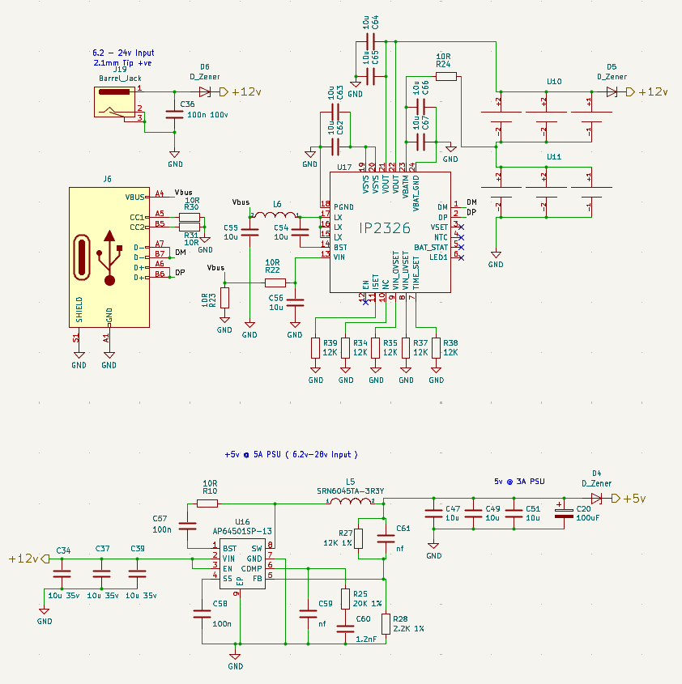

**Вхідний каскад живлення та захист:**

Живлення пристрою здійснюється через роз'єм **J10 (Barrel\_Jack)**,
призначений для підключення зовнішнього джерела постійного струму в
діапазоні **6.2 В - 24 В**. **Конденсатор C36 (100n 100V)**: Служить для
фільтрації високочастотних шумів на вхідній лінії живлення, забезпечуючи
більш чисту напругу для наступних перетворювачів.

**Мікросхема IP2326 (USB Type-C Power Delivery Controller/Converter):**

Мікросхема **IP2326 (U17)** [IP2326 datasheet
!](http://lcsc.com/datasheet/lcsc_datasheet_2304062030_INJOINIC-IP2326_C2832094.pdf)
є ключовим елементом для живлення через інтерфейс USB Type-C, зокрема
для реалізації функцій Power Delivery (PD). Це дозволяє не тільки живити
пристрій від USB Type-C джерела, але й керувати режимами зарядки або
живлення для інших пристроїв, підключених до USB. **J6 (USB Type-C):**
Це роз'єм USB Type-C, який підключається до IP2326.

**VBUS, CC1, CC2, D+, D-, SHIELD, GND:** Стандартні виводи роз'єму USB
Type-C, які дозволяють передавати живлення (VBUS), дані (D+, D-) та
керуючі сигнали (CC1, CC2), необхідні для ініціалізації Power Delivery.

**Обв'язка IP2326:**

-   **PGND, LX, SW, VIN:** Вхідні та вихідні лінії для внутрішнього
    імпульсного перетворювача, який формує VBUS для USB.
-   **VSYS\_OUT, VSYS\_IN, VBMON, VBAT\_OUT, VBAT\_IN, VBAT\_GND:**
    Лінії, що стосуються системного живлення та моніторингу батареї. Це
    вказує на можливість керування зарядкою або живленням від
    акумулятора.
-   **NTC, BAT\_STAT, LED1:** Виводи для підключення термістора (NTC)
    для моніторингу температури батареї, індикації статусу зарядки
    (BAT\_STAT) та світлодіода (LED1).
-   **VSET, ISET, TIME\_SET, EN, AC:** Керуючі виводи для налаштування
    вихідної напруги (VSET), струму (ISET), часу (TIME\_SET), активації
    (EN) та індикації живлення від AC (AC).
-   **R39, R34, R35, R37, R38:** Набір резисторів, які, використовуються
    для налаштування параметрів IP2326, таких як вихідна напруга, струм
    зарядки/живлення, або для визначення режимів PD.
-   **L6, C54, C55, C56:** Індуктор та конденсатори, які є невід'ємною
    частиною імпульсного перетворювача для стабілізації та фільтрації
    напруги.

**Формування напруги +5В @ 5A (PSU):**

Цей блок відповідає за формування стабілізованої напруги **+5В** з
високим струмом до **5А**, що є критично важливим для живлення
процесорного модуля та інших високопотужних компонентів. Вхідна напруга
для цього блоку становить **+6.2-24В**. **U16 (AP64501SP-13):** Це
імпульсний понижуючий перетворювач (Buck Converter) від Analog Power
[AP64501SP-13 datasheet
!](https://lcsc.com/datasheet/lcsc_datasheet_2108041630_Diodes-Incorporated-AP64501SP-13_C2071517.pdf)
. Його використання дозволяє ефективно перетворювати вхідну напругу
(+12В) на потрібні +5В з мінімальними втратами на тепло.

-   **VIN:** Вхід живлення від +12В. Фільтруючі конденсатори C34, C37,
    C38 (10u 35V) на вході забезпечують стабільність вхідної напруги та
    фільтрацію шумів.
-   **BST, SW, PGND, GND, EN, FB:** Стандартні виводи імпульсного
    перетворювача: BST (bootstrap), SW (switching node), PGND (power
    ground), GND (signal ground), EN (enable), FB (feedback).
-   **FB (Feedback):** Цей вивід підключається до резистивного дільника
    (R27, R28), який встановлює вихідну напругу +5В.
-   **L5 (SRN6045TA-3R3Y):** Індуктор, який є ключовим компонентом
    імпульсного перетворювача. Його номінал (3.3 мкГн, судячи з
    маркування 3R3) важливий для стабільності та ефективності
    перетворення.
-   **Конденсатори C47, C49, C50, C20:** Вихідні конденсатори (10u,
    100u) для фільтрації та стабілізації вихідної напруги +5В,
    згладжуючи пульсації, характерні для імпульсних перетворювачів.
-   **C58 (100n):** Додатковий фільтруючий конденсатор.
-   **C59 (1.2nF), C60:** Ці компоненти є частиною компенсаційної мережі
    для стабільності зворотного зв'язку імпульсного перетворювача.
-   **R25 (20K 1%), R27 (12K 1%), R28 (2.2K 1%):** Резистори зворотного
    зв'язку, що визначають точність вихідної напруги +5В. Їхня точність
    (1%) важлива для стабільності вихідної напруги.
-   **D\_Zener (D4):** Додатковий діод Зенера на виході +5В, що
    забезпечує захист від перенапруги для шини +5В.

**Кола фільтрації та розв'язки:**

По всій схемі розкидані конденсатори малої ємності (наприклад, 10n,
100n, 10u), які служать для блокування високочастотних шумів (decoupling
capacitors) та згладжування пульсацій на лініях живлення поблизу
мікросхем (C64, C65, C67, C68 поблизу U17). Це допомагає забезпечити
стабільне та чисте живлення для чутливих цифрових та аналогових схем.

**Висновки щодо організації живлення:**

Представлена схема живлення є комплексною та добре продуманою,
забезпечуючи:

1.  **Широкий діапазон вхідної напруги:** Можливість роботи від джерела
    6.2В до 24В.
2.  **Гнучкість живлення:** Підтримка живлення через традиційний barrel
    jack та сучасний USB Type-C з Power Delivery.
3.  **Ефективність:** Використання імпульсних перетворювачів
    (AP64501SP-13) для формування +5В, що мінімізує втрати енергії та
    тепловиділення, особливо при великих струмах.
4.  **Стабілізація:** Забезпечення стабільних вихідних напруг (+5В,
    +12В) для всіх компонентів.
5.  **Захист:** Наявність діодів Зенера на вхідних та вихідних лініях
    живлення для захисту від перенапруги.
6.  **Фільтрація:** Широке використання фільтруючих та блокуючих
    конденсаторів для забезпечення чистого живлення.

Ця архітектура живлення забезпечує надійну та стабільну роботу всього
електронного пристрою.

### Реалізація інтерфейсів та роз'ємів

Цей підрозділ детально описує ключові інтерфейси та роз'єми, які
забезпечують взаємодію розроблюваного пристрою із зовнішнім світом,
мережею та периферійними пристроями. Вибір та реалізація цих інтерфейсів
є критично важливими для функціональності та гнучкості системи.

**Інтерфейс Ethernet:**

Блок Ethernet (верхня ліва частина схеми) забезпечує дротове мережеве
підключення, що є важливим для стабільної та високошвидкісної передачі
даних.

**U1 та U2 (TPD4E05B30):** Це мікросхеми захисту від електростатичного
розряду (ESD) та перенапруги для ліній Ethernet [TPD4E05B30 datasheet
!](https://www.alldatasheet.com/datasheet-pdf/view/796048/TI1/TPD4E02B04.html)
. Вони захищають диференціальні пари TRD0\_N/P, TRD1\_N/P, TRD2\_N/P,
TRD3\_N/P, які несуть високошвидкісні сигнали даних, від пошкодження, що
є критичним для надійної роботи мережевого інтерфейсу.

-   **J3 (Magjack -- A70-112-331N26):** Це інтегрований роз'єм Ethernet
    (RJ45) з вбудованим трансформатором та світлодіодними індикаторами
    стану (LED\_A, LED\_G).
-   **Вбудований трансформатор:** Необхідний для гальванічної розв'язки
    між мережевим контролером та Ethernet-кабелем, захищаючи обладнання
    від перешкод та різних потенціалів землі.
-   **LED\_A (Activity/Link) та LED\_G (Link/Activity):** Світлодіоди,
    підключені через резистори R2 (470R) та R3 (470R) до лінії +3.3В,
    індикують активність мережі та наявність з'єднання.
-   **TRD\_N/P (TDx+, TDx-):** Це виводи диференціальних пар для
    передачі/прийому даних Ethernet. Вони підключаються безпосередньо до
    процесорного модуля або до зовнішнього контролера Ethernet, якщо
    такий є. Конденсатори (C1, C2, C3, C4) на цих лініях служать для
    AC-зв'язку (фільтрації постійної складової) та узгодження імпедансу.

**Інтерфейс USB Type-C (J11):**

Роз'єм **J11 (USB\_C\_Receptacle\_USB2.0)** забезпечує можливість
живлення пристрою та обміну даними через стандартний інтерфейс USB
Type-C.

-   **VBUS:** Лінія живлення (+5В).
-   **CC1, CC2:** Конфігураційні канали, які використовуються для
    визначення орієнтації кабелю, ролі пристрою (хост/пристрій) та
    узгодження режиму живлення (наприклад, USB Power Delivery, хоча цей
    роз'єм позначений як USB2.0). Резистори R4 та R5 (2.2K) на цих
    лініях використовуються для визначення ролі пристрою (наприклад,
    DFP/UFP).
-   **D+, D-:** Диференціальні лінії даних USB 2.0. Конденсатори C18 та
    C19 (100n) служать для фільтрації високочастотних шумів на цих
    лініях.
-   **SBU1, SBU2:** Додаткові лінії, які можуть використовуватися для
    альтернативних режимів роботи USB Type-C (наприклад, для передачі
    відео).
-   **SHIELD, GND:** Заземлення та екран для захисту від перешкод.

**Інтерфейс CM5Lite SDCARD I/F (J7):**

Цей блок відповідає за підключення карти пам'яті формату MicroSD, яка,
як правило, використовується для зберігання операційної системи,
програмного забезпечення та даних.

-   **J7 (Micro\_SD\_Card\_Det):** Роз'єм для MicroSD-карти з детектором
    присутності карти.
-   **SD\_DAT0, SD\_DAT1, SD\_DAT2, SD\_DAT3, SD\_CMD, SD\_CLK:**
    Стандартні виводи для інтерфейсу SD-карти (data, command, clock).
-   **U1B (RTS7420GJS):** Це мікросхема що забезпечує перетворення рівня
    напруги (level shifter) або керування живленням для SD-карти.
-   **SD\_PWR:** Лінія керування живленням SD-карти.
-   **IN, OUT, INFO, EN:** Вхідні та вихідні лінії для керування
    живленням, інформації про стан та активації. Конденсатор C51 (4.7u)
    на виході PWR\_ON є фільтруючим.

**Аудіоінтерфейс (U4 та J8):**

Блок аудіо забезпечує відтворення та запис звуку.

-   **U4 (WM8960):** Це аудіокодек, який інтегрує аналого-цифрові та
    цифро-аналогові перетворювачі (АЦП/ЦАП), а також підсилювачі для
    навушників/динаміків та мікрофонні входи [WM8960 datasheet
    !](http://lcsc.com/datasheet/lcsc_datasheet_2410121530_Cirrus-Logic-WM8960CGEFL-RV_C18752.pdf).
-   **DCVDD, DBVDD, AVDD, SPKVDD2:** Лінії живлення для різних секцій
    кодека (цифрова, аналогова, живлення динаміка). Фільтруючі
    конденсатори C3, C11, C12, C13, C14, C21 забезпечують стабільне
    живлення.
-   **MCLK, BCLK, DACLRC, ADCLRC, DACDAT, ADCDAT:** Лінії для обміну
    даними та тактовими сигналами з процесорним модулем (Master Clock,
    Bit Clock, Left/Right Clock, Data In/Out).
-   **HEADPHONE\_L/R, SPEAKER\_L/R, SPEAKER\_EN:** Виходи для навушників
    та динаміків, а також лінія керування вмиканням/вимиканням
    динаміків.
-   **MONO\_OUT:** Монофонічний аудіовихід.
-   **LINPUTx, RINPUTx:** Вхідні лінії для підключення мікрофонів або
    інших аудіоджерел (наприклад, LINPUT1-3, RINPUT1-3).
-   **GPIOx:** Додаткові виводи загального призначення, які можуть
    використовуватися для керування або індикації.
-   **AGND, DGND:** Аналогове та цифрове заземлення.
-   **J8 (Audiojack4):** Роз'єм для підключення аудіопристроїв, таких як
    навушники або зовнішні динаміки.

**Додаткові інтерфейси та керування живленням (J2):**

Цей блок, позначений як **Conn 02/07 Odd Even**, містить різні керуючі
та інтерфейсні лінії, що підключаються до процесорного модуля.

-   **NRPBOOT, EEPROM\_WPNP:** Лінії, пов'язані з режимом завантаження
    (NRPBOOT) та захистом пам'яті EEPROM (EEPROM\_WPNP).
-   **SYNC\_DTG:** Лінія синхронізації.
-   **USBDT\_G:** Пов'язана з USB (USB debug).
-   **PMIC\_ENABLE, PWR\_BUT:** Лінії керування живленням, які
    дозволяють вмикати/вимикати або перезавантажувати систему.
-   **VBAT:** Лінія для підключення зовнішнього джерела живлення
    батареї, або для моніторингу системної напруги.

**Інтерфейс GPS (U5):** У нижній правій частині схеми представлений блок
для інтеграції GPS-модуля. **GPIO4, GPIO5:** Це лінії GPIO, які
використовуються для обміну даними (RX, TX) з GPS-модулем через
інтерфейс UART, що є стандартним для багатьох GPS-приймачів.

**Висновки щодо реалізації інтерфейсів:**

Надана схема демонструє комплексну реалізацію різноманітних інтерфейсів,
які є фундаментальними для функціональності пристрою. Це включає:

-   **Надійне мережеве підключення** через Ethernet з вбудованим
    захистом та трансформатором.
-   **Гнучке живлення та передачу даних** через USB Type-C.
-   **Можливість розширення пам'яті** за допомогою MicroSD-карти.
-   **Повноцінний аудіоінтерфейс** з кодеком для відтворення та запису
    звуку.
-   **Інтеграція GPS-модуля** для визначення місцезнаходження.
-   **Керування живленням** та іншими системними функціями через
    спеціалізовані виводи.

Кожен з цих інтерфейсів ретельно розроблений з урахуванням необхідних
захисних елементів та фільтрації для забезпечення стабільної та надійної
роботи.

### Реалізація високошвидкісних інтерфейсів та роз'ємів

У цьому підрозділі продовжено опис ключових інтерфейсів, зосереджуючись
на високошвидкісних лініях передачі даних, які є критично важливими для
мультимедійних та периферійних функцій пристрою.

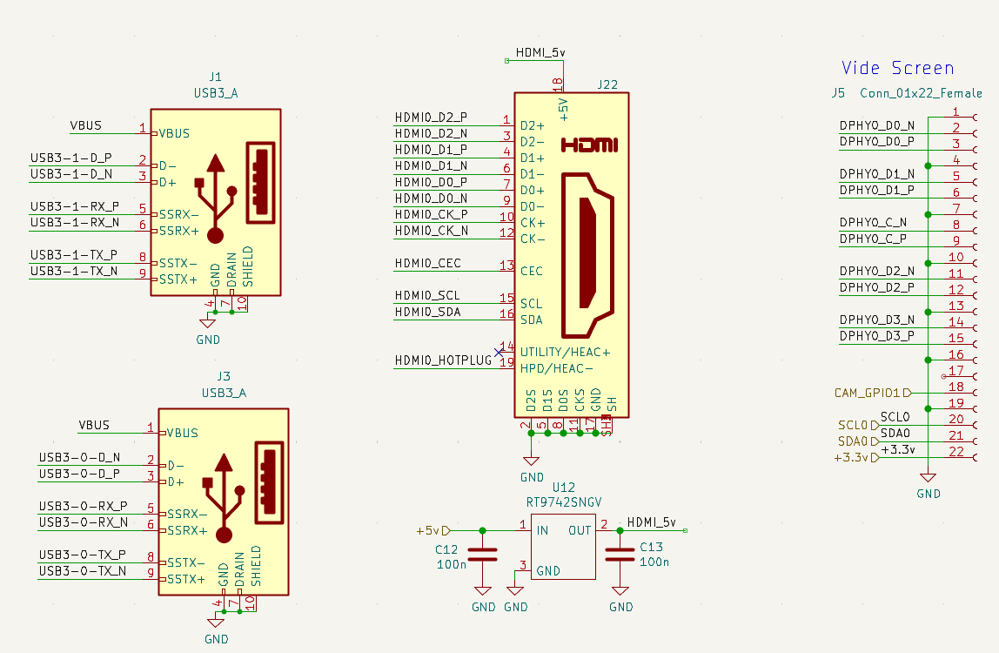

**Інтерфейси USB 3.0:**

На схемі представлені два роз'єми **USB3\_A (J1 та J3)**, що вказує на
наявність як мінімум двох портів USB 3.0. Це забезпечує високу швидкість
передачі даних для підключення сучасних периферійних пристроїв, таких як
зовнішні накопичувачі, вебкамери високої роздільної здатності тощо.

-   **VBUS:** Лінія живлення (+5В) для підключених USB-пристроїв.
-   **D+, D-:** Стандартні диференціальні пари даних для USB 2.0
    (High-Speed). Вони сумісні з USB 3.0 та дозволяють працювати з
    пристроями USB 2.0.
-   **SSRX+, SSRX-:** Диференціальні пари для прийому даних (SuperSpeed
    Receive) USB 3.0. Забезпечують швидкість до 5 Гбіт/с.
-   **SSTX+, SSTX-:** Диференціальні пари для передачі даних (SuperSpeed
    Transmit) USB 3.0. Також забезпечують швидкість до 5 Гбіт/с.
-   **GND, SHIELD:** Заземлення та екран роз'єму для захисту від
    електромагнітних перешкод.

Наявність двох окремих роз'ємів USB 3.0 означає, що система підтримує
кілька одночасних високошвидкісних підключень, що підвищує її
функціональність. Ці лінії USB3-x-y-D\_N/P та USB3-x-y-RX/TX\_N/P
підключаються безпосередньо до відповідних виводів процесорного модуля,
як це було показано на Рисунку 2.3.1 (Модуль Module1B).

**Інтерфейс HDMI:**

Роз'єм **HDMI (J22)** є ключовим для виведення високоякісного відео та
аудіосигналу на зовнішні дисплеї (монітори, телевізори).

-   **HDMI0\_D0\_P/N, HDMI0\_D1\_P/N, HDMI0\_D2\_P/N:** Це три
    диференціальні пари даних (TMDS data channels), які передають власне
    відеодані.
-   **HDMI0\_CLK\_P/N:** Диференціальна пара тактування (TMDS clock),
    яка синхронізує передачу даних.
-   **HDMI0\_CEC (Consumer Electronics Control):** Лінія, що дозволяє
    керувати іншими HDMI-сумісними пристроями (наприклад, вмикати
    телевізор, перемикати вхід).
-   **HDMI0\_SCL, HDMI0\_SDA:** Лінії інтерфейсу I²C, які
    використовуються для обміну даними EDID (Extended Display
    Identification Data) з підключеним дисплеєм. Це дозволяє пристрою
    дізнаватися про підтримувані роздільні здатності та формати дисплея.
-   **HDMI0\_HOTPLUG (HPD/HEAC):** Лінія Hot Plug Detect, яка інформує
    пристрій про підключення або відключення HDMI-кабелю. Також може
    використовуватися для функцій HDMI Ethernet Channel (HEAC).
-   **+5V\_D:** Лінія живлення +5В для живлення EDID EEPROM у кабелі
    HDMI та для керування деякими функціями.
-   **U12 (RT9742SNGV):** Це мікросхема керування живленням або захисний
    елемент для лінії +5V\_D, що забезпечує стабільне живлення та/або
    захист від перевантажень/коротких замикань на HDMI-роз'ємі.
    Конденсатори C12 та C13 (100n) служать для фільтрації шуму на лінії
    живлення.

Лінії HDMI (HDMI0\_D\_N/P, HDMI0\_CLK\_N/P, HDMI0\_CEC, HDMI0\_SCL/SDA,
HDMI0\_HOTPLUG) безпосередньо підключаються до відповідних виводів
процесорного модуля, які позначені на Рисунку 2.3.1 (Модуль Module1B) в
секції "High Speed Serial".

**Інтерфейс для екрану (MIPI D-PHY / Video Screen - J5):**

Роз'єм **J5 (Conn\_01x1x22\_Female)** призначений для підключення
зовнішнього дисплея з використанням інтерфейсу MIPI D-PHY (Mobile
Industry Processor Interface Physical Layer). Це високошвидкісний
інтерфейс, який зазвичай використовується для підключення дисплеїв (DSI
- Display Serial Interface) та камер (CSI - Camera Serial Interface) у
мобільних та вбудованих системах.

-   **DPHYO\_D0\_N/P, DPHYO\_D1\_N/P, DPHYO\_D2\_N/P, DPHYO\_D3\_N/P:**
    Це чотири диференціальні пари даних MIPI D-PHY. Кожна пара передає
    дані послідовно.
-   **DPHYO\_C\_N/P:** Диференціальна пара тактування MIPI D-PHY, що
    синхронізує передачу даних по всіх парах даних.
-   **CAM\_GPIO1D1:** Цей вивід є лінією GPIO, пов'язаною з функціями
    камери або дисплея, яка може використовуватися для керування
    (наприклад, скидання дисплея, вмикання підсвічування) або індикації
    стану.
-   **SCL0, SDA0:** Лінії інтерфейсу I²C, що використовуються для
    зв'язку з дисплеєм (наприклад, для керування підсвічуванням,
    отримання інформації про дисплей). Ці ж лінії I²C можуть бути
    мультиплексовані з іншими інтерфейсами (наприклад, HDMI I²C, як
    показано на Рисунку 2.3.1).
-   **+3.3V, GND:** Лінії живлення (+3.3В) та заземлення для живлення
    дисплея.

Використання MIPI D-PHY для підключення екрану підкреслює орієнтацію
проекту на компактні рішення та високу якість зображення, характерну для
мобільних пристроїв. Лінії DPHYO\_D\_N/P та DPHYO\_C\_N/P безпосередньо
підключаються до відповідних виводів процесорного модуля, як це було
показано на Рисунку 2.3.1 (Модуль Module1B) у секції "High Speed
Serial".

**Висновки щодо реалізації високошвидкісних інтерфейсів:**

Наданий фрагмент схеми демонструє високий рівень функціональності
пристрою в частині мультимедіа та підключення периферії. Наявність двох
портів USB 3.0 забезпечує швидкий обмін даними, тоді як HDMI та MIPI
D-PHY дозволяють підключати різноманітні дисплеї, від зовнішніх
моніторів до вбудованих екранів, забезпечуючи високоякісний відеовихід.
Усі ці інтерфейси спроектовані з урахуванням вимог до цілісності сигналу
та захисту, що є критичним для їхньої стабільної та надійної роботи.

### Реалізація інтерфейсу M2

У цьому підрозділі розглянуто реалізацію інтерфейсу M.2, який забезпечує
гнучкість у підключенні додаткових модулів, таких як NVMe SSD,
Wi-Fi/Bluetooth модулі, або 4G/5G модеми, а також пов'язані з ним
компоненти живлення та тактування.

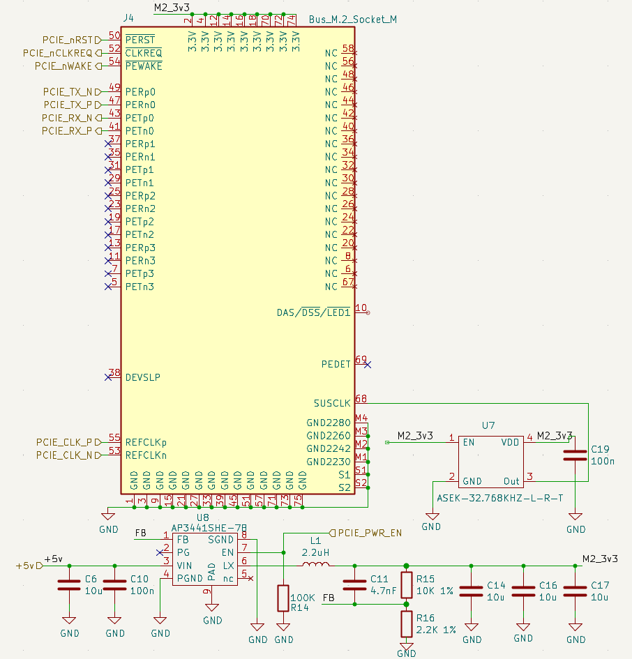

**Інтерфейс M.2 (Bus\_M.2\_Socket\_M):**

Роз'єм **J4 (Bus\_M.2\_Socket\_M)** є основним інтерфейсом для
підключення M.2 модуля. Він забезпечує високошвидкісний зв'язок через
шину PCIe, а також інші необхідні сигнали.

-   **PCIe\_TX\_N/P, PCIe\_RX\_N/P (PERPx, PERPx\_N/P):** Ці
    диференціальні пари представляють лінії передачі (TX) та прийому
    (RX) для інтерфейсу PCI Express (PCIe). На схемі показано чотири
    канали PCIe (PERP0, PERP1, PERP2, PERP3), що вказує на підтримку
    PCIe x4. Це дозволяє підключати високопродуктивні NVMe SSD, які
    потребують високої пропускної здатності.
-   **PCIe\_NRSTD, PCIe\_NCLKREQ, PCIE\_NWAKE:** Це керуючі сигнали
    PCIe.
-   **PCIe\_NRSTD:** Скидання PCIe (Reset).
-   **PCIe\_NCLKREQ:** Запит тактування PCIe (Clock Request),
    використовується для керування режимами енергозбереження.
-   **PCIE\_NWAKE:** Сигнал пробудження PCIe (Wake-up).
-   **NC (No Connect):** Багато виводів роз'єму позначені як NC, що
    означає "не підключено". Це стандартно для універсальних роз'ємів
    M.2, де не всі піни використовуються у всіх конфігураціях.
-   **3.3V:** Лінії живлення +3.3В для M.2 модуля.
-   **PEDET (Pin Event Detect):** Цей вивід може використовуватися для
    виявлення присутності модуля або інших подій, пов'язаних з ним.
-   **DAS/DSS/LED1:** Ці виводи можуть використовуватися для індикації
    активності даних (Data Activity Status), стану диска (Drive Status),
    або для керування світлодіодом (LED1) на M.2 модулі.

Лінії PCIe\_TX\_N/P, PCIe\_RX\_N/P, PCIe\_NCLKREQ, PCIE\_NWAKE та
PCIe\_NRSTD підключаються безпосередньо до відповідних виводів
процесорного модуля, як це було показано на Рисунку 2.3.1 (Module1B) у
секції "PCIe".

**Живлення для M.2 модуля (+3.3В):**

Для забезпечення стабільного живлення M.2 модуля використовується
окремий імпульсний понижуючий перетворювач, що формує напругу +3.3В.

-   **U8 (AP3441SHE-7B):** Це синхронний понижуючий DC/DC перетворювач.
    Він приймає вхідну напругу +5В та перетворює її на +3.3В, необхідні
    для живлення M.2 модуля [AP3441SHE datasheet
    !](https://lcsc.com/datasheet/lcsc_datasheet_2304140030_Diodes-Incorporated-AP3441SHE-7B_C2070918.pdf).
-   **VIN:** Вхід живлення від +5В. Конденсатори C6 (10u) та C10 (100n)
    забезпечують фільтрацію вхідної напруги.
-   **FB (Feedback):** Вивід зворотного зв'язку, підключений до
    резистивного дільника (R14 - 100K), який визначає вихідну напругу
    +3.3В.
-   **EN:** Вивід керування дозволом (Enable) для увімкнення/вимкнення
    перетворювача. Підключення до "PCIE\_PWR\_EN" вказує, що живлення
    для M.2 активується за певним керуючим сигналом.
-   **LX, SW, PGND, GND, SGND:** Виводи для внутрішнього імпульсного
    перетворювача (комутаційний вузол, силові та сигнальні заземлення).
-   **L1 (2.2uH):** Індуктор, який є ключовим компонентом імпульсного
    перетворювача, необхідний для накопичення енергії та формування
    стабілізованої вихідної напруги.
-   **C11 (4.7nF):** Компенсаційний конденсатор.
-   **R15 (10K 1%), R16 (2.2K 1%):** Резистори зворотного зв'язку, що
    разом з R14 формують дільник напруги для встановлення точної
    вихідної напруги +3.3В.
-   **C14, C16, C17 (10u, 10u, 10u):** Вихідні конденсатори для
    фільтрації та стабілізації вихідної напруги +3.3В, згладжуючи
    пульсації.

**Тактування PCIe (PCIe\_CLK):**

Для коректної роботи інтерфейсу PCIe необхідний стабільний тактовий
сигнал.

-   **U7 (ASEK-32.768KHZ-L-R-T):** Це генератор тактового сигналу
    (кварцовий генератор або осцилятор), який забезпечує тактування для
    PCIe. Хоча маркування 32.768KHz зазвичай вказує на годинниковий
    кварц, це може бути помилка або ж це базовий генератор, від якого
    походить основне тактування через PLL. Важливо, що він забезпечує
    референсний тактовий сигнал для PCIe.
-   **EN:** Вхід дозволу для увімкнення генератора.
-   **VDD:** Живлення (+3.3В).
-   **Out:** Вихід тактового сигналу.
-   **PCIe\_CLK\_N/P:** Ці виводи представляють диференціальну пару для
    тактового сигналу PCIe (PCIe Reference Clock), яка подається на M.2
    роз'єм. Диференціальне тактування є критичним для високошвидкісних
    інтерфейсів, оскільки зменшує вплив шуму та забезпечує точну
    синхронізацію.

**Висновки щодо реалізації інтерфейсу M.2:**

Інтеграція інтерфейсу M.2 значно розширює функціональні можливості
пристрою, дозволяючи підключати різноманітні високопродуктивні модулі.
Розробка забезпечує:

-   **Високошвидкісний зв'язок:** Підтримка PCIe x4 для максимальної
    пропускної здатності.
-   **Стабільне живлення:** Окремий ефективний DC/DC перетворювач для
    +3.3В живлення M.2 модуля.
-   **Надійне тактування:** Забезпечення стабільного диференціального
    тактового сигналу для PCIe.
-   **Керування живленням та станом:** Наявність керуючих ліній для
    активації та моніторингу модуля.

Ця реалізація підкреслює модульність та розширюваність архітектури
пристрою, дозволяючи адаптувати його під різні завдання за допомогою
стандартних компонентів M.2.

### Загальна компоновка та 3D вигляд друкованої плати

Після розробки принципової електричної схеми наступним етапом є
компоновка компонентів на друкованій платі (PCB) та її фізичне
проектування. Цей підрозділ надає 3D вигляд розробленої плати,
демонструючи розташування ключових функціональних блоків та роз'ємів, що
забезпечує інтуїтивне розуміння фізичної реалізації пристрою.

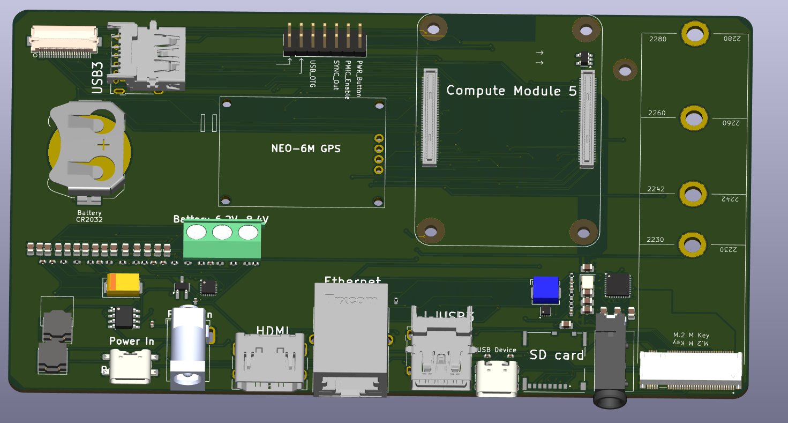

На Рисунку 2.3.4 представлено 3D вигляд розробленої друкованої плати, що
включає всі компоненти та інтерфейси, детально описані в попередніх
підрозділах. Компоновка плати оптимізована для забезпечення ефективного
розподілу живлення, мінімізації шумів, цілісності високошвидкісних
сигналів та зручності монтажу.

**Ключові елементи та їх розташування на платі:**

1.  **Процесорний модуль (Compute Module 5):** Розташований у верхній
    правій частині плати. Це центральний елемент, що підключається до
    системного роз'єму (SO-DIMM-подібний роз'єм). Його близьке
    розташування до високошвидкісних інтерфейсів (таких як HDMI, MIPI
    D-PHY, PCIe) мінімізує довжину доріжок, що критично для цілісності
    сигналу.

2.  **Роз'єми USB 3.0 (USB3):** Два роз'єми USB 3.0 розташовані у
    верхній лівій частині плати. Це дозволяє зручно підключати зовнішні
    високошвидкісні периферійні пристрої, такі як накопичувачі або
    камери.

3.  **GPS-модуль (NEO-6M GPS):** Розташований у центральній лівій
    частині плати. Ймовірно, це модуль UBLOX NEO-6M, що забезпечує
    функціональність визначення місцезнаходження. Його розташування на
    краю плати або в зоні з мінімальними перешкодами допомагає покращити
    прийом супутникового сигналу. Поруч, імовірно, знаходиться роз'єм
    для зовнішньої GPS-антени (маленький золотий роз'єм).

4.  **Кола живлення (Power In, Battery CR2032, Battery 6.2V-24V):**
    -   **"Power In" (Barrel Jack):** Розташований у нижній лівій
        частині плати. Це основний вхід для живлення пристрою від
        зовнішнього адаптера.
    -   **"Battery CR2032":** Тримач для батареї CR2032, ймовірно, для
        живлення годинника реального часу (RTC) процесорного модуля.
        Розташований біля роз'ємів USB3.
    -   **"Battery 6.2V-24V":** Гвинтові клеми або аналогічний роз'єм
        для підключення зовнішнього джерела живлення в діапазоні
        6.2В-24В, що забезпечує гнучкість у виборі джерела живлення.
        Розташований у верхній центральній частині плати.
    -   Навколо цих роз'ємів розташовані компоненти, що відповідають за
        стабілізацію та фільтрацію живлення, як описано в підрозділі
        2.2.
5.  **Інтерфейси Ethernet, HDMI, USB Device, SD Card:** Ці ключові
    роз'єми компактно розташовані вздовж нижнього краю плати.

        * **Ethernet:** Роз'єм RJ45 для дротового мережевого підключення.
        * **HDMI:** Роз'єм для підключення зовнішнього дисплея.
        * **USB Device (Type-C):** Роз'єм USB Type-C, який може використовуватися як для живлення, так і для підключення пристрою в режимі USB-пристрою (наприклад, для завантаження ОС або дебагування).
        * **SD Card:** Слот для MicroSD-карти, що служить для зберігання операційної системи та даних.

6.  **M.2 M Key:** Роз'єм M.2 M Key розташований у нижній правій частині
    плати. Це дозволяє підключати високошвидкісні NVMe SSD або інші
    сумісні M.2 модулі (наприклад, 4G/5G модеми), значно розширюючи
    можливості пристрою.

7.  **Інші компоненти:** Інші пасивні компоненти (резистори,
    конденсатори, індуктивності) та активні мікросхеми (стабілізатори,
    логічні елементи, аудіокодек) розташовані по всій платі відповідно
    до їхніх функціональних блоків та вимог до трасування сигналів.
    Вони, як правило, розміщуються якомога ближче до компонентів, з
    якими вони взаємодіють, для мінімізації довжини доріжок та зменшення
    перешкод.

Висновок до розділу 2.3

Компоновка друкованої плати виконана з урахуванням оптимального
розміщення компонентів для досягнення високої функціональності та
надійності. Центральне розташування процесорного модуля та грамотне
розміщення високошвидкісних інтерфейсів, таких як PCIe, HDMI та USB 3.0,
є ключовим для забезпечення цілісності сигналу. Інтегровані рішення для
живлення та захисту, а також підтримка широкого спектру периферійних
інтерфейсів, роблять цю плату гнучким та потужним рішенням для різних
вбудованих застосувань. Цей 3D вигляд наочно демонструє результати етапу
розробки принципової електричної схеми та є основою для подальшого
виробництва.

Розробка корпусу
----------------

### Деталі корпусу

1.  Корпус

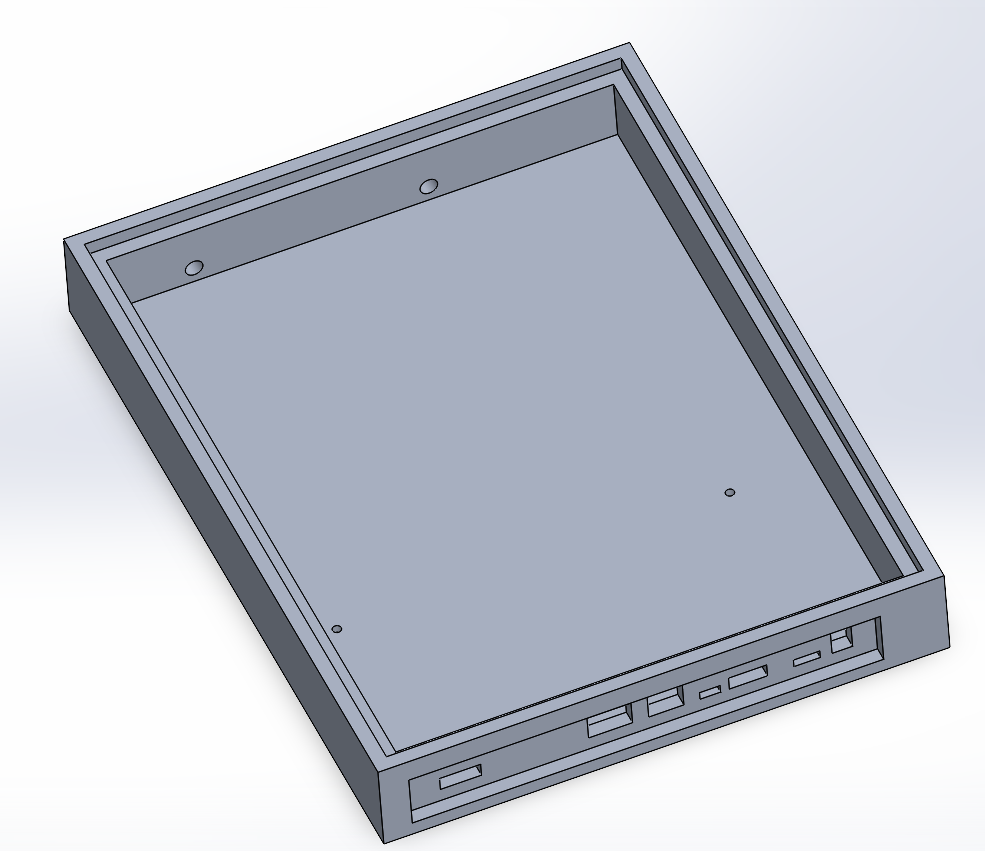

2.  Захисна кришка з органічного скла

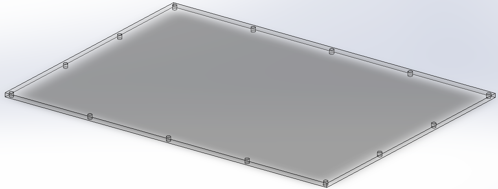

Висновок по розділу 2.4

Висновок по розділу 2
---------------------

**Методологія роботи АПКВАР**
=============================

У цьому розділі розглядаються основні підходи, інструменти та принципи,
що використовуються при розробці та дослідженні автоматизованої
програмно-керованої варіантної радіосистеми (АПКВАР). Описано вибір
апаратних і програмних засобів, методи збору, обробки та аналізу даних,
а також обґрунтовано застосування сучасних технологій, таких як SDR і
алгоритми штучного інтелекту. Особлива увага приділяється практичним
аспектам реалізації системи, що забезпечують її гнучкість,
масштабованість і надійність у різних умовах експлуатації.

Приймання радіосигналів за допомогою технології SDR
---------------------------------------------------

**Загальні принципи роботи SDR**

Програмно-визначуване радіо (SDR, Software-Defined Radio) є новітньою
концепцією в галузі радіозв'язку, що дозволяє виконувати більшість
функцій традиційного радіоприймача програмними засобами. Основна ідея
полягає у перетворенні аналогового сигналу в цифровий одразу після
приймання та подальшій обробці цього сигналу програмно, що забезпечує
виняткову гнучкість системи.

Сучасні SDR-системи складаються з високошвидкісного аналого-цифрового
перетворювача (АЦП), цифрового сигнального процесора (DSP), комп'ютера
або мікроконтролера та програмного забезпечення для обробки сигналів. Це
дозволяє змінювати параметри приймання та обробки сигналу, такі як
частота, тип модуляції, смуга пропускання та інші, без втручання в
апаратну частину системи.

У праці \>\>\> Mahmoud S. A., Ismail A. A., Elhoseny M. et al. Software
defined radio: operation, challenges and possible solutions
\[Електронний ресурс\] // International Journal of Communication
Networks and Information Security. --- 2016. --- Т. 8, № 3. --- Режим
доступу: https://www.researchgate.net/publication/309777143
підкреслюється, що одним з головних викликів при реалізації SDR є
необхідність використання надшвидких процесорів, здатних обробляти в
реальному часі великі обсяги цифрової інформації. Також важливу роль
відіграє точність АЦП та вибір аналогового фронтенду --- першого каскаду
приймання сигналу.

**Апаратні платформи SDR**

Найбільш поширеною платформою для побутового та дослідницького
використання є RTL-SDR --- недорогий USB-тюнер на базі мікросхеми
RTL2832U. Цей пристрій здатен приймати сигнали в діапазоні від 24 МГц до
1766 МГц. Завдяки відкритим драйверам та підтримці великої кількості
програмного забезпечення (наприклад, SDR\# або GQRX), RTL-SDR знайшов
широке застосування у багатьох проєктах.

У дослідженні \>\>\> Khan S., Anjum M., Masood A. Receiving ADS-B
Signals on Embedded Linux using RTL-SDR: A Practical Guide \[Електронний
ресурс\] // Frontiers in Computer and Information Science. --- 2022. ---
Т. 2, № 2. --- Режим доступу:
https://drpress.org/ojs/index.php/fcis/article/view/14059 було описано
використання RTL-SDR на вбудованій Linux-системі для прийому сигналів
авіаційної служби спостереження ADS-B. Автори навели практичні аспекти
конфігурації та прийому, що є цінним для розробників портативних систем
спостереження.

Іншою поширеною платформою є HackRF One --- одноканальний SDR трансивер
з діапазоном частот від 1 МГц до 6 ГГц. Його відкритий дизайн дозволяє
глибоку модифікацію як на рівні прошивки, так і на рівні схеми пристрою,
що робить його привабливим для науковців і розробників військових
рішень.

**Техніки приймання слабких сигналів**

Однією з переваг SDR є можливість ефективного приймання слабких сигналів
за умов наявності сильних перешкод. У роботі \>\>\> McFarlin D. Weak
Signal Reception Using Software Defined Radios and a Two-Element Antenna
Array \[Електронний ресурс\] : дис. ... M.Sc. --- Auburn University,
2009. --- Режим доступу:
https://holocron.lib.auburn.edu/handle/10415/613 досліджено використання
двоелементного антеного масиву у поєднанні з адаптивними алгоритмами
цифрової обробки сигналів для покращення співвідношення сигнал/шум.
Запропонована система продемонструвала здатність до просторового
фільтрування сигналів та зменшення впливу завад.

Цей підхід особливо актуальний у військових системах зв'язку, де часто
необхідно приймати сигнали зі слабкою потужністю на фоні активного
радіоелектронного протиборства.

**SDR як засіб тестування вразливостей**

Завдяки широкому діапазону частот та можливості генерувати сигнали, SDR
використовується також для тестування захищеності радіосистем. У статті
\>\>\> Zhang Y., Zhao J., Zhang W. GPS Signal Reception and Spoofing
Based on Software-Defined Radio Devices \[Електронний ресурс\] //
ResearchGate. --- 2023. --- Режим доступу:
https://www.researchgate.net/publication/367265928 представлено
реалізацію атаки типу spoofing на GPS-приймач з використанням
SDR-пристрою. За допомогою генерації синтетичних GPS-сигналів дослідники
змогли обдурити навігаційний модуль пристрою Android, змусивши його
визначити фальшиве місцеположення.

Цей приклад показує як SDR може застосовуватись не лише для приймання
сигналів, а й для їх аналізу, генерації та модифікації з метою
підвищення безпеки систем навігації.

**Інтеграція SDR з елементами штучного інтелекту**

Сучасні дослідження активно впроваджують машинне навчання в SDR-системи.
У публікації \>\>\> Mihai C., Gontean A., Rusu C. Signals Intelligence
System with Software-Defined Radio // Applied Sciences. --- 2023. ---
Vol. 13, No. 8. --- DOI: \[ttps://doi.org/10.3390/app13085199\] описано
систему інтелектуального аналізу сигналів, що здатна автоматично
визначати тип модуляції вхідного сигналу за допомогою нейромережі. Для
розгортання системи було використано хмарну інфраструктуру Microsoft
Azure, що забезпечило масштабованість та високу продуктивність.

Інтеграція алгоритмів штучного інтелекту дозволяє автоматизувати процес
аналізу радіочастотного спектру та виявлення аномалій, що є цінним у
контексті радіоелектронної боротьби або моніторингу ефіру в реальному
часі.

**Приклад застосування: аналіз Wi-Fi сигналів**

Технологія SDR також може використовуватись для вивчення сигналів
побутових бездротових систем. У дослідженні \>\>\> Kumar R., Prasad M.
Analysis of Wi-Fi Signal Transmission and Reception Using
Software-Defined Radio \[Електронний ресурс\] // International Journal
of Multidisciplinary Research. --- 2022. --- Режим доступу:
https://www.multiresearchjournal.com/admin/uploads/archives/archive-1743160648.pdf
описано методику аналізу потужності Wi-Fi сигналу при наявності різних
фізичних перешкод. Було встановлено, що тіло людини значною мірою
впливає на стабільність з'єднання, особливо при використанні спрямованих
антен.

У статті також було вивчено ефективність односторонньої передачі даних в
умовах обмеженого покриття, що може бути корисним у створенні
енергоефективних мереж для IoT-пристроїв.

**Висновки до розділу**

SDR є потужним інструментом для побудови гнучких і адаптивних систем
зв'язку. Завдяки програмній реалізації основних функцій приймання та
обробки сигналу, SDR дає можливість створювати пристрої з широким
спектром можливостей: від простого радіоприймача до складної системи
аналізу ефіру з використанням штучного інтелекту. Застосування SDR у
військових, наукових та побутових системах підтверджує його
універсальність та перспективність.

Приймання та обробка радіосигналів за допомогою технології SDR
--------------------------------------------------------------

**Загальні принципи роботи SDR**

Програмно-визначуване радіо (SDR, Software-Defined Radio) --- це
концепція, яка передбачає реалізацію основних функцій радіоапаратури за
допомогою програмного забезпечення. Традиційні радіоприймачі
використовують апаратні фільтри, модулятори та демодулятори. У SDR
більшість цих функцій виконується програмно після оцифрування сигналу за
допомогою аналого-цифрового перетворювача (АЦП).

Основні складові SDR-системи:

-   **Аналоговий фронтенд**: приймає сигнал з ефіру і подає його на АЦП;
-   **АЦП**: перетворює аналоговий сигнал у цифрову форму;
-   **Цифровий сигнальний процесор (DSP)** або **ЦП/ГП** комп'ютера:
    виконує фільтрацію, демодуляцію, декодування;
-   **Програмне забезпечення**: забезпечує візуалізацію, обробку та
    збереження сигналів.

**Програмне забезпечення для обробки SDR-сигналів**

Для повноцінної роботи з SDR використовуються різні програми, які мають
широкий функціонал і застосовуються для різних задач: спостереження за
спектром, демодуляції, запису, декодування цифрових протоколів, аналізу
тощо.

**[SDR\#](https://airspy.com/download/)** --- популярна Windows-програма
для роботи з RTL-SDR:

-   Спектр та waterfall;
-   AM, FM, SSB, CW, WFM, NFM демодуляція;
-   Плагіни: декодування AIS, ADS-B, TETRA, DMR тощо;
-   Запис сигналів у WAV/IQ форматах;
-   Підтримка вбудованих фільтрів, зміщення частоти, автоналаштування.

**[GQRX](https://www.gqrx.dk/)** --- кросплатформний SDR-інтерфейс на
базі GNU Radio для Linux/macOS:

-   Графічний інтерфейс з FFT/Waterfall;
-   AM/FM/SSB/CW/RAW демодуляція;
-   Запис аудіо та IQ-даних;
-   Підтримка RTL-SDR, HackRF, USRP, BladeRF, PlutoSDR тощо.

**[GNU Radio](https://www.gnuradio.org/)** --- фреймворк для створення
SDR-додатків у вигляді графічного середовища (GRC):

-   Побудова потоку обробки сигналу з блоків: джерело, фільтр,
    демодулятор, декодер;
-   Підтримка мови Python для користувацької логіки;
-   Застосовується для наукових, військових, комерційних задач;
-   Можливість симуляції складних систем (MIMO, фазовий масив, модуляція
    QAM, OFDM тощо).

(URH)

**[Universal Radio Hacker](https://github.com/jopohl/urh)** ---
інструмент для аналізу цифрових протоколів:

-   Захоплення, перегляд, декодування і повторна передача сигналів;
-   Аналіз бітових послідовностей, протоколів (манчестер, NRZ, ASK,
    OOK);
-   Підтримка багатьох SDR пристроїв.

**[Inspectrum](https://github.com/miek/inspectrum)** --- програма для
аналізу IQ-сигналів:

-   Розширене відображення спектру та фазового простору;
-   Можливість розмітки імпульсів і виявлення манчестерського кодування;
-   Застосовується для реверс-інжинірингу радіопротоколів.

**[SDR++](https://github.com/AlexandreRouma/SDRPlusPlus)** --- легкий,
мультиплатформний SDR клієнт:

-   Працює під Windows, macOS, Linux;
-   Підтримка декількох SDR одночасно;
-   Швидкий спектрограф, підтримка плагінів.

**[SigDigger](https://batchdrake.github.io/SigDigger/)** --- аналітична
SDR-програма з підтримкою широкого спектру сигналів:

-   FFT, демодуляція, запис;
-   Підтримка векторного аналізу та власних демодуляторів.

**Audacity та інші звукові редактори**

Для аналізу та обробки демодульованого сигналу у форматі WAV
використовують звукові редактори, наприклад
**[Audacity](https://www.audacityteam.org/)**:

-   Розгортка сигналу по часу;
-   Спектральний аналіз;
-   Виділення, вирізання, фільтрація підсигналів.

**Етапи обробки сигналу в SDR**

Обробка сигналу за допомогою SDR включає наступні етапи:

1.  **Приймання сигналу**:

    -   Вибір частоти, ширини смуги;
    -   АЦП перетворення (IQ-дані).

2.  **Попередня обробка**:

    -   Фільтрація (низькочастотна, смуговапропускна);
    -   Усунення зміщення частоти, нормалізація амплітуди.

3.  **Демодуляція**:

    -   Залежно від типу сигналу: AM/FM/SSB/FSK/QAM/PSK;
    -   Витягнення корисної інформації (аудіо, дані).

4.  **Декодування**:

    -   Інтерпретація бітових потоків у пакети/протоколи;
    -   Вивід у текстовому або графічному вигляді.

5.  **Аналіз і зберігання**:

    -   Збереження IQ-даних або аудіо для подальшої обробки;
    -   Побудова спектрограм, логів, діаграм.

Обробка сигналів, отриманих через SDR, є гнучким, адаптивним процесом,
що може бути автоматизований і масштабований. Завдяки розвинутому набору
інструментів, користувач може аналізувати ефір у реальному часі,
виявляти цифрові сигнали, тестувати протоколи, а також здійснювати
зворотну інженерію. SDR --- це інструмент не лише для спостереження, а й
для глибокого розуміння принципів роботи сучасних радіосистем.

Висновок по розділу 3
---------------------

У цьому розділі було розглянуто ключові методологічні підходи до
розробки та дослідження автоматизованих програмно-керованих варіантних
радіосистем із використанням SDR. Описано апаратні платформи, програмне
забезпечення та сучасні техніки приймання й обробки сигналів, включаючи
інтеграцію алгоритмів штучного інтелекту. Наведені приклади практичного
застосування SDR у різних сферах --- від аналізу Wi-Fi до тестування
вразливостей GPS --- демонструють універсальність і гнучкість цієї
технології. Використання SDR забезпечує масштабованість, адаптивність і
можливість швидкої модернізації систем зв'язку, що є критично важливим
для сучасних наукових, військових та побутових задач. Таким чином, SDR
виступає фундаментальним інструментом для побудови інноваційних
радіосистем нового покоління. \# **Експеремент/результат дослідження**

<!-- дякую автору https://www.youtube.com/watch?v=IaThnn2r1no -->

Прийом радіосигналу аналогової рації
------------------------------------

Обладнання:

-   Джерело сигналу - рація Baofeng
-   Приймач сигналу - BladeRF
-   Обробник сигналу - GNU Radio

**Baofeng ключові технічні характеристики та функціонал** Більшість
моделей Baofeng мають схожі базові характеристики, але є і відмінності.
Зазначте їх узагальнено, а потім можете додати приклади.

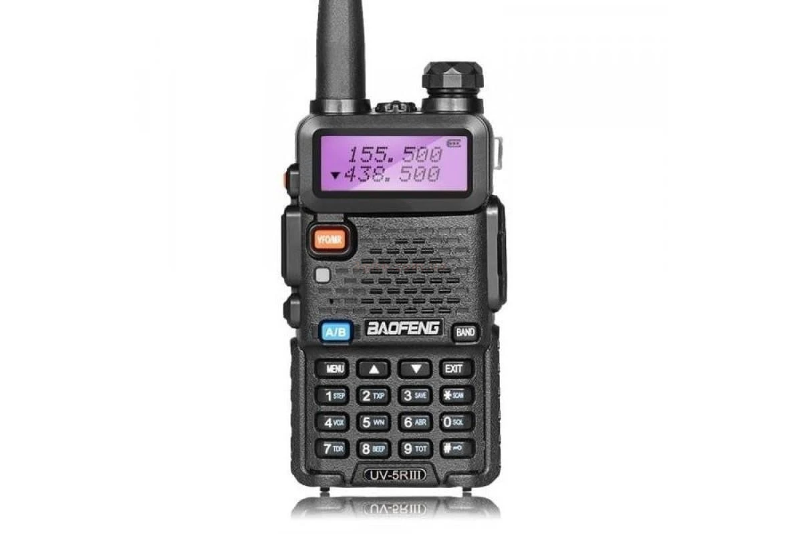

**Діапазони частот:**

-   Переважно **дводіапазонні** (Dual Band) рації, що працюють у **VHF**
    (136-174 МГц) та **UHF** (400-520 МГц) діапазонах. Це дозволяє
    використовувати їх для різних цілей та з різними типами інших
    радіостанцій.
-   Деякі моделі підтримують також прийом FM-радіо (для розваги).
-   **Вихідна потужність:** Зазвичай від 1 до 8 Вт. Потужність впливає
    на дальність зв'язку. Важливо зазначити, що рекламована потужність
    не завжди відповідає фактичній, але навіть 5 Вт достатньо для
    більшості аматорських та побутових потреб.
-   **Модуляція:** **FM (частотна модуляція)** -- стандарт для
    портативних рацій, забезпечує гарну якість звуку.
-   **Кількість каналів:** Зазвичай від 128 до 200 каналів, що
    програмуються, дозволяючи зберігати багато різних частот.
-   **Функціональні особливості:**
-   **Два канали одночасно (Dual Watch/Dual Receive):** Можливість
    одночасного моніторингу двох частот.
-   **VOX (Voice Operated eXchange):** Активація передачі голосом, без
    натискання кнопки PTT.
-   **CTCSS/DCS (Tone Squelch):** Кодовий шумоподавлювач, що дозволяє
    фільтрувати небажані сигнали і чути тільки абонентів своєї групи.

**1. Налаштування програми GNU Radio для прослуховування:**

-   Встановлюються параметри, такі як частота (на прикладі 446.13 МГц)
    та частота дискретизації (Sample Rate).
-   Посилення (Gain) встановлено на мінімальне значення (-1).
-   Використовується блок Osmocom Source з параметрами, адаптованими для
    конкретного SDR-приймача (BladeRF).
-   Для візуалізації спектра використовується блок GUI Sink.

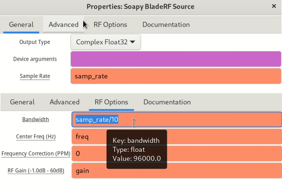

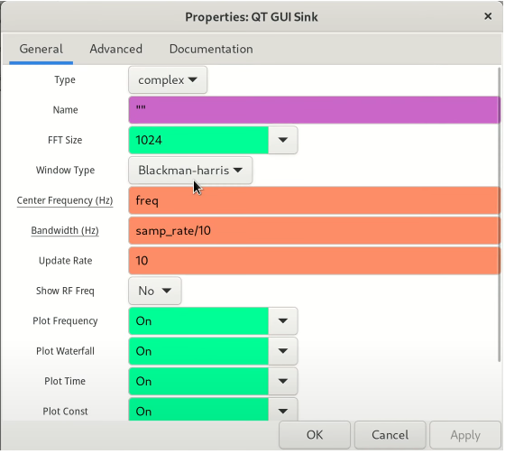

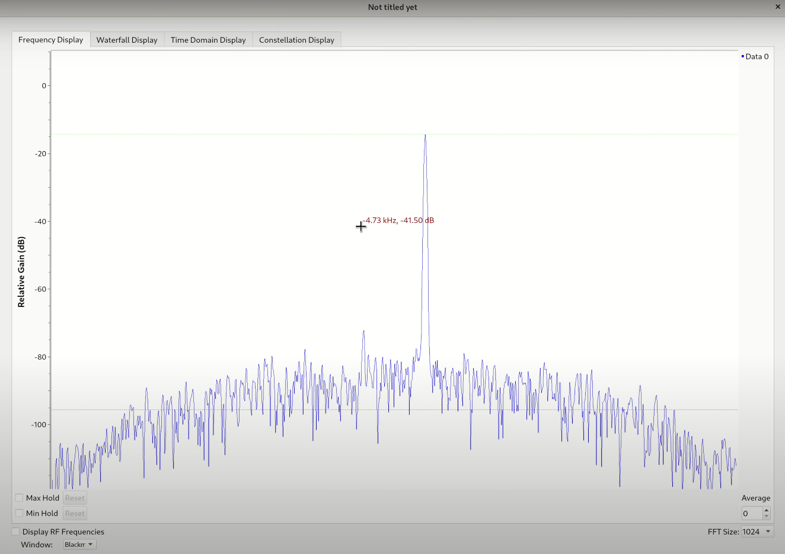

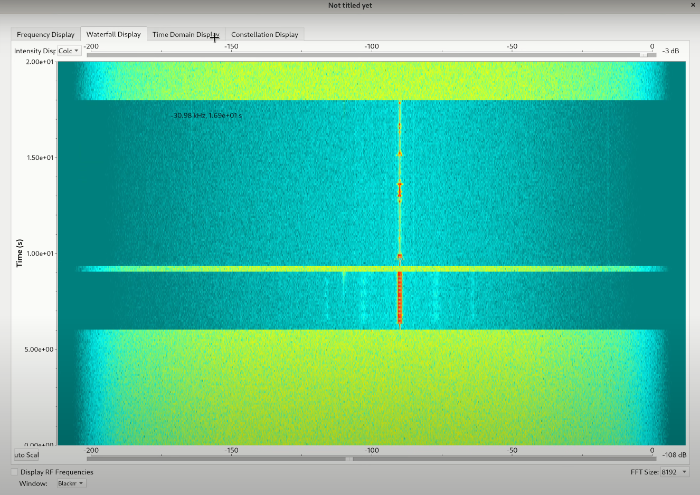

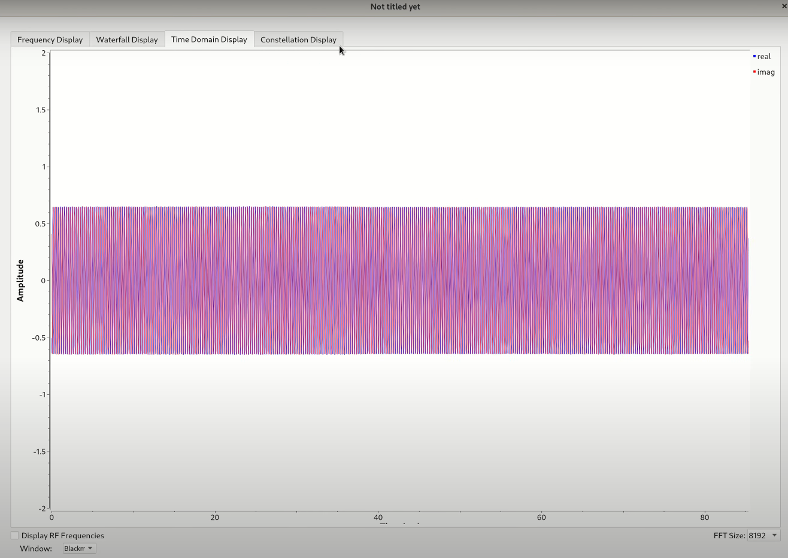

**2. Налаштування для прослуховування через аудіосистему комп'ютера:**

-   Для виведення звуку на комп'ютер необхідно додати блоки обробки
    аудіо.
-   Встановлення фільтра низьких частот (Low Pass Filter) для виділення
    потрібного каналу.
    -   Встановлення параметри фільтра: Sample Rate, Cutoff Frequency
        (на прикладі 50 кГц) та Transition Width (на прикладі 3 кГц).
-   Додаємо блок FM Demod для демодуляції FM-сигналу.
    -   Параметри FM Demod: Sample Rate та Audio Decimation.
-   Використовуємо блок Audio Sink для виведення звуку на аудіосистему.
    -   Встановлення Sample Rate аудіовиходу (на прикладі 48 кГц).

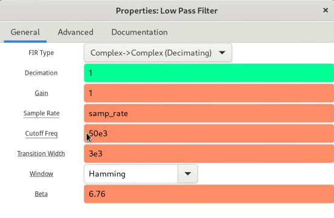

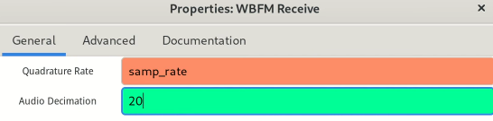

**3. Запис ефіру у файл:**

-   Для запису ефіру блок Audio Sink вимикається.
-   Замість нього вмикається блок Wave File Sink.
-   Вказується шлях до файлу для збереження, кількість каналів (1 для
    моно) та Sample Rate (48000 Гц).

Висновок

У ході експерименту було успішно прийнято та оброблено аналоговий
радіосигнал за допомогою SDR-приймача BladeRF та програмного
забезпечення GNU Radio. Проведено налаштування параметрів прийому,
демодуляції та виводу аудіосигналу, а також здійснено запис ефіру у
файл. Отримані результати підтверджують можливість використання SDR для
аналізу та обробки аналогових радіосигналів, а також демонструють
гнучкість та функціональність сучасних цифрових систем радіоприйому.

Цікавий задум! Якщо ми плануємо експеримент з прийому супутникових
зображень за допомогою **WebSDR**, наш план буде дещо відрізнятися від
того, що показано у відео, оскільки ми не будемо фізично підключати
обладнання та встановлювати спеціалізоване ПЗ для керування радіо.
WebSDR вже надає нам доступ до радіо з антеною.

Ось адаптований план експерименту:

<!-- дякую https://www.youtube.com/watch?v=cjClTnZ4Xh4 -->

Прийом супутникових зображень
-----------------------------

Обладнання

-   **[WebSDR](http://websdr.org/):** який має можливість прийому на
    частотах метеорологічних супутників. Важливо, щоб обраний WebSDR мав
    **антену Double Cross** або іншу антену з круговою поляризацією для
    кращого прийому.
-   **Програмне забезпечення:**
    -   **SDR\#** (SDRSharp) -- ці програми не підключатимуться до
        WebSDR напряму, але ми використовуватимемо їх для **демодуляції
        аудіосигналу** з WebSDR.
    -   **[LRPTDecoder](https://www.rtl-sdr.com/m2_lrpt_decoder-version-59-released/)**
        -- для декодування сигналу.
    -   **Orbitron** або **Gpredict** -- програми для відстеження
        супутників і прогнозування їх проходження над нашим
        місцезнаходженням.
    -   **Віртуальний аудіокабель**
        [VB-Cable](https://vb-audio.com/Cable/) -- програма для
        перенаправлення аудіо з браузера (де працює WebSDR) до програм
        декодування (LRPTDecoder).
-   **Супутник:**
    -   **[NOAA 15, 18, 19](https://uk.wikipedia.org/wiki/NOAA-19):**

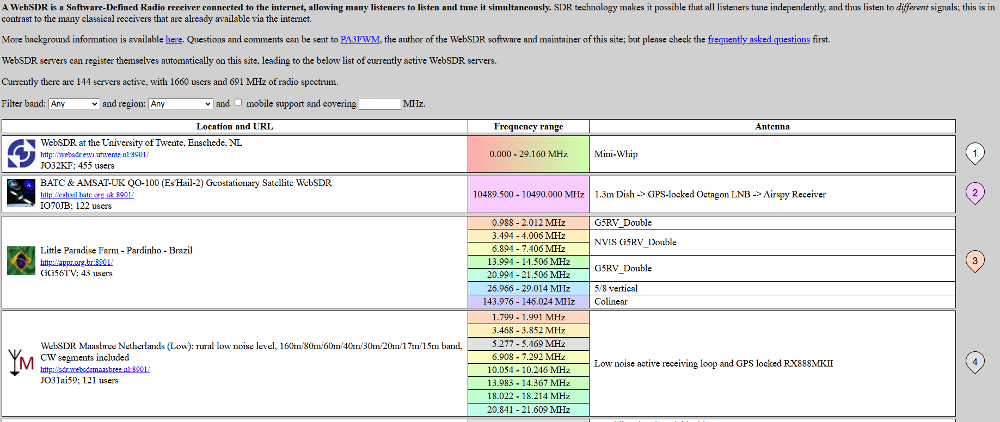

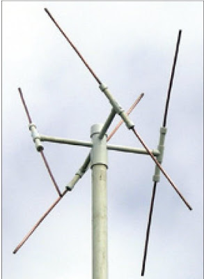

**1. Підключення до WebSDR та захоплення сигналу**

1.  **Вибір WebSDR:** Ми знайдемо відповідний WebSDR. Шукатимемо в
    пошуку за запитом "WebSDR 137 MHz" або "WebSDR NOAA Meteor".
    Переконаємося, що він активний та має хорошу антену.
2.  **Відстеження супутника:** Запустимо
    **[Orbitron](https://www.stoff.pl/)**. Введемо наші координати та
    додамо TLE-дані для NOAA 15/18/19 . Програма покаже нам час
    проходження супутників над зоною покриття WebSDR.
3.  **Налаштування WebSDR:** За кілька хвилин до проходження супутника
    налаштуємо частоту WebSDR на відповідну частоту супутника 137.9125
    МГц . Використовуватимемо **режим NFM** (narrowband FM) для NOAA та
    **широкосмуговий FM** (WFM) або **пряме захоплення IQ-сигналу**
    (якщо WebSDR це підтримує) для Meteor M2.
4.  **Запис аудіосигналу:** Під час проходження супутника записуватимемо
    аудіосигнал з WebSDR. Якщо WebSDR має функцію запису, використаємо
    її. В іншому випадку, нам потрібно буде перенаправити аудіо з
    браузера через **Віртуальний аудіокабель** в програму запису аудіо
    Audacity.

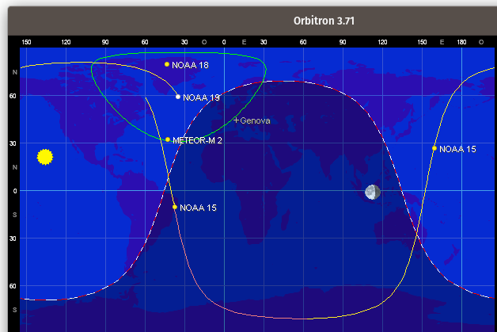

**2. Декодування зображення**

-   Відкриємо LRPTDecoder.
-   Якщо ми записували аудіофайл, конвертуємо його в потрібний формат за
    допомогою SDR\#.
-   Завантажимо файл до LRPTDecoder.
-   Запустимо процес демодуляції та декодування. LRPTDecoder створить
    зображення.

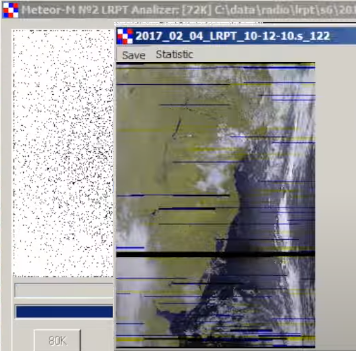

Висновок:

У ході експерименту було успішно прийнято та декодовано супутникове
зображення за допомогою WebSDR та спеціалізованого програмного
забезпечення. Використання WebSDR дозволило отримати сигнал без
необхідності власного радіообладнання, а програмні інструменти
забезпечили обробку та декодування даних у зображення. Результати
підтверджують ефективність дистанційного прийому супутникових сигналів і
демонструють доступність сучасних SDR-технологій для аматорських
досліджень у сфері радіозв'язку та супутникової метеорології.

Висновок по розділу 4
---------------------

У цьому розділі було розглянуто практичні аспекти роботи з SDR (Software
Defined Radio) для прийому та обробки аналогових і супутникових
радіосигналів. Проведені експерименти показали, що SDR-платформи
забезпечують гнучкість, універсальність і доступність для дослідників та
аматорів. Відсутність необхідності у спеціалізованому апаратному
забезпеченні (завдяки WebSDR) значно спрощує процес отримання та аналізу
сигналів. Використання сучасного програмного забезпечення дозволяє не
лише приймати сигнали, а й виконувати їхню демодуляцію, декодування та
подальшу обробку. Таким чином, SDR-технології відкривають широкі
можливості для експериментів у сфері радіозв'язку, навчання та
досліджень, а також сприяють популяризації радіоелектроніки серед
широкого кола користувачів.
