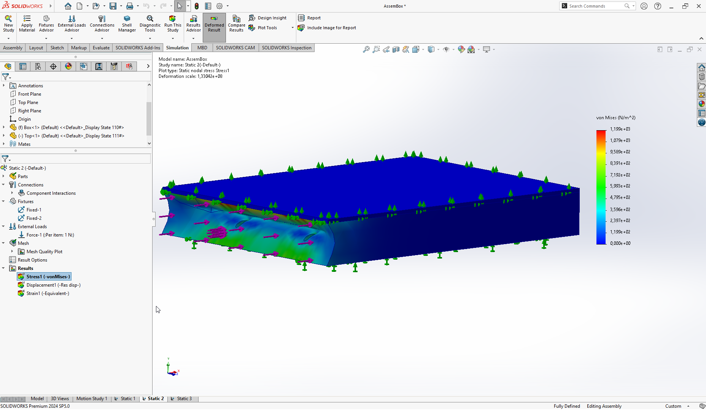

# Тиждень 5. Механічний аналіз та тестування матеріалів

На п'ятому тижні практики було проведено серію симуляційних аналізів розробленої 3D-моделі корпусу портативного автоматизованого комплексу в SolidWorks Simulation. Метою цих аналізів було оцінити міцність, жорсткість та деформації конструкції під впливом різних навантажень, а також порівняти поведінку корпусу з алюмінію та полімеру.

## Аналіз міцності при статичному навантаженні (Static Study 1)
Опис: На першому етапі було проведено статичний аналіз, щоб визначити розподіл напружень в корпусі під дією прикладених сил. Сили були змодельовані у вигляді тиску, рівномірно розподіленого по верхній поверхні корпусу, що імітує статичне навантаження від обладнання або зовнішнього тиску.

1. Відображає розподіл напружень (von Mises) у корпусі. Кольорова гама показує рівні напружень, від синього (низькі напруження) до червоного (високі напруження). Червоні стрілки вказують напрямок прикладених сил. Зелені стрілки, ймовірно, позначають місця фіксації.
2. Показує розподіл деформацій (Strain) у корпусі під навантаженням. Кольорова гама відображає величину деформацій.
3. Відображає переміщення (Displacement) корпусу під навантаженням. Червона область в центрі вказує на найбільші переміщення.

Висновки: Аналіз показав, що найбільші напруження виникають в місцях кріплення та навколо отворів. Деформації розподілені нерівномірно, з найбільшими переміщеннями в центральній частині корпусу. Ці результати дозволяють оцінити міцність конструкції та виявити потенційні слабкі місця.

## Аналіз міцності при зосередженому навантаженні (Static Study 2)

Опис: Другий аналіз був проведений для моделювання ситуації, коли на корпус діє зосереджена сила, наприклад, при ударі або падінні предмета. Сила була змодельована як точкова, прикладена в певній області верхньої поверхні корпусу.

1. Показує розподіл напружень (von Mises) при зосередженому навантаженні. Видно, що зона високих напружень локалізована навколо точки прикладання сили.
2. Відображає переміщення (Displacement) корпусу при зосередженому навантаженні. Деформації мають більш локальний характер порівняно з рівномірним навантаженням.

Висновки: Зосереджене навантаження призводить до значно вищих локальних напружень, що може спричинити пошкодження корпусу в місці удару. Ці результати підкреслюють важливість забезпечення міцності корпусу в місцях, найбільш схильних до ударів.

## Порівняльний аналіз матеріалів (Static Study 3)

Опис: На третьому етапі було проведено порівняльний аналіз поведінки корпусу, виготовленого з різних матеріалів (алюмінію та полімеру), при однакових умовах навантаження. Це дозволило оцінити вплив матеріалу на міцність, жорсткість та деформації конструкції.

1. Розподіл напружень (von Mises) для одного з матеріалів (ймовірно, алюмінію).
2. Розподіл деформацій (Strain) для іншого матеріалу (ймовірно, полімеру).
3. Переміщення (Displacement) для полімеру.

Висновки: Порівняльний аналіз показав, що алюміній має більшу жорсткість і менші деформації порівняно з полімером. Полімер, ймовірно, демонструє більшу гнучкість, але при цьому вищі рівні деформацій, що може призвести до його пошкодження при значних навантаженнях.

## Загальні висновки за результатами 5-го тижня:

* Проведені симуляційні аналізи дозволили отримати детальну інформацію про механічну поведінку розробленої 3D-моделі корпусу при різних умовах навантаження.
* Результати аналізів підтвердили важливість правильного вибору матеріалу та геометрії корпусу для забезпечення його міцності та надійності.
* Отримані дані будуть використані для оптимізації конструкції корпусу та прийняття обґрунтованих рішень щодо його виготовлення.

Рекомендації:

* На основі отриманих результатів рекомендується посилити конструкцію корпусу в місцях, де виникають найбільші напруження, наприклад, за допомогою додаткових ребер жорсткості або зміни геометрії.
* При виборі матеріалу слід враховувати не лише міцність і жорсткість, але й інші фактори, такі як вага, вартість, технологічність виготовлення та умови експлуатації.
* Для подальшої оптимізації конструкції рекомендується провести додаткові аналізи, наприклад, аналіз на власні коливання (модальний аналіз) для оцінки вібростійкості корпусу.
