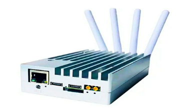

# ОГЛЯД ІСНУЮЧИХ РОЗРОБОК 

## [SDR радіостанція з 5 антенами 1МГц 6ГГц HackRF One Portapack H4 Mayhem](https://fd24.com.ua/ua/p1044872164-sdr-radiostantsiya-antennami.html?source=merchant_center&gad_source=1&gad_campaignid=16695681573&gbraid=0AAAAACqF10_-rY4lJZlaJmtpxI3HFCwSQ&gclid=CjwKCAjw56DBBhAkEiwAaFsG-tMrTVbThssU7Zpa5kQyvDk9m0I4ZMkaidrQvP96XgwxpQHuhkZQ7RoCglAQAvD_BwE)

### Опис

Програмно-визначувана радіостанція HackRF One з додатковим модулем PortaPack H4 та програмним забезпеченням Mayhem – універсальне портативне рішення для роботи, передачі і аналізу радіосигналів в широкому діапазоні частот. Цей пристрій створено на відкритому вихідному коді та володіє великим спектром застосування: моніторинг стільникових мереж, аналіз бездротових протоколів, програмування та експлуатація радіочастот, тестування безпеки бездротових мереж і багато іншого.

Оновлений модуль PortaPack H2 додає до функціоналу HackRF One кольоровий сенсорний дисплей, навігаційні кнопки і енкодер для керування. А встановлене програмне забезпечення Mayhem розширює можливості аналізу, експлуатації та тестування бездротових мереж.

На відміну від попередньої версії, H4 володіє покращеним матовим екраном, портом GPIO для додаткових аксесуарів, екранів та датчиків. Також переробленою системою живлення: один перемикач вкл/викл живлення; покращеною архітектурою керування батареєю: швидкою зарядкою через Type-C; відсутністю витоку живлення і розрядки акумулятора.

Вбудований повзунковий перемикач для швидкого перемикання між внутрішнім і зовнішнім мікрофоном/навушниками. Новий вбудований мікрофон дозволить використовувати H4 в якості повноцінного голосового приємопередавача.

**Характеристики**

* Версія: v2.0.2
* Робота в режимі: полудуплекс
* Діапазон частот: 1 МГц – 6 ГГц
* Підтримувана частота дискретизації: від 2 до 20 млн семплів в секунду
* Програмно-керуючий смуговий фільтр на прийом і передачу
* Програмно-контрольоване живлення антенного порта (до 50 мА на 3.3 В)
* Сенсорний кольоровий РК-екран з діагоналлю 3.2”
* Вбудований динамік
* Зручні кнопки для програмування
* Роз'єм антени: SMA-мама
* Роз'єм для навушників/мікрофона: 3.5 мм
* Роз'єм GPIO для підключення
* Живлення: вбудований акумулятор, ємністю 2500 мАг
* Матеріал корпусу: АВС-пластик
* Розміри: 8 x 12.5 x 2.5 см

**Комплектація**

* Програмована радіостанція HackRF One
* Підсилювач 20 дБ 50 МГц - 6 ГГц
* Антена 5 дБі 40 – 860 МГц
* Антена 8 дБі 2.4 / 5 / 5.8 ГГц
* Антена 12 дБі 700 – 2700 МГц
* Антена 35 дБі 700 – 2700 МГц
* Телескопічна антена 40 МГц – 6 ГГц
* Кабель SMA тато-тато, довжиною ~10 см
* Кабель Type-C
* Вага набору: 800 г

## [SDR радіостанція з 4 антенами 70МГц 6ГГц LibreSDR PLUTO з Zynq7020](https://fd24.com.ua/ua/p2465955107-sdr-radiostantsiya-antennami.html)

LibreSDR є аналогом популярного SDR-модуля ADALM-PLUTO (або PlutoSDR), який зроблений у металевому корпусі для ефективнішого розсіювання тепла та міцності.

Пристрій спроєктований на друкованій платі з використанням 8-бітної мікросхеми ЦАП. На самій платі містяться наступні роз'єми:

* два коаксіальні роз'єми MMCX (мама) для інтерфейсів синхронізації 1 PPS і 10 МГц;
* роз'єм RJ-45 для інтерфейсу Gigabit Ethernet, через який відбувається передавання IQ-складників сигналу та доступ у консоль вбудованої ОС Linux;
* два роз'єми Type-C (OTG і Debug):
    * OTG для доступу в консоль вбудованої Linux з послідовного порту
    * Debug для налагодження та завантаження вбудованого ПЗ засобами Xilinx через інтерфейс JTAG
    * обидва роз'єми також використовуються для живлення LibreSDR
* роз'єм MicroSD;
* 4 коаксіальні роз'єми SMA (мама) для двох приймальних і двох передавальних каналів.

Також на пристрої є прихована кнопка DFU для відновлення заводського вбудованого ПЗ. У LibreSDR інтегрований радіочастотний трансивер AD9363.

**Характеристики**

* Використання чіпа XC7Z020-2CLG400I xc7z020-2I
* Чип AD9363 налаштований на використання чипа AD9361 з діапазоном частот 70 МГц ~ 6 ГГц
* Канали: 2 TX, 2 RX
* Розрядність ЦАП/АЦП: 12 біт
* Діапазон частот: 70 МГц – 6 ГГц
* Вихідна частота: VCTCXO 40 МГц 0.5 стор./хв
* SOC: для Zynq7010 FPGA: 28 Кб
* ОЗП: 512 Mб
* FLASH: 32 Mб
* USB: 2.0, підтримка OTG
* Ethernet: 1000 Mб
* MicroSD можна використовувати для завантаження
* Вхід постійного струму: 5 В, 2 А, MicroUSB
* Підтримка дуплексів: TDD, FDD
* Смуга пропускання: від 200 кГц до 20 МГц
* Матеріал: алюміній
* Розмір: 11.3 х 7.2 х 3 см
* Вага: 565 г

**Комплектація**

* SDR радіостанція
* 4 WI-FI-антени
* 2 Type-C кабелю
* Type-C to USB OTG кабель
* мережевий кабель 1.5 м
* MicroSD 32GB з прошивками

## [BladeRF 2.0 micro xA4 SDR трансівер 47 МГц-6 ГГц 49 КЛЕ ПЛІС](https://selteq.com.ua/ru/bladerf-2-0/)

BladeRF 2.0 micro xA4 Програмно-визначене радіо (SDR) нового покоління з частотним діапазоном від 47 МГц до 6 ГГц, 2×2 MIMO, ПЛІС із 49К логічних елементів.

**Опис**

bladeRF 2.0 micro xA4 – це програмно-визначене радіо (SDR) нового покоління з частотним діапазоном від 47 до 6 ГГц, частотою дискретизації 61,44 МГц (з можливістю збільшення до 122,88 МГц) та потоковою передачею 2×2 MIMO. Будучи упакованим у невеликий форм-фактор, bladeRF 2.0 micro був розроблений для високопродуктивних та мобільних додатків. Завдяки libbladeRF bladeRF 2.0 micro сумісний з GNURadio, GQRX, SDR-Radio, SDR#, gr-fosphor, SoapySDR і т.д. під Windows, Linux та MacOS.

Екрануючий кожух захищає чутливі радіочастотні компоненти від електромагнітних перешкод (EMI) та забезпечує додаткове тепловідведення, дозволяючи bladeRF 2.0 micro працювати у складних умовах.

Всі радіочастотні SMA-порти здатні забезпечити живлення широкосмугових та попередніх підсилювачів за схемою струмового інжектора. Живлення периферійних пристроїв струмовим інжектором управляється програмно, що забезпечує максимальну експлуатаційну гнучкість.

В основі мікросхеми bladeRF 2.0 лежить ПЛІС останнього покоління Cyclone V від Intel (раніше Altera). xA4 використовується ПЛІС, що містить 49 логічних елементів.

**Удосконалений тактовий генератор**

Удосконалена архітектура синхронізації дозволяє bladeRF 2.0 micro приймати від інших пристроїв та передавати сигнал тактового генератора з частотою 38,4 МГц. Крім того, вбудована схема ФАПЧ дозволяє мікроконтролеру bladeRF 2.0 синхронізувати вбудований тактовий генератор із зовнішнім сигналом опорної частоти 10 МГц. У моделі xA4 використовують високоточний, стабільний тактовий генератор. Вбудований ЦАП управляє регулюванням підстроювання частоти генератора для заводського калібрування.

Ланцюги живлення модуля bladeRF 2.0 micro є складною комбінацією малошумливих і високоефективних імпульсних і лінійних регуляторів потужності. Хоча bladeRF 2.0 micro може живитися виключно від USB шини, для забезпечення максимальної лінійності периферійних пристроїв, що живляться через інжектор, необхідно підключити зовнішнє джерело живлення. Ланцюги живлення мають схему автоматичного перемикання для оптимізації споживання потужності між шиною USB та зовнішнім постійним живленням.

Модуль bladeRF 2.0 micro може працювати в некерованому автономному режимі, не вимагаючи підключення до зовнішнього контролера або комп'ютера. Об'єм вбудованої флеш-пам'яті досить великий, щоб вмістити образ ПЛІС будь-якого розміру xA4.

**Можливості та функції**

* **РЧ-ХАРАКТЕРИСТИКИ:**
    * Діапазон частот: від 47 МГц до 6 ГГц
    * 2 × 2 MIMO
    * Частота дискретизації: 61,44 МГц
    * Ширина смуги ПЧ: до 56 МГц
    * Автоматичне регулювання посилення (АРП)
    * Автоматична корекція IQ та зміщення по постійному струму

* **ПІДТРИМКА СВЕРХХІДНОГО ІНТЕРФЕЙСУ USB 3.0:**
    * Процесор ARM926EJ-S із частотою 200 МГц
    * Повністю живиться по шині USB 3.0
    * Зовнішнє живлення 5 В постійного струму з автоматичним перемиканням

* **ПЛІС ALTERA CYCLONE V FPGA:**
    * 49 кЛЕ для користувальницької обробки сигналів та апаратних прискорювачів

* **VCTCXO ІЗ ЗАВОДСЬКИМ КАЛІБРУВАННЯМ:**
    * Управління ланцюгом ФАПЧ 12-розрядним ЦАП
    * Заводське калібрування тактової частоти 38,4 МГц

## [Радіоприймач 1 МГц-6GHz SDR Повнофункціональний радіопередавач-аматор](https://www.joom.com/uk/products/67ea3b1a35422d011b0f5a93?variant_id=67ea3b1a35422dbc1b0f5a95)

### Особливість

1. **3,5 мм звуковий роз'єм:** Цей радіотрансивер використовує 3,5-мм аудіороз'єм, тому, підключивши мікрофон, ви можете просто натиснути та утримувати праву бічну кнопку, щоб здійснити дзвінок.
2. **Прийом кількох голосових повідомлень:** Цей радіотрансивер підтримує прийом голосу в діапазонах SSB, AM, вузькосмугового FM, широкосмугового FM зі спектральним водоспадом.
3. **Спіймати та відтворити:** Цей радіоприймач дуже спрощує прийом та відтворення бездротових сигналів з пультів дистанційного керування діапазону ISM.
4. **Апаратне забезпечення завершено:** Цей радіотрансивер оснащений 3,2-дюймовим резистивним сенсорним екраном, навігаційними перемикачами, радіовиходами, мікрофонними входами, інтерфейсом DC 2.1 та 4-шаровим позолоченим покриттям.
5. **Широке застосування:** Цей радіоприймач має широкий спектр застосування та може використовуватися на кораблях, автомобілях, електронних лічильниках комунальних послуг, для моніторингу транспондерів тощо.

**Специфікація:**

* Тип пристрою: Радіоприймач
* Матеріал: Алюмінієвий сплав
* Тип батареї: Літієва батарея 3,7 В 2000 мАг x1 (Поставляється з вбудованою батареєю)
* Антена прийому частотного діапазону: 1 МГц – 6 ГГц

**Зловити повтор:**

Одна з найкращих переваг радіотрансивера полягає в тому, що він дозволяє дуже легко вловлювати та відтворювати бездротові сигнали з пультів дистанційного керування діапазону ISM.  
Створіть улов. Все, що вам потрібно зробити, це зайти в меню лову, встановити частоту клавішею пульта дистанційного керування, натиснути червону кнопку запису R та натиснути клавішу на пульті дистанційного керування.  
Потім зупиніть запис, щоб зберегти його на карту пам’яті.  
Тепер ви можете перейти до меню Відтворення, вибрати щойно записаний файл і натиснути кнопку Відтворити. Точно такий же сигнал буде передаватися по повітрю, ефективно замінюючи ваш віддалений ключ.

**Мікрофон TX:**

**Приймач:**

Ви можете легко прослуховувати стандартні радіосигнали NFM та WFM, підключивши динамік до 3,5-мм радіороз'єму Portapack.  
Прийом ADS B легко вмикається на радіопередавачі, вибравши символ індуктора та блискавки у верхньому правому куті.

**Апаратної конфігурації:**

* 3,2-дюймовий, 240 x 320 RGB РК-дисплей з резистивним сенсорним екраном
* Навігаційні перемикачі
* Радіовихід
* Вхід мікрофона
* Роз'єм постійного струму 2.1
* 4-шарове позолота

**Функції HAVOC включають:**

* Відтворення файлів IQ
* Мікрофонна FM-передача з CTCSS
* Декодер CTCSS
* Частотний менеджер (Збереження та завантаження з карти пам'яті з категоріями та коментарями)
* Файловий менеджер
* Програвач звукових файлів Soundboard Wave (Зберігає 8-бітні монофайли) Карта пам'яті, каталог Wav
* Приймач ADS B з видом карти
* Передавач SSTV
* Повністю налаштовувані сигнали передавача
* Передавач POCSAG
* Приймач, декодер POCSAG
* Передавач Морзе (FM-тон та CW)
* Передавачі OOK для звичайних дистанційних кодерів (PT2262, Дверні дзвінки, Віддалені розетки, Деякі гаражі)
* RDS (Система радіоданих) Передавачі PSN, радіотексту та групового зв'язку за часом
* Приймачі метеорологічних радіоехолотів для M10 та M2K2
* Приймач AFSK
* Передавач АФСК (Дзвінок202)
* Передавач синхронізації Nuoptix DTMF
* Універсальний пульт дистанційного керування TouchTunes Jukebox
* LCR (Language de Commande Routier) Генератор повідомлень
* Передавач управління вуличним освітленням (Тони CCIR)
* Прикидатися мертвим у надзвичайних ситуаціях
* Повністю налаштовуваний генератор радіочастотних сигналів
* Вихід радіо RSSI для висоти тону (для пошуку напрямку)

**Особливості:**

* 4-сторонні кнопки зі стрілками, колесо прокручування та кнопки вибору
* Батарейка-таблетка для збереження налаштувань, дати й часу
* Слот для мікрокартки пам'яті для зберігання даних та коду
* SSB, AM, вузькосмуговий FM, широкосмуговий FM-радіоприйом з каскадним спектром
* Високошвидкісне підключення (18 МГц) Спектральний та каскадний аналіз
* Моніторинг суден (AIS), автомобілів (TPMS), Транспондери електронних лічильників комунальних послуг (ІТРОН ЕРТ)
* Для режиму запуску прошивки для використання з програмним забезпеченням хоста SDR
* Калібрує PPM для точніших налаштувань
* Режим сну економить енергію, вимикаючи лише дисплей

**Інструкції:**

Коли ви переведете PortaPack у режим, він продовжить працювати з програмним забезпеченням SDR на базі ПК.  
Радіоприймач сумісний лише з One. Якщо на вашому пристрої для синього не встановлено роз’єм базової смуги, у вас не повинно виникнути механічних проблем.

**Список пакунків:**

* 1 x Повнофункціональний радіопередавач
* 5 x Антена
* 2 x Аксесуар для антени
* 1 x USB-кабель
* 1 x Інструкція англійською мовою

## [Приймач 1.10D DSP SDR від 10 кГц до 2 ГГц 3,5-дюймовий сенсорний екран, підтримка 2 антен, короткохвильовий радіоприймач](https://www.joom.com/uk/products/67b2acd0683d8101ba932088?variant_id=67b2acd0683d815eba93208a)

### Опис

1. **Режим демодуляції:** Приймач DSP SDR з використанням AM, SSB, NFM, WFM, CW. На основі архітектури SDR, використовуючи передній кінець msi001 RF для 12-бітної кількісної вибірки, використовуючи процесор stm32h743, основна частота до 480 МГц.
2. **Чутливість і тривалий термін служби батареї:** Цей приймач DSP SDR має частотний діапазон 10 кГц–2,0 ГГц (Зареєстрована версія 1.10d) з s,w 0,3 мікровольт 10 дБ на частоті до 250 МГц. Вбудований акумулятор ємністю 3000мАг забезпечує тривале відтворення.
3. **Фільтри:** Приймач DSP SDR радіо підтримує подвійний антенний вхід, модуль фільтра загасання переднього кінця, загасання до 30 дБ, високий опір введення, поліпшену короткохвильову чутливість, додати чотири додаткових фронтальних фільтра.
4. **Багатофункціональна:** Цей короткохвильовий радіоприймач DSP SDR має потужні вбудовані функції зі змінною шириною фільтра, адаптивного шумозаглушувача, порогового шумозаглушувача, шумозаглушувача, AGC, еквалайзера.
5. **Підключення до USB:** 3,5-дюймовий ємнісний сенсорний екран. Корпус друкованої плати, краща радіочастотна продуктивність, через USB-підключення до комп’ютера, для кота, IQ і звуковий зв’язок може бути реалізований.

**Специфікація:**

* Тип елемента: приймач DSP SDR
* Матеріал: PCB
* Акумулятор: літій-іонний акумулятор 503450 (Побудований в), Ємність: 3000mAh
* Екран: 3,5-дюймовий IPS ємнісний сенсорний екран
* Демодуляція: AM, SSB, NFM, WFM, CW
* Значення частоти: діапазон від 50 кГц до 49,999 МГц, від 50,001 МГц до 249,999 ГГц, від 400 МГц до 2 ГГц
* MCU: потужний stm32h743 із тактовою частотою 480 МГц.
* Потужні функції: змінна ширина фільтра, адаптивний шумоподавлювач, пороговий шумоподавлювач, шумоподавлювач, AGC, еквалайзер.
* Мікросхема демодуляції: використовуйте повністю функціональну, високоінтегровану та надійну мікросхему msi001.
* Підключено: через USB-з’єднання з комп’ютером, для кота, IQ та звукового зв’язку можна реалізувати.

**Комплектація**

* 1 x приймач DSP SDR
* 1 x зарядний кабель типу C
* 1 x антена
* 4 x гвинт
* 2 x гайка
* 2 x кронштейн

## Висновок по розділу

Ринок автоматизованих систем управління вогнем та контролю пропонує інноваційні рішення, спрямовані на прискорення процесів прийняття рішень і підвищення точності бойових завдань.
Однак більшість систем орієнтовані на масштабні військові операції та потребують значних фінансових та технічних ресурсів. Це відкриває перспективи для розробки компактних, економічно ефективних систем, орієнтованих на малі групи, що можуть виконloувати завдання в автономному режимі з мінімальною інфраструктурою.