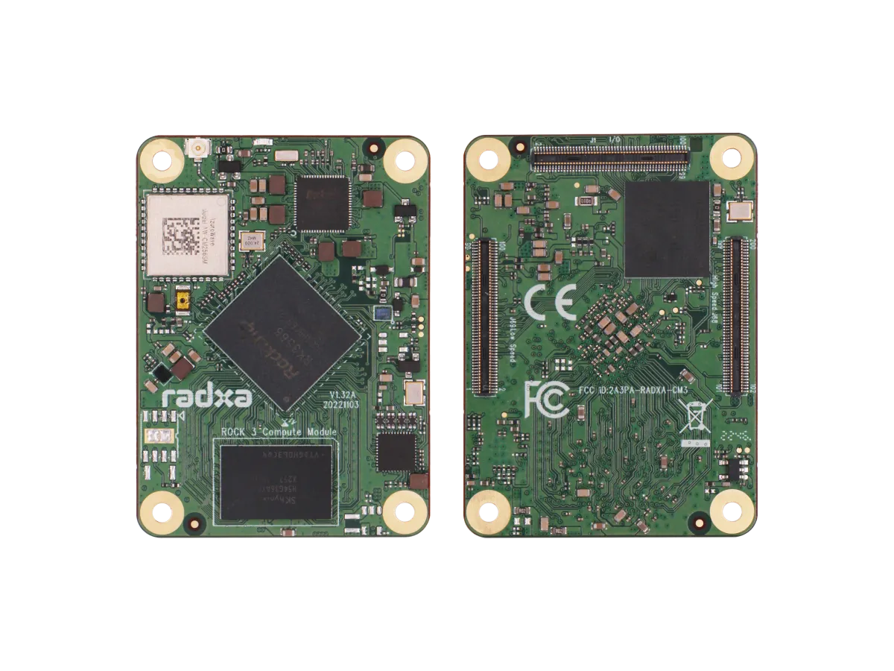
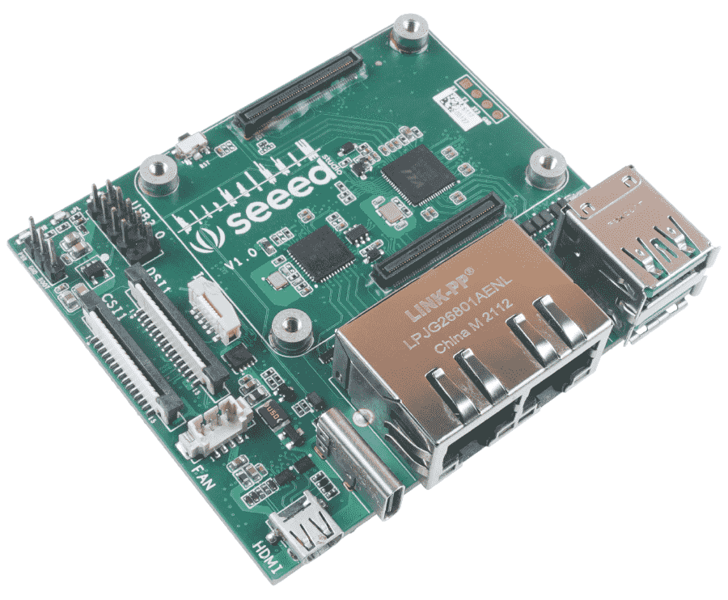
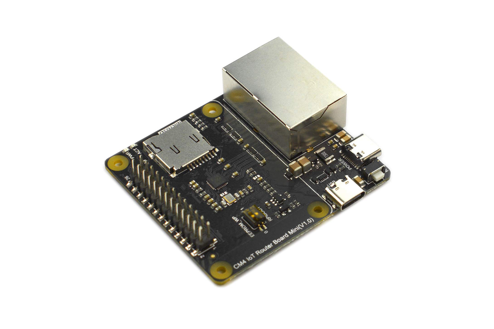
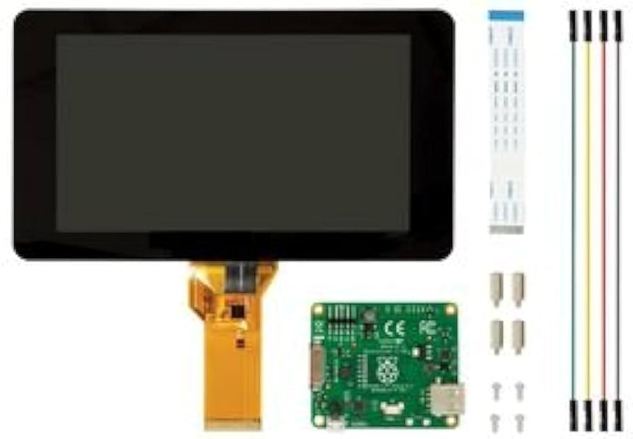
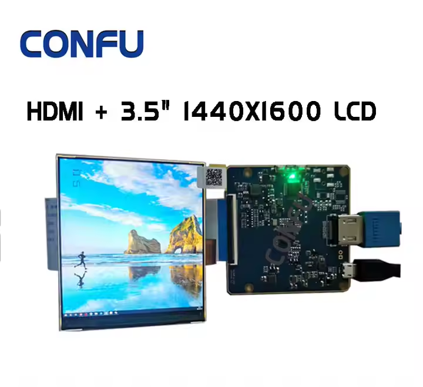
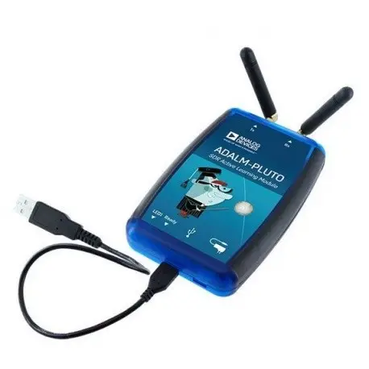

# ПІДБІР ЕЛЕМЕНТОЇ БАЗИ

## Центральне ядро обчислень

### [Raspberry Pi Compute Module 4](https://www.raspberrypi.com/products/compute-module-4/?variant=raspberry-pi-cm4108032)

Raspberry Pi Compute Module 4 (CM4) — це компактний та потужний комп'ютер на базі процесора Broadcom BCM2711, який використовується в різноманітних вбудованих системах. Це основний компонент, який виконує обчислювальні операції у проекті. CM4 пропонує широку гнучкість завдяки варіативності в обсягах пам'яті (від 1 ГБ до 8 ГБ) і можливості додаткового зберігання через eMMC або microSD картки.

Переваги:
- Висока потужність: чотириядерний процесор Cortex-A72 дозволяє запускати інтенсивні додатки, зокрема обробку відео та даних у реальному часі.
- Гнучкість: доступні варіанти з різними об'ємами пам'яті та зберігання.
- Широка підтримка периферії: можливість підключення різноманітних пристроїв через GPIO, HDMI, USB, Ethernet, а також підтримка стандартних Raspberry Pi HAT.
- Підтримка бездротового зв'язку: вбудовані модулі Wi-Fi та Bluetooth дозволяють організувати мобільний зв'язок і передачу даних без дротів.

Недоліки:
- Високі вимоги до живлення: потребує постійного підключення до джерела живлення, що може бути проблемою в автономних рішеннях.
- Відсутність вбудованого монітора: необхідно підключати зовнішній дисплей.
- Обмеження за типами зберігання: відсутність стандартного жорсткого диска обмежує швидкість зберігання даних при великих об'ємах.

### NVIDIA Jetson Nano

NVIDIA Jetson Nano — це мікрокомп'ютер, орієнтований на проекти, що потребують обробки даних з використанням штучного інтелекту (AI). Він оснащений чотириядерним ARM Cortex-A57 процесором та графічним процесором NVIDIA Maxwell із 128 ядрами CUDA, що робить його ідеальним для задач комп'ютерного зору, машинного навчання та автономних систем.

Переваги:

* Потужний GPU: підтримує глибоке навчання, AI, відеоаналітику в реальному часі.
* Висока продуктивність у AI-завданнях: оптимізований під TensorFlow, PyTorch, OpenCV.
* Підтримка дисплеїв через HDMI та MIPI DSI, а також камер через CSI.

Недоліки:

* Високе енергоспоживання, що не ідеально для автономних рішень.
* Обмежена спільнота у порівнянні з Raspberry Pi.
* Потребує активного охолодження при тривалому навантаженні.

[Офіційна сторінка Jetson Nano](https://developer.nvidia.com/embedded/jetson-nano)

### [Radxa CM3](https://wiki.radxa.com/CM3)

Radxa CM3 — це сумісний за розмірами модуль з Raspberry Pi CM4, але базується на SoC Rockchip RK3566 (4x Cortex-A55 до 2.0 ГГц) і орієнтований на вбудовані та мультимедійні рішення. Він підтримує до 8 ГБ LPDDR4 RAM і до 128 ГБ eMMC.

Переваги:

* Висока енергоефективність: Cortex-A55 забезпечує хорошу продуктивність при низькому споживанні енергії.
* Розширені можливості відео: підтримка 4K відео, кодеків H.265/H.264.
* Повна сумісність по роз'єму з Raspberry Pi CM4.

Недоліки:

* Менш розвинена екосистема (менше доступного ПЗ, менше підтримки спільноти).
* Підтримка Linux дещо обмежена в порівнянні з Raspberry Pi OS.
* Немає вбудованого Wi-Fi/Bluetooth у базовій конфігурації.

### [Banana Pi BPI-CM4](https://wiki.banana-pi.org/Banana_Pi_BPI-CM4)

Banana Pi BPI-CM4 — ще один сумісний із Raspberry Pi Compute Module 4 варіант, який використовує Rockchip RK3568 (4x Cortex-A55). Він орієнтований на промислові рішення, що потребують високої стабільності та надійності.

Переваги:

* Великий набір інтерфейсів: SATA, PCIe, USB 3.0, MIPI DSI/CSI.
* Підтримка eMMC до 128 ГБ, до 8 ГБ RAM.
* Хороша термостійкість і надійність — придатний для польових умов.

Недоліки:

* Не настільки добре підтримується спільнотою, як Raspberry Pi.
* Відсутність офіційної підтримки деяких популярних дистрибутивів Linux.
* Деякі користувачі відзначають нестабільність програмного забезпечення.

Висновок:

Попри наявність конкурентів, Raspberry Pi Compute Module 4 залишається найкращим вибором для через баланс між продуктивністю, гнучкістю, широкою підтримкою та стабільністю. Його багаторічна репутація, величезна спільнота користувачів, сумісність з великою кількістю периферійних модулів і чудова документація роблять його ідеальним ядром для проєктів, де важливі стабільність, підтримка і масштабованість.

## Материнська плата

### [Compute Module 4 IO Board](https://www.raspberrypi.com/products/compute-module-4-io-board/)

Це основна плата для підключення Raspberry Pi Compute Module 4 до різних периферійних пристроїв. Вона надає різноманітні порти та можливості підключення: HDMI, USB, Ethernet, слот для microSD, PCIe слот для розширення і підтримку камер через MIPI CSI-2.

Переваги:
- Розширення можливостей: надає доступ до всіх основних інтерфейсів для підключення периферії.
- Інтерфейси для дисплеїв і камер: підтримує MIPI DSI для дисплеїв та MIPI CSI-2 для камер, що дозволяє створювати мультимедійні системи.
- Підтримка PoE: можливість живлення через Ethernet (PoE) спрощує монтаж і зменшує потребу в додаткових живильних кабелях.

Недоліки:
- Потрібен додатковий обв'язок: вимагає підключення Compute Module 4, що збільшує складність розробки та інтеграції.
- Обмеження по кількості портів: деякі інтерфейси, такі як USB, обмежені в портах.

### [Waveshare CM4 IO Base Board B](https://www.waveshare.com/cm4-io-base-b.htm)

Ця плата розроблена компанією Waveshare спеціально для Raspberry Pi Compute Module 4. Вона має компактний форм-фактор, зручний для вбудованих рішень, а також надає доступ до основних портів: HDMI, USB, Ethernet, камери та дисплеїв через MIPI.

Переваги:

* Компактний розмір: зручно вбудовується у портативні пристрої, включаючи планшети.
* Повна підтримка CM4: має слот для eMMC-версій, слот microSD для Lite-версій.
* Виводи для GPIO: можна підключати сенсори, кнопки, інші периферійні пристрої.

Недоліки:

* Обмежені можливості розширення: відсутній PCIe слот.
* Відсутність PoE: не підтримується живлення через Ethernet.

### [Seeed Studio reComputer CM4 IO Board](https://www.seeedstudio.com/reComputer-IO-Board-p-5279.html)

Розроблена для використання з CM4, плата reComputer IO Board орієнтована на промислові рішення та мультимедійні пристрої. Має повноцінний набір інтерфейсів, включаючи HDMI, USB 3.0, GbE Ethernet, слот PCIe, RTC, і підтримує до 2 камер.

Переваги:

* Підтримка PCIe: дозволяє розширити функціональність через NVMe диски або інші модулі.
* Підтримка RTC: можливість точного відстеження часу без зовнішнього джерела.
* Гарна якість збірки та розведення.

Недоліки:

* Трохи більші габарити — не ідеально для тонких планшетів.
* Вища ціна у порівнянні з базовими платами.

<!-- ### [DFRobot Raspberry Pi CM4 IoT Router Carrier Board Mini](https://www.dfrobot.com/product-2590.html)

Хоча ця плата орієнтована на побудову маршрутизаторів на базі CM4, вона має компактний розмір і чудово підходить для мініатюрних планшетів з функціями зв’язку. Має два гігабітні порти, слот для microSD, USB 2.0, UART, і GPIO.

Переваги:

* Дуже компактна: ідеально підходить для планшетів та мобільних пристроїв.
* Добре підходить для мережевих рішень: два гігабітні Ethernet порти.
* GPIO на місці — для підключення сенсорів і модулів.

Недоліки:

* Обмежена мультимедійна підтримка: відсутній HDMI і роз'єм для дисплеїв.
* Немає PCIe і слотів для камер. -->

Висновок

Compute Module 4 IO Board — це еталонна плата від Raspberry Pi Foundation, яка надає найбільшу гнучкість для розробників. Вона підтримує всі ключові інтерфейси, включно з PCIe, двома камерами, двома дисплеями, PoE та великим числом GPIO. Завдяки офіційній підтримці, надійності та великій кількості доступної документації, ця плата є найкращою базою для побудови прототипів і повноцінних DIY-пристроїв, таких як планшети, мультимедійні станції чи автоматизовані контролери.

## Дисплей

### [Сенсорний дисплей IBM Lenovo Wacom 12.1in XGA LCD Touch Screen](https://www.alancomputech.com/ibm-lenovo-wacom-12-1in-xga-lcd-touch-screen-13n7241-laptop-su5r-12s05as-02x-13n7241.html)

Цей сенсорний дисплей має XGA роздільну здатність (1024x768 пікселів) і підтримує технологію стилусного введення. Його можна використовувати для розробки інтерфейсів користувача, де необхідний високий рівень точності введення. Використання стилуса дозволяє отримати більш точні результати, що важливо в польових умовах або при роботі з картами та іншими детальними графіками.

Переваги:
- Сенсорне введення: підтримує ввід як пальцем, так і стилусом, що є важливим для інтерактивних додатків.
- Висока точність: точність введення за допомогою стилуса дозволяє використовувати дисплей у складних робочих умовах.
- Компактність і зручність: зручний розмір для портативних рішень.

Недоліки:
- Малий розмір екрана: може бути недостатньо великим для відображення складних графічних інтерфейсів.
- Вартість: дисплей високої якості може бути дорожчим порівняно з іншими дисплеями.

### [Waveshare 10.1" HDMI LCD with Capacitive Touch](https://www.waveshare.com/10.1inch-hdmi-lcd.htm)

Цей 10.1-дюймовий дисплей із роздільною здатністю 1280x800 пікселів підтримує ємнісне сенсорне введення до 10 дотиків одночасно. Він підключається через HDMI для відео і через USB для сенсорного інтерфейсу, що робить його простим у використанні з Raspberry Pi Compute Module 4.

Переваги:

* Вища роздільна здатність, ніж XGA — зручніше для сучасних UI.
* Ємнісний multitouch: підтримка до 10 торкань, плавна взаємодія.
* Просте підключення (HDMI + USB), без складного налаштування драйверів.

Недоліки:

* Не підтримує стилус з точністю Wacom.
* Не має MIPI-інтерфейсу — потребує HDMI, що не завжди зручно в планшетах.

### [Official Raspberry Pi 7" Touchscreen Display](https://www.raspberrypi.com/products/raspberry-pi-touch-display/)

Офіційний 7-дюймовий дисплей для Raspberry Pi має роздільну здатність 800x480 та підтримує ємнісний multitouch. Підключається через DSI-інтерфейс, тому не займає HDMI-порт, що критично у компактних системах.

Переваги:

* DSI-підключення: не займає HDMI, що залишає порт для додаткового дисплея або інших задач.
* Компактний: ідеально підходить для невеликих корпусів планшету.
* Хороша інтеграція з Raspberry Pi: драйвери та підтримка з коробки.

Недоліки:

* Низька роздільна здатність (800x480) — обмеження при роботі з великими UI.
* Малий розмір — не завжди зручно для складних інтерфейсів.

<!-- ### [BOE 10.1" MIPI DSI IPS LCD Touch Screen](https://www.panelook.com/TV101WXM-NH0_BOE_10.1_LCM_overview_26806.html)

Цей дисплей з IPS-матрицею має роздільну здатність 1280x800 або 1920x1200, підтримує інтерфейс MIPI DSI і часто використовується у промислових планшетах. Підтримує ємнісне сенсорне введення, є моделі з підтримкою стилуса (пасивного або активного).

Переваги:

* Повна підтримка MIPI DSI — без потреби у HDMI, що критично для CM4.
* Висока роздільна здатність, широкі кути огляду (IPS).
* Опціонально — підтримка стилуса або перо.

Недоліки:

* Потребує контролера або виводу з CM4 через DSI-конектор (іноді складне підключення).
* Немає стандартизованої підтримки — залежить від конкретної моделі. -->

Висновок

Цей дисплей виділяється завдяки підтримці активного стилуса з технологією Wacom, що забезпечує високу точність введення, критичну для військових або інженерних додатків, картографії та роботи в складних умовах. Його співвідношення сторін (4:3) зручно для читання технічної документації та створення інтерфейсів, орієнтованих на точність, а не на розваги. Крім того, його корпус і призначення дозволяють використовувати дисплей у надійних польових рішеннях, що робить його кращим варіантом серед альтернатив.

## Пристрій захоплення радіосигналу

### [HackRF-One](https://github.com/dodgymike/hackrf-wiki/blob/master/HackRF-One.md)

HackRF-One — це програмоване радіо, що дозволяє працювати з широким діапазоном частот (від 1 MHz до 6 GHz). Цей пристрій є потужним інструментом для досліджень і застосувань у бездротових комунікаціях, криптографії, виявленні та аналізі радіосигналів.

Переваги:
- Широкий діапазон частот: підтримка від 1 MHz до 6 GHz дозволяє працювати з практично всіма радіочастотними спектрами.
- Програмованість: можливість налаштовувати частоти і параметри роботи за допомогою відкритого програмного забезпечення.
- Мобільність: HackRF-One має компактний розмір, що дозволяє використовувати його у польових умовах.

Недоліки:
- Потребує спеціалізованих знань: використання потребує знань у галузі радіоелектроніки та програмування.
- Обмежена потужність: HackRF-One не підходить для високоякісних і далекобійних передавальних пристроїв.

### [RTL-SDR v3](https://www.rtl-sdr.com/buy-rtl-sdr-dvb-t-dongles/)

RTL-SDR — це недорогий USB-приймач SDR, побудований на базі RTL2832U. Хоча він не підтримує передавання сигналів, його можна використовувати для широкого спектру задач моніторингу — від аналізу спектру до прийому супутникових або авіаційних сигналів.

Переваги:

* Дуже низька вартість — ідеально підходить для початківців.
* Покриває частоти від 500 kHz (через модифікацію) до 1.7 GHz.
* Працює з популярними програмами, такими як SDR#, GQRX, GNURadio.

Недоліки:

* Тільки приймач — неможливо передавати сигнали.
* Вужчий діапазон частот порівняно з HackRF.
* Нижча точність та динамічний діапазон.

### [LimeSDR Mini v2](https://limemicro.com/products/boards/limesdr-mini/)

LimeSDR Mini — це компактний SDR із повною підтримкою прийому та передачі сигналів. Працює в діапазоні від 10 MHz до 3.5 GHz та підтримує USB 3.0 для високої швидкості передачі даних. Відмінно підходить для мобільних проєктів з аналізу та трансляції сигналів.

Переваги:

* Повноцінна підтримка TX/RX.
* Вища якість сигналу, ніж у HackRF, особливо при цифровій модуляції.
* Відкрите ПЗ та активна спільнота.

Недоліки:

* Вужчий частотний діапазон: до 3.5 GHz проти 6 GHz у HackRF-One.
* Дорожчий, ніж RTL-SDR, і трохи складніший у використанні.
<!-- 
### [ADALM-Pluto (PlutoSDR)](https://wiki.analog.com/university/tools/pluto)

PlutoSDR від Analog Devices — це потужна SDR-платформа з підтримкою прийому і передачі в діапазоні 325 MHz – 3.8 GHz (можна розширити до 70 MHz – 6 GHz через прошивку). Використовується в освітніх та наукових цілях, з дуже якісною документацією та підтримкою від виробника.

Переваги:

* Надійна апаратна реалізація від Analog Devices.
* TX/RX з хорошим рівнем чистоти спектру.
* Можливість розширення частотного діапазону програмно.

Недоліки:

* Складніше у налаштуванні для новачків.
* Менш компактний форм-фактор, ніж у HackRF-One. -->

Висновок

HackRF-One — це оптимальний баланс між функціональністю, мобільністю та відкритістю платформи. Він підтримує як прийом, так і передачу сигналів у найширшому частотному діапазоні (1 MHz – 6 GHz), що дозволяє працювати з більшістю типів радіозв’язку: GSM, LTE, LoRa, Wi-Fi, Bluetooth, GPS, супутниковий зв’язок та інше. Його компактність і USB-підключення роблять його зручним для мобільного використання, а широка підтримка в спільноті забезпечує легке навчання та розгортання. У контексті польових умов і потреб DIY-планшету, HackRF-One забезпечує універсальність без складного налаштування або надлишкової вартості, тому він залишається найкращим варіантом.

## Пристрій захоплення аналогового відеосигналу

### USB карта відеозахоплення LUX EasyCap

EasyCap — це бюджетний USB-адаптер для захоплення відеосигналу з аналогових джерел, таких як камери, DVD-плеєри чи ігрові консолі. Він підтримує передачу відео і аудіо через USB, що робить його універсальним рішенням для запису відео та моніторингу.

Переваги:
- Низька ціна: один із найекономніших варіантів для відеозахоплення.
- Легкість у використанні: підключається через USB і сумісний з більшістю операційних систем.
- Універсальність: можна використовувати з різними аналоговими джерелами відео.

Недоліки:
- Обмеження якості: відео може бути обмежене в роздільній здатності та якості порівняно з сучасними цифровими рішеннями.

### [Digitnow USB 2.0 Video Capture Card](https://www.amazon.com/Digitnow-Video-Capture-Converter-VHS/dp/B01HEQZ66U)

Цей пристрій є повним аналогом EasyCap, але має покращений чипсет і часто постачається з власним ПЗ для захоплення відео. Призначений для роботи з аналоговими джерелами через композитні та S-Video входи.

Переваги:

* Покращена сумісність з Windows 10 і 11.
* Часто має краще ПЗ для редагування/запису відео в комплекті.
* Легке підключення через USB.

Недоліки:

* Все ще обмежена якість відео (SD, 720x576 max).
* Більш висока ціна порівняно з EasyCap без суттєвих переваг.

<!-- ### [August VGB100 USB Video Capture Stick](https://www.augustint.com/uk/productmsg-103-0.html)

August VGB100 — це більш преміальний адаптер з підвищеною стабільністю з'єднання, кращим чипсетом і зменшеним шумом у відео. Ідеально підходить для захоплення відео з аналогових камер у реальному часі.

Переваги:

* Вища якість відео у порівнянні з бюджетними рішеннями.
* Менше артефактів та шуму при записі.
* USB 2.0 сумісність та підтримка PAL/NTSC.

Недоліки:

* Вартість значно вища за EasyCap.
* Все ще обмежений до SD-якості. -->

## Висновок

LUX EasyCap забезпечує оптимальне співвідношення ціни та функціональності для задач захоплення аналогового відео в DIY-проєкті. Попри скромну якість відео (яка характерна для всіх адаптерів цього класу), він легкий у використанні, доступний, сумісний з Linux/Windows, і не потребує складного налаштування. У контексті польового планшета, де важлива мобільність, економія енергії та простота, LUX EasyCap стає ідеальним бюджетним вибором для роботи з аналоговими камерами або відеосигналами.

## Пристрій збереження данних

### [SSD диск Transcend MTS420S 240GB M.2 2242 SATAIII 3D NAND TLC](https://hard.rozetka.com.ua/ua/transcend-ts240gmts420s/p436737317/)

Цей SSD диск забезпечує високу швидкість читання та запису завдяки використанню 3D NAND технології та інтерфейсу SATAIII. Ідеальний для зберігання операційної системи, даних та програм у вашому пристрої.

Переваги:
* Висока швидкість: забезпечує швидке завантаження та збереження даних.
* Надійність: 3D NAND пам'ять є більш стійкою до зносу, ніж традиційна 2D NAND.
* Енергоефективність: знижене споживання енергії в порівнянні з механічними жорсткими дисками.

Недоліки:
* Ціна: хоча ціни на SSD знижуються, вони все ще дорожчі, ніж звичайні жорсткі диски.
* Обмежена ємність: хоча 240 ГБ — достатньо для стандартних задач, для великих даних знадобиться диск більшої ємності.

### KingSpec M.2 2242 SATAIII 256GB

KingSpec — китайський виробник SSD-дисків, який пропонує бюджетні рішення з форм-фактором M.2 2242. Цей SSD має інтерфейс SATAIII і базується на TLC NAND, що забезпечує швидкий доступ до даних.

Переваги:

* Вигідна ціна.
* Продуктивність на рівні більшості SATAIII SSD.
* Широка доступність на AliExpress та локальних ринках.

Недоліки:

* Менша надійність і тривалість служби у порівнянні з брендовими рішеннями.
* Часті варіації якості між партіями.

### ADATA SU650 M.2 2280 SATAIII 240GB

ADATA — відомий виробник із більш стабільною якістю продукції. SU650 — це SATA SSD, який має трохи більший форм-фактор (2280), але може використовуватись у 2242 слотах із адаптером або вільним місцем на платі.

Переваги:

* Стабільна якість і хороша підтримка бренду.
* Надійність в роботі навіть при підвищених навантаженнях.
* Добре підходить для Linux- або Android-платформ.

Недоліки:

* Форм-фактор 2280 — не підходить для компактних систем без адаптера.
* Немає високих швидкостей як у NVMe SSD.

<!-- ### Transcend MTS430S 256GB M.2 2242 SATAIII

Оновлена версія MTS420S, цей диск має вищу ємність (256 ГБ), покращену продуктивність і той самий компактний форм-фактор M.2 2242. Оснащений 3D NAND TLC і підтримує DevSleep для зниженого енергоспоживання.

Переваги:

* Офіційна підтримка Transcend.
* Енергоефективний і довговічний.
* Швидкість читання до 560 МБ/с.

Недоліки:

* Трохи дорожчий, ніж MTS420S.
* Різниця в продуктивності не завжди помітна в реальному використанні. -->

Висновок

Transcend MTS420S забезпечує ідеальний баланс розміру (2242), швидкості, енергоефективності та надійності. У порівнянні з KingSpec, він має значно вищу якість збірки і стабільність роботи, а на відміну від рішень формату 2280 (як ADATA SU650), легко інтегрується в компактні проєкти, зокрема планшети. Крім того, підтримка 3D NAND TLC гарантує довший термін служби без шкоди для продуктивності. Це робить Transcend MTS420S найкращим вибором для польових і DIY-рішень, де важливі компактність, надійність та витривалість.

## Пристрій геопозиціонування

### [GPS модуль NEO-6M v2](https://uamper.com/products/datasheet/NEO-6.pdf)

  
GPS модуль u-blox NEO-6M забезпечує точне визначення географічних координат і може використовуватися для синхронізації часу або визначення місця розташування. Він є важливим компонентом для проектів, де необхідно точно визначати позицію детекованого сигналу, наприклад, у системах моніторингу або геолокації.

Переваги:  
- Висока точність: забезпечує точність до кількох метрів, що ідеально підходить для геолокаційних задач.  
- Швидкий старт: підтримує функцію швидкого холодного та гарячого старту для швидкого визначення координат.  
- Низьке енергоспоживання: оптимізований для роботи в енергоефективних системах.  
- Широка сумісність: підтримує стандартні інтерфейси UART і I2C, що дозволяє легко інтегрувати модуль у різні системи.  

Недоліки:  
- Залежність від сигналу: потребує відкритого доступу до неба для отримання точних координат.  
- Додаткові антени: для покращення прийому сигналу може знадобитися зовнішня антена.  

### u-blox NEO-M8N

NEO-M8N — більш сучасна модель від u-blox з розширеною функціональністю. Підтримує одразу декілька навігаційних систем (GPS, GLONASS, Galileo), що значно підвищує точність і надійність у складних умовах.

Переваги:

* Підтримка кількох GNSS систем.
* Вища точність і стабільність у міських або лісистих місцевостях.
* Висока швидкість оновлення (до 10 Гц).

Недоліки:

* Вища ціна.
* Потребує якіснішої антени для досягнення повної продуктивності.

### Quectel L86 GPS/GNSS модуль

L86 — компактний GNSS модуль із вбудованою патч-антеною. Підтримує GPS, QZSS і SBAS. Має вбудовану флеш-пам’ять для збереження даних та швидкого старту.

Переваги:

* Надзвичайно компактний форм-фактор.
* Вбудована антена — не потребує зовнішньої (але можна підключити).
* Підтримка AGPS (завантаження ефемерид через інтернет).

Недоліки:

* Нижча чутливість у порівнянні з модулями з повноцінною антеною.
* Вужчий діапазон GNSS протоколів, ніж у M8N.

<!-- ### Beitian BN-220

BN-220 — це готовий до використання GPS-модуль у пластиковому корпусі з вбудованою керамічною антеною. Він особливо популярний у дронах та автономних роботах.

Переваги:

* Просте підключення (UART, plug-n-play).
* Надійний прийом сигналу.
* Вбудована антена з хорошими характеристиками.

Недоліки:

* Менше можливостей кастомізації, ніж у NEO-серії.
* Складніше інтегрувати у тонкий корпус планшета через корпус модуля. -->

Висновок

NEO-6M v2 — це перевірене, надійне та доступне рішення для проєктів, де важлива точність позиціювання та простота інтеграції. Він має відкриту документацію, велику спільноту підтримки, добре працює з Raspberry Pi, Arduino і STM32, а також легко підключається до зовнішньої активної антени. На відміну від новіших моделей (M8N, L86), NEO-6M не потребує додаткового програмного налаштування, що робить його найкращим варіантом для прототипів і польових DIY-рішень із фокусом на стабільну роботу та простоту.

## Батарея

### [Акумулятор літій-полімерний 10000 mAh, 3.7v, 1260110](https://alphapower.com.ua/ua/p1184584341-akkumulyator-litij-polimernyj.html)

* Країна виробник: Китай
* Тип акумулятора: Li-Pol
* Напруга акумулятору; 3.7 V
* Ємність: 10000 мА/год
* Довжина: 110 мм
* Ширина: 60 мм
* Товщина 12 мм

Висновок
Чому Акумулятор літій-полімерний 10000 mAh, 3.7v, 1260110 — найкращий вибір

## Висновок по розділу  
У цьому розділі було розглянуто основні компоненти, які можуть бути використані для побудови проекту. Raspberry Pi Compute Module 4 забезпечує високу продуктивність і гнучкість, а Compute Module 4 IO Board розширює можливості підключення периферійних пристроїв. Сенсорний дисплей IBM Lenovo Wacom дозволяє створювати інтерактивні інтерфейси, а HackRF-One відкриває можливості для роботи з радіочастотними сигналами. USB карта відеозахоплення LUX EasyCap є бюджетним рішенням для захоплення відео, а SSD диск Transcend MTS420S забезпечує швидке та надійне зберігання даних. Кожен із цих компонентів має свої переваги та недоліки, що слід враховувати при виборі елементної бази для конкретного застосування.