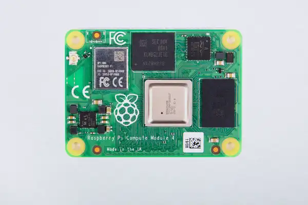
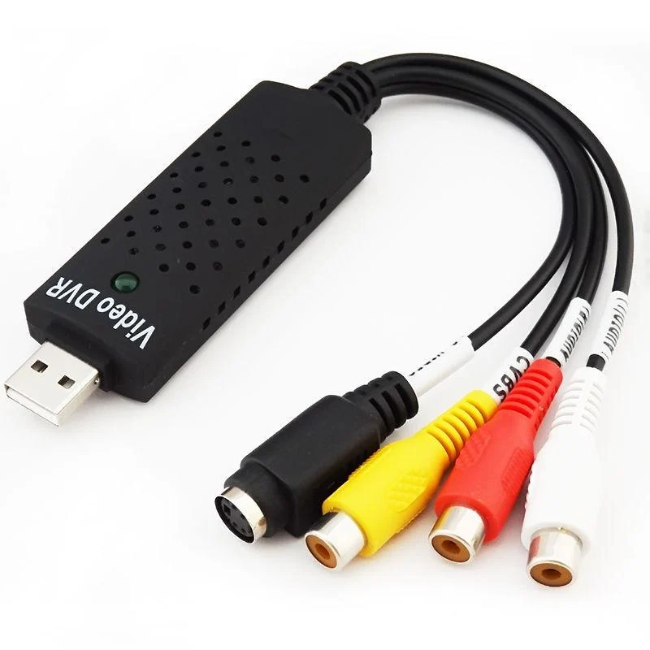
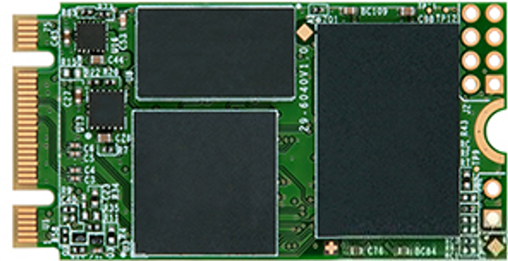

<!-- ---
Деталі

[Rasberry Pi Compute Module 4](https://www.raspberrypi.com/products/compute-module-4/?variant=raspberry-pi-cm4108032)

Specification
Broadcom BCM2711 quad-core Cortex-A72 (ARM v8) 64-bit SoC @ 1.5GHz
H.265 (HEVC) (up to 4Kp60 decode), H.264 (up to 1080p60 decode, 1080p30 encode) 
OpenGL ES 3.1, Vulkan 1.0
Options for 1GB, 2GB, 4GB or 8GB LPDDR4-3200 SDRAM (depending on variant)
Options for 0GB ("Lite"), 8GB, 16GB or 32GB eMMC Flash memory (depending on variant)
Option for fully certified radio module:
2.4 GHz, 5.0 GHz IEEE 802.11 b/g/n/ac wireless;
Bluetooth 5.0, BLE;
On-board electronic switch to select either external or PCB trace antenna

[Compute Module 4 IO Board](https://www.raspberrypi.com/products/compute-module-4-io-board/)

Specification
External power connector (+12V, +5V)
2 x full-size HDMI® 2.0 connectors
2 x USB 2.0 connectors, with header for two additional connectors
Gigabit Ethernet RJ45 with PoE support
Micro USB socket for updating Compute Module 4
MicroSD card socket for Compute Module 4 Lite (without eMMC) variants
PCIe Gen 2 x1 socket
Standard fan connector
2 x MIPI DSI display FPC connectors (22-pin 0.5 mm pitch cable)
2 x MIPI CSI-2 camera FPC connectors (22-pin 0.5 mm pitch cable)
Standard Raspberry Pi HAT connectors
Real-time clock with battery socket and ability to wake Compute Module 4
Various jumpers to disable specific features, e.g. wireless connectivity, EEPROM writing

дисплей сенсорний з підтримкою стилусів
[IBM Lenovo Wacom 12.1in XGA LCD Touch Screen 13N7241 Laptop SU5R-12S05AS-02X](https://www.alancomputech.com/ibm-lenovo-wacom-12-1in-xga-lcd-touch-screen-13n7241-laptop-su5r-12s05as-02x-13n7241.html)

[HackRF-One](https://github.com/dodgymike/hackrf-wiki/blob/master/HackRF-One.md)

[USB карта відеозахоплення LUX EasyCap ](https://hard.rozetka.com.ua/ua/38510320/p38510320/)

[SSD диск Transcend MTS420S 240GB M.2 2242 SATAIII 3D NAND TLC (TS240GMTS420S)](https://hard.rozetka.com.ua/ua/transcend-ts240gmts420s/p436737317/)

--- -->

# Деталі компонентів

## 1. Raspberry Pi Compute Module 4

Опис:
Raspberry Pi Compute Module 4 (CM4) — це компактний та потужний комп'ютер на базі процесора Broadcom BCM2711, який використовується в різноманітних вбудованих системах. Це основний компонент, який виконує обчислювальні операції у проекті. CM4 пропонує широку гнучкість завдяки варіативності в обсягах пам'яті (від 1 ГБ до 8 ГБ) і можливості додаткового зберігання через eMMC або microSD картки.

Переваги:
- Висока потужність: чотириядерний процесор Cortex-A72 дозволяє запускати інтенсивні додатки, зокрема обробку відео та даних у реальному часі.
- Гнучкість: доступні варіанти з різними об'ємами пам'яті та зберігання.
- Широка підтримка периферії: можливість підключення різноманітних пристроїв через GPIO, HDMI, USB, Ethernet, а також підтримка стандартних Raspberry Pi HAT.
- Підтримка бездротового зв'язку: вбудовані модулі Wi-Fi та Bluetooth дозволяють організувати мобільний зв'язок і передачу даних без дротів.

Недоліки:
- Високі вимоги до живлення: потребує постійного підключення до джерела живлення, що може бути проблемою в автономних рішеннях.
- Відсутність вбудованого монітора: необхідно підключати зовнішній дисплей.
- Обмеження за типами зберігання: відсутність стандартного жорсткого диска обмежує швидкість зберігання даних при великих об'ємах.

[Докладніше про Raspberry Pi Compute Module 4](https://www.raspberrypi.com/products/compute-module-4/?variant=raspberry-pi-cm4108032)

---

## 2. Compute Module 4 IO Board

Опис:
Це основна плата для підключення Raspberry Pi Compute Module 4 до різних периферійних пристроїв. Вона надає різноманітні порти та можливості підключення: HDMI, USB, Ethernet, слот для microSD, PCIe слот для розширення і підтримку камер через MIPI CSI-2.

Переваги:
- Розширення можливостей: надає доступ до всіх основних інтерфейсів для підключення периферії.
- Інтерфейси для дисплеїв і камер: підтримує MIPI DSI для дисплеїв та MIPI CSI-2 для камер, що дозволяє створювати мультимедійні системи.
- Підтримка PoE: можливість живлення через Ethernet (PoE) спрощує монтаж і зменшує потребу в додаткових живильних кабелях.

Недоліки:
- Потрібен додатковий обв'язок: вимагає підключення Compute Module 4, що збільшує складність розробки та інтеграції.
- Обмеження по кількості портів: деякі інтерфейси, такі як USB, обмежені в портах.

[Докладніше про Compute Module 4 IO Board](https://www.raspberrypi.com/products/compute-module-4-io-board/)

---

## 3. Сенсорний дисплей IBM Lenovo Wacom 12.1in XGA LCD Touch Screen

Опис:
Цей сенсорний дисплей має XGA роздільну здатність (1024x768 пікселів) і підтримує технологію стилусного введення. Його можна використовувати для розробки інтерфейсів користувача, де необхідний високий рівень точності введення. Використання стилуса дозволяє отримати більш точні результати, що важливо в польових умовах або при роботі з картами та іншими детальними графіками.

Переваги:
- Сенсорне введення: підтримує ввід як пальцем, так і стилусом, що є важливим для інтерактивних додатків.
- Висока точність: точність введення за допомогою стилуса дозволяє використовувати дисплей у складних робочих умовах.
- Компактність і зручність: зручний розмір для портативних рішень.

Недоліки:
- Малий розмір екрана: може бути недостатньо великим для відображення складних графічних інтерфейсів.
- Вартість: дисплей високої якості може бути дорожчим порівняно з іншими дисплеями.

[Докладніше про дисплей](https://www.alancomputech.com/ibm-lenovo-wacom-12-1in-xga-lcd-touch-screen-13n7241-laptop-su5r-12s05as-02x-13n7241.html)

---

## 4. HackRF-One

Опис:
HackRF-One — це програмоване радіо, що дозволяє працювати з широким діапазоном частот (від 1 MHz до 6 GHz). Цей пристрій є потужним інструментом для досліджень і застосувань у бездротових комунікаціях, криптографії, виявленні та аналізі радіосигналів.

Переваги:
- Широкий діапазон частот: підтримка від 1 MHz до 6 GHz дозволяє працювати з практично всіма радіочастотними спектрами.
- Програмованість: можливість налаштовувати частоти і параметри роботи за допомогою відкритого програмного забезпечення.
- Мобільність: HackRF-One має компактний розмір, що дозволяє використовувати його у польових умовах.

Недоліки:
- Потребує спеціалізованих знань: використання потребує знань у галузі радіоелектроніки та програмування.
- Обмежена потужність: HackRF-One не підходить для високоякісних і далекобійних передавальних пристроїв.

[Докладніше про HackRF-One](https://github.com/dodgymike/hackrf-wiki/blob/master/HackRF-One.md)

---

## 5. USB карта відеозахоплення LUX EasyCap

Опис:
EasyCap — це бюджетний USB-адаптер для захоплення відеосигналу з аналогових джерел, таких як камери, DVD-плеєри чи ігрові консолі. Він підтримує передачу відео і аудіо через USB, що робить його універсальним рішенням для запису відео та моніторингу.

Переваги:
- Низька ціна: один із найекономніших варіантів для відеозахоплення.
- Легкість у використанні: підключається через USB і сумісний з більшістю операційних систем.
- Універсальність: можна використовувати з різними аналоговими джерелами відео.

Недоліки:
- Обмеження якості: відео може бути обмежене в роздільній здатності та якості порівняно з сучасними цифровими рішеннями.

[Докладніше про LUX EasyCap](https://hard.rozetka.com.ua/ua/38510320/p38510320/)

---

## 6. SSD диск Transcend MTS420S 240GB M.2 2242 SATAIII 3D NAND TLC

Опис:
Цей SSD диск забезпечує високу швидкість читання та запису завдяки використанню 3D NAND технології та інтерфейсу SATAIII. Ідеальний для зберігання операційної системи, даних та програм у вашому пристрої.

Переваги:
- Висока швидкість: забезпечує швидке завантаження та збереження даних.
- Надійність: 3D NAND пам'ять є більш стійкою до зносу, ніж традиційна 2D NAND.
- Енергоефективність: знижене споживання енергії в порівнянні з механічними жорсткими дисками.

Недоліки:
- Ціна: хоча ціни на SSD знижуються, вони все ще дорожчі, ніж звичайні жорсткі диски.
- Обмежена ємність: хоча 240 ГБ — достатньо для стандартних задач, для великих даних знадобиться диск більшої ємності.

[Докладніше про SSD диск](https://hard.rozetka.com.ua/ua/transcend-ts240gmts420s/p436737317/)