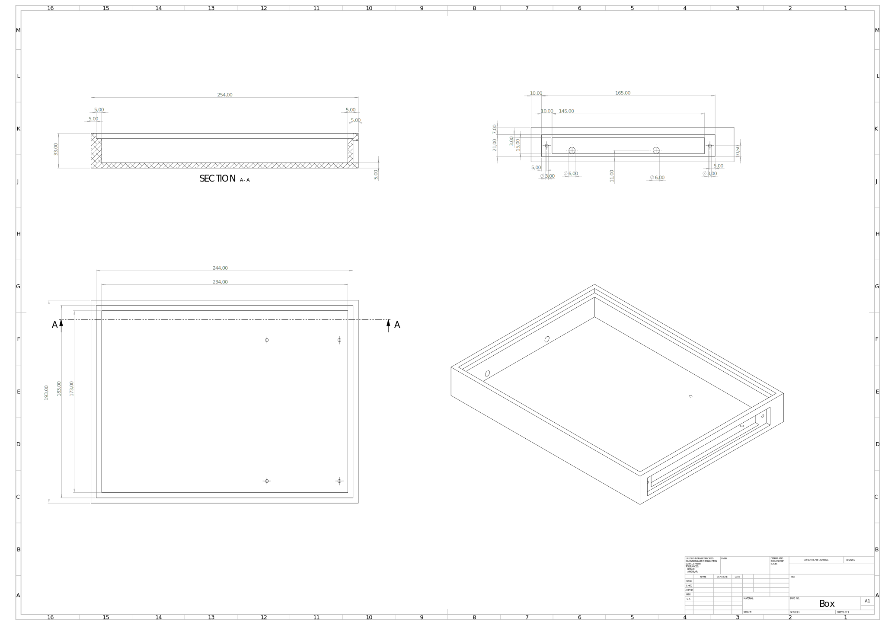
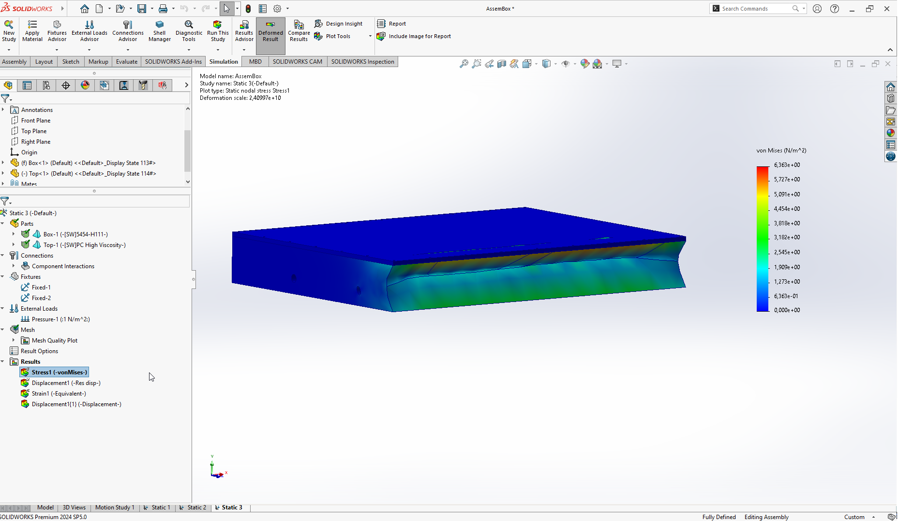

#  Розробка корпусу

## Деталі корпусу

### Корпус 

### Захисна кришка з органічного скла

## Симуляція навантаження

### Навантаження зверху на захисне органічне скло екрану

### Бічне навантаження

### Бічне навантаження

